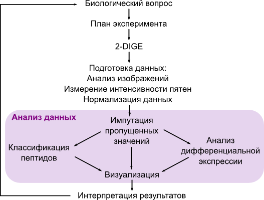

```{r setup, include=FALSE}
knitr::opts_chunk$set(echo = TRUE)
library("knitcitations")
cleanbib()
options("citation_format" = "pandoc")
```

Дифференциальный двумерный электрофорез [two-dimensional difference gel electrophoresis, 2D-DIGE; @unlu_difference_1997] доступный и чувствительный метод, который позволяет сравнивать уровень экспрессии белков в различных выборках. Этот метод часто используется в протеомике для выявления биомаркеров. 



В этой части курса вы познакомитесь с различными способами анализа данных, полученных протеомными методами. Мы рассмотрим анализ 2-DE (two-dimensional gel electrophoresis) данных с момента, когда информация об интенсивности пятен уже получена (и нормализована), т.е. собственно анализ данных для ответа на биологический вопрос исследования [@sellers_statistical_2012; @valledor_standardization_2014].

Раздел 1 посвящен языку статистического программирования R `r citep(citation())`. Читатели познакомятся с работой в среде RStudio [@rstudio_team_rstudio:_2015], освоят основные элементы языка R.

В разделе 2 обсуждаются техники подготовки и предварительной обработки данных протеомных исследований. Мы поговорим о том, в каком формате удобно хранить данные, каким образом их можно использовать в R, мы обсудим проблему пропусков в данных и научимся их заполнять.

Раздел 3 посвящен методам классификации. В нем рассказывается о различных типах расстояний, и алгоритмах, которые используются для кластеризации белков или проб. Читатели научатся строить дендрограммы, оценивать надежность их ветвей, рисовать тепловые карты экспрессии белков.

В разделе 4 говорится о методах сравнения уровня экспрессии в разных пробах или группах проб. Читатель научится выявлять дифференциально экспрессируемые белки при помощи fold change анализа и модерируемого t-критерия. Кроме того, мы обсудим проблемы, возникающие при множественном тестировании и статистические поправки, которые позволяют их избегать.

Раздел 5 рассказывает о выявлении групп маркеров с похожим уровнем экспрессии при помощи анализа главных компонент (Principal Component Analysis, PCA).

Раздел 6 посвящен многомерному анализу паттернов дифференциальной экспрессии при помощи сочетания регрессии методом частных наименьших квадратов и дискриминантного анализа (Partial Least Squares Regression and Discriminant Analysis, PLS-DA).

Заметки к лекциям этого модуля написаны при помощи `RMarkdown` `r citep(citation('rmarkdown'))` и `knitr` `r citep(citation("knitr"))`.

## Ссылки

```{r include=FALSE}
write.bibtex(file="bibs/00_packages.bib")
```

