```{css, echo=FALSE}
.spoiler {
  visibility: hidden;
}

.spoiler::before {
  visibility: visible;
  content: "ОТВЕТ (наведите указатель, чтобы увидеть)"
}

.spoiler:hover {
  visibility: visible;
}

.spoiler:hover::before {
  display: none;
}
```

```{r setup, include=FALSE}
knitr::opts_chunk$set(echo = TRUE)
library("knitcitations")
cleanbib()
options("citation_format" = "pandoc")
```

---

# Данные к этому занятию

- [Код](https://varmara.github.io/proteomics/01_introduction_to_r.R)
- Данные [@kikuta_proteome_2009]:
    - [expression_3.csv](https://varmara.github.io/proteomics/data/expression_3.csv)
    - [expression_3.xlsx](https://varmara.github.io/proteomics/data/expression_3.xlsx)
    - [expression_3.zip](https://varmara.github.io/proteomics/data/expression_3.zip)

---

# 

## Как появился R

R `r citep(citation())` --- это язык для статистического анализа и визуализации данных. Он возник как ответвление языка S/Splus, разработанного еще в 70-х годах в Bell Laboratories.


---

[Росс Ихака](https://en.wikipedia.org/wiki/Ross_Ihaka) (Ross Ihaka) и [Роберт Джентльмен](https://en.wikipedia.org/wiki/Robert_Gentleman_(statistician)) (Robert Gentleman), молодые ученые из университета Окленда, Новая Зеландия разработали R в 1993 году [@ihaka_r:_1998].


<small>Роберт Джентльмен и Росс Ихака, [источник: Росс Ихака](https://www.stat.auckland.ac.nz/~ihaka/downloads/the-r-project.pdf)</small>

---

Сейчас Росс Ихака занимается статистикой [в университете Окленда](https://www.stat.auckland.ac.nz/~ihaka/) (Associate Professor). В 2010 году Ихака начал работать над новым языком с целью усовершенствовать R и улучшить его быстродействие [@ihaka_r:_2010].


<small>Росс Ихака, [источник: сайт university of Waikato](http://www.waikato.ac.nz/news-events/media/2015/learning-another-language-on-kngitanga-day)</small>

---

Роберт Джентльмен работал как ученый и эксперт в нескольких компаниях биотехнологического и генетического профиля, и недавно стал вицепрезидентом компании 23andMe как эксперт в биоинформатике. Еще в 2001 году Роберт Джентльмен начал работать над проектом [Bioconductor](http://www.bioconductor.org/). 


<small>Роберт Джентльмен, [источник: Susie Fitzhugh](https://www.fredhutch.org/en/news/center-news/2009/05/Gentlemen-presents-lecture.html)</small>


# RStudio --- среда разработки

## Создатели  RStudio

RStudio [@rstudio_team_rstudio:_2019] --- это свободно распространяемая среда для разработки (integrated development environment) на языке R.


RStudio была основана в 2009 году американским программистом и интернет-предпринимателем [Джозефом Аллером](https://en.wikipedia.org/wiki/Joseph_J._Allaire) (Joseph J. Allaire). Среду RStudio можно устанавливать на компьютеры с разными операционными системами (Windows, OS X, and Linux).


<small>Джозеф Аллер, [источник: Hubert Burda Media on Flickr](https://flic.kr/p/jn7JDS)</small>

Сейчас RStudio, пожалуй, самый удобный вариант среды для разработки на R. Мне кажется, что бум использования R в начале 10-х годов отчасти объясняется тем, что писать программы стало гораздо удобнее благодаря появлению среды RStudio.

К слову, вторая причина роста популярности R --- это появление графического пакета ggplot2 `r citep(citation("ggplot2"))`, написанного [Хедли Викхемом](http://hadley.nz/) (Hadley Wickham). Этот пакет во много раз облегчил построение сложных и красивых графиков. С тех пор Хедли Викхем написал еще много полезных пакетов и сейчас работает Chief Scientist в RStudio и Adjunct Professor в университете Окленда.


<small>Хедли Викхем, [источник: Hadley Wickham](https://twitter.com/hadleywickham)</small>


Для работы над этим курсом вам понадобится установить

- [R](http://cran.r-project.org/)
- [RStudio](https://www.rstudio.com/products/rstudio/download/preview/)


## Устройство  RStudio


Окно редактора RStudio разделено на 4 области:

1. код (зеленый прямоугольник на схеме) - это обычный текстовый редактор, в котором открывают и редактирут файлы с программами.
2. консоль/RMarkdown (оранжевый прямоугольник на схеме). На вкладке консоль можно в живом режиме выполнять команды R, если вы не хотите их сохранять в виде программы.
3. файлы/графики/пакеты/помощь/просмотр (желтый прямоугольник на схеме). На вкладке помощь можно просматривать файлы справки. На вкладке графики будут появляться графики. На вкладке файлы расположен файловый менеджер, который позволяет перемещаться по директориям вашего проекта и компьютера.
4. среда/история (и еще может быть /Git, если ваш проект под контролем версий) (синий прямоугольник на схеме). На вкладке история есть список всех выполненных команд R. На вкладке среда расположен список объектов, находящихся в памяти.

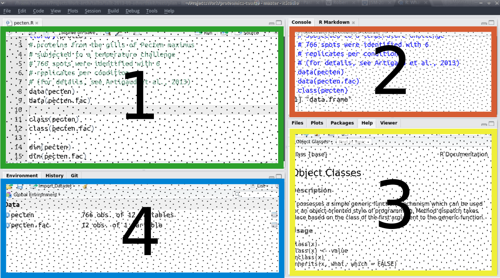

## Организация рабочего пространства

1. Создайте папку (например, `Proteomics`), где будут храниться ВСЕ материалы курса. Например:  Мы будем ее называть __рабочей директорией__. В эту папку помещайте ВСЕ файлы с кодом (с расширением .R).
2. Внутри папки `Proteomics` создайте папку `data`, где будут храниться все файлы с данными для анализа.

В итоге у вас должно получиться примерно это:

```
C:\Proteomics\
C:\Proteomics\data\
```

## Настройка

Все настройки RStudio находятся меню Tools -> Global Options

- Восстановление рабочено пространства из прошлого сеанса --- это лучше отменить, т.к. обычно переменные-призраки очень мешают. На вкладке `General` убираем галочку `Restore .RData into workspace at startup`, и меняем `Save workspace to .RData on exit` - `Never`
- Перенос длинных строк в окне кода --- это удобно. На вкладке `Code` ставим галочку рядом с опцией `Soft-wrap R source files`

## Клавиатурные сокращения

- `Ctrl + Shift + C` - закомментировать/раскомментировать выделенный фрагмент кода.
- `Ctrl + Enter` - отправляет строку из текстового редактора в консоль, а если выделить несколько строк, то будет выполнен этот фрагмент кода.
- `Tab` или `Ctrl + Space` - нажмите после того как начали набирать название функции или переменной, и появится список автоподстановки. Это помогает печатать код быстро и с меньшим количеством ошибок.

Автоподстановка названий функций начинает работать как только вы ввели несколько первых букв названия функции. Вы можете вызвать ее раньше, если нажмете `Tab` или `Ctrl + Space`.

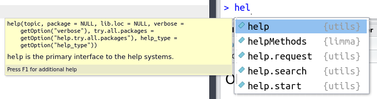

Как только вы полностью ввели название функции и скобки, RStudio автоматически ставит закрывающую скобку и показывает раздел справки Usage для этой функции.

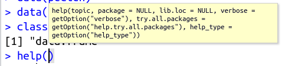

Если вы нажмете `Tab` или `Ctrl + Space`, когда курсор находится внутри скобок, то вам покажут список аргументов этой функции с расшифровками их значений из раздела справки Arguments для этой функции.

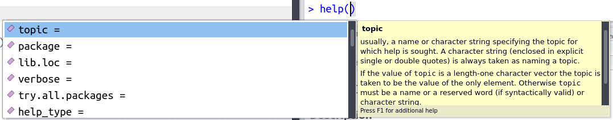


# Установка дополнительных пакетов c CRAN и Bioconductor

R --- модульная система, он состоит из пакетов. Некоторые пакеты уже установлены, другие придется устанавливать из внешнего репозитория. Пакеты единожды устанавливаются в локальную библиотеку, затем их нужно активировать для работы один раз за сеанс.

Из центрального репозитория `R` `CRAN` пакеты можно установить при помощи функции `install.packages()`, указав имя пакета. Запустите RStudio (с правами администратора, если вы в Windows) и, для начала, установите пакеты `ggplot2` и `readxl` --- они нам сегодня понадобятся.

```{r eval=FALSE}
# Из репозитория CRAN
install.packages("ggplot2")
install.packages("readxl")
```

Остальные пакеты мы будем устанавливать по мере необходимости. Сейчас просто прочтите, как это делается.

Несколько имен пакетов можно объединить в вектор и установить при помощи одной команды. Если вдруг что-то не получится, то можно попробовать устанавливать пакеты по-одному, чтобы выяснить в чем проблема.

```{r eval=FALSE}
# Из репозитория CRAN
install.packages(c("gplots", "fpc", "pvclust", "Hmisc", "RColorBrewer"))
```

Кроме того, нам понадобятся несколько пакетов из репозитория `Bioconductor.` Пакеты из этого репозитория устанавливают при помощи функции `install()` из пакета `BiocManager`. Так же как `install.packages()` функция `install()` может принимать в качестве аргумента вектор с названиями нескольких пакетов.

```{r eval=FALSE}
# С сайта Bioconductor
if (!requireNamespace("BiocManager", quietly = TRUE))
    install.packages("BiocManager")
BiocManager::install(c("Biobase", "prot2D", "impute", "pcaMethods", "limma", "hexbin"))
```

# Основы языка R

## Математические операции

```{r}
2 + 3
36 / 2
7 * 4
5 ^ 2
```

Для некоторых операций есть специальные функции:

```{r}
sqrt(27)
```

#### Задание 1

Найдите длину гипотенузы прямоугольного треугольника со сторонами 3 и 5 см.

<div class="spoiler">
```{r purl=FALSE}
sqrt(3^2 + 5^2)
```
</div>

#### Задание 2

Извлеките кубический корень из 27.

<div class="spoiler">
```{r purl=FALSE}
27^(1 / 3) # кубический корень
```
</div>

## Предупреждения и ошибки (warnings and errors)

Предупреждения

```{r}
sqrt(-27)
```

Ошибки

```{r eval=FALSE}
sqr(27)
```
```
Error: could not find function "sqr"
```

## Как можно получить помощь в R

1) В `RStudio` можно поставить курсор на название функции и нажать `F1`

`sqrt()`

2) Перед названием функции можно напечатать знак вопроса и выполнить эту строку

`?sqrt`

3) Можно воспользоваться функцией `help()`

`help("sqrt")`

Все файлы справки состоят из нескольких типов разделов.

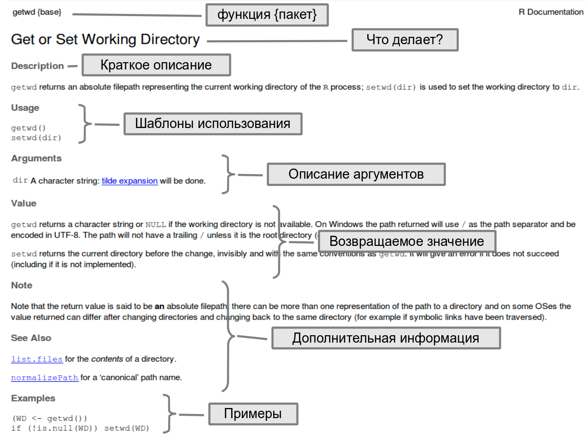

### Задание 3

Что делает функция `round()`?

<div class="spoiler">
```{r purl=FALSE}
# Справка
?round
help("round")
```
</div>

### Задание 4

Посмотрите в справку к функции `log()`. Какое основание логарифма используется в R по умолчанию?

<div class="spoiler">
```{r purl=FALSE}
# Справка
?log
help("log")
```
</div>


## Переменные (variables)

Можно сохранить результат любого вычисления или любую величину в переменной. Переменные - это такие контейнеры, в которые можно положить разные данные (и даже функции).

Оператор присваивания это символ стрелочки `<-`
Он работает справа налево, это значит, что значение выражения в его правой части присваивается объекту в левой части. Есть еще более экзотический оператор присваивания слева направо `->`, но его не рекомендуют использовать оттого, что хуже читается код.

Имена переменных могут содержать латинские буквы обоих регистров, символы точки . и подчеркивания _ , а так же цифры. Имена переменных должны начинаться с латинских букв. Создавайте понятные и "говорящие" имена переменных.

```{r}
num_1 <- 1024 / 2
num_1
1238 * 3 -> num_2  # экзотический вариант
num_2
```

Правила именования переменных

Просто `a` --- плохо, и даже `b`, `с`, или `х`. Но в некоторых случаях название из одной буквы вполне допустимо:)

- `var1` --- плохо, но уже лучше
- `var_1` --- тоже плохо, но уже лучше
- `shelllength` --- говорящее, но плохо читается
- `shell_length`, `wing_colour` или `leg_num` --- хорошие, говорящие, короткие, но вполне читабельные названия.

Осторожно, переменные можно случайно или намеренно перезаписать. Пока что `num_1` было равно `r num_1`, но если мы присвоим переменной `num_1` другое значение --- ее содержимое изменится.

```{r}
num_1
num_1 <- 2^2
num_1
```

Код --- это линейная последовательность действий. 
Переменные можно использовать только после того, как они были созданы.

Пример 1

```{r eval=FALSE}
# Неправильно:
box_wt <- 1.2
apples <- 6
box / apples # ошибка. переменная box еще не была создана.
# нужная переменная называется box_wt.

# Правильно:
box_wt <- 1.2
apples <- 6
box / apples
```

Пример 2

```{r eval=FALSE}
# Неправильно:
box <- 1.3
box / fruits # ошибка. переменная fruits еще не была создана.
fruits <- 7

# Правильно:
box <- 1.3
fruits <- 7
box / fruits # ошибка. переменная fruits еще не была создана.
```

#### Задание 5

Переставьте строки так, чтобы код можно было выполнить без ошибки.

```{r eval=FALSE}
distance <- 120
speed <- distance / time
time <- 6
```

<div class="spoiler">
```{r purl=FALSE}
distance <- 120
time <- 6                # сначала создаем переменную time
speed <- distance / time # только потом ее используем
```
</div>

#### Задание 6

Ширина прямоугольника 2 см, а длина на 7 см больше. Чему равен периметр? (В решении создайте и используйте переменные `width`, `len` и `per`).

<div class="spoiler">
```{r purl=FALSE}
width <- 2               # Ширина
len <- width + 7         # Длина
per <- 2 * (width + len) # Периметр
```
</div>

## Типы данных в R

В R всего шесть различных типов данных. Но нам пригодятся только некоторые из них.

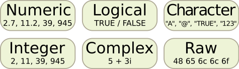

### Числовые данные

Мы только что их видели. 

По умолчанию используется тип `numeric`, который позволяет хранить целые и дробные числа. 

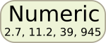

Есть еще тип `integer`, который предназначен для хранения целых чисел.

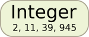

И, наконец, тип `complex` используется для хранения комплексных чисел.

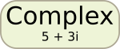

### Текстовые данные (`character`)

Текстовые данные используются для хранения последовательностей символов произвольной длины. 

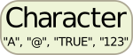

Каждый текстовый элемент должен быть окружен кавычками - двойными или одинарными

```{r}
"это текст"
'это тоже текст'
```

### Логические данные (`logical`)

Логические данные используются для записи значений типа истина/ложь.

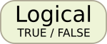

В R определены две логические константы: `TRUE` и `FALSE`

```{r}
TRUE # истина
FALSE # ложь
```

Для ленивых --- если вы вдруг очень спешите, то можно сокращать первыми заглавными буквами. Но лучше так не делать, чтобы читать программы было легче.

```{r}
T
F
```

### Сырые данные (`raw`)

Тип `raw` используется для хранения "сырых" последовательностей байтов. Это очень экзотический тип, нам он не пригодится.

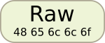

### Встроенные в R константы

В R есть несколько встроенных констант. Нам пригодятся только несколько из них.

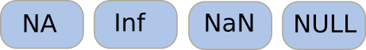

`NA` --- англ _"not available"_. Когда объект был, но его свойство не измерили или не записали. Что произойдет с `NA` при различных операциях?

```{r}
NA + 2
NA * 0
NA / 0
sqrt(NA)
```

`Inf` --- _"infinity"_ --- бесконечность. Вы увидите `Inf` при делении чисел на ноль.

```{r}
1 / 0
```

`NaN` --- _"not a number"_. `NaN` получится при делении нуля на ноль, или если взять корень из отрицательного числа.

```{r}
0 / 0
sqrt(-1)
```

`NULL` --- ноль, т.е. это значит "пусто", "ничего нет".

# Основные структуры данных в R

Данные в R можно хранить в виде разных объектов: вектор, матрица, массив, список, датафрейм. Мы бегло рассмотрим только некоторые из них.

## Векторы (vectors)

Основной объект R - векторы. Векторы - один объект, внутри которого может быть одно или несколько значений. Главное, чтобы эти значения относились к одному и тому же типу данных.

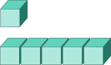

Вам могло показаться, что в результате выполнения следующих команд получаются просто числа:

```{r}
23
sqrt(25)
```

но на самом деле, это векторы единичной длины. В R можно легко создавать векторы большей длины.


### Создание векторов из произвольных элементов

Функция `c()` --- от англ. _concatenate_. Функция `c` принимает несколько (произвольное количество) аргументов, разделенных запятыми, и собирает из них вектор (см. справку `?c`). Когда используете функцию `c()`, следите, чтобы было английское "си", а не русское "эс".

```{r}
c(2, 4, 6)
c(-9.3, 0, 2.17, 21.3)
```

Векторы можно хранить в переменных для последующего использования.

```{r}
vect_num <- c(2, 4, 6, 8, 10, 12, 14, 16)
vect_num_1 <- c(1.3, 1.7, NA, 0.9, 1.6, 1.4)
```

При помощи функции `c()` можно объединять несколько векторов в один вектор.

```{r}
c(1, 1, 5:9)
c(vect_num, vect_num_1)
c(100, vect_num)
```

Вектора могут содержать не только числа, но и логические значения, текст.

```{r}
c(TRUE, TRUE, TRUE, FALSE, FALSE, TRUE)
colours <- c("red", "orange", "yellow", "green", "blue", "violet")
```

#### Задание 7

Создайте вектор, в котором будут буквами закодированы нуклеотиды ДНК в алфавитном порядке.

<div class="spoiler">
```{r purl=FALSE}
# Решение
c("A", "C", "G", "T")
```
</div>

#### Задание 8

Создайте вектор, в котором будет три наименьших отрицательных целых числа в порядке возрастания.

<div class="spoiler">
```{r purl=FALSE}
# Решение
c(-3, -2, -1)
```
</div>

### Создание векторов из целых чисел подряд

Оператор `:` используется для создания целочисленных векторов, где значения следуют одно за другим без пропусков

```{r}
1:10 # от одного до 10
-5:3 # от -5 до 3
```

#### Задание 9

Создайте вектор из целых чисел от 1 до 100. Как вы думаете, что означают номера в квадратных скобках в начале каждой строки?

<div class="spoiler">
```{r purl=FALSE}
1:100 
# Номера в квадратных скобках - порядковый номер первого элемента строки
```
</div>

### Создание векторов из повторяющихся элементов

Чтобы создавать длинные векторы из повторяющихся элементов, можно использовать функцию `rep()`

`?rep`

```{r}
rep(x = 1, times = 3) # 1 повторяется 3 раза
rep(x = "red", times = 5) # "red" повторяется 5 раз
rep(x = TRUE, times = 2) # TRUE повторяется 2 раза
```

Названия аргументов функций в R можно не указывать, если вы используете аргументы в том же порядке, что прописан в `help` к этой функции.

```{r}
rep(TRUE, 5) # TRUE повторяется 5 раз, аргументы без названий
```

Создаем логический вектор, где `TRUE` повторяется 3 раза, `FALSE` 3 раза и `TRUE` 4 раза. Результат сохраняем в переменной `vect_log`.

```{r}
vect_log <- c(rep(TRUE, 3), rep(FALSE, 3), rep(TRUE, 4))
vect_log
```

#### Задание 10

Создайте вектор `season` в котором названия времен года будут следовать в том же порядке, что и месяцы года, к которым они относятся (начиная с января).

<div class="spoiler">
```{r purl=FALSE}
# Без использования rep()
season <- c("winter", "winter", "spring", "spring", "spring", "summer", "summer", "summer", "autumn", "autumn", "autumn", "winter")

# С использованием rep()
season <- c(rep("winter", 2), 
            rep(c("spring", "summer", "autumn"), each = 3), 
            "winter")
```
</div>


### Адресация внутри векторов

При помощи оператора `[]`, мужно обратится к некоторым элементам вектора.

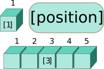

В квадратных скобках вам нужно указать порядковые номера элементов вектора, которые вы хотите добыть --- один или несколько.

```{r}
vect_num # весь вектор
vect_num[1] # первый элемент
vect_num[3] # 3-й элемент
```

Если вам нужно несколько элементов, то их нужно указать в квадратных скобках их порядковые номера в виде вектора.

```{r}
colours # весь вектор
colours[3:5] # 3-5 элемент
```

Аналогично, если вам нужны элементы не подряд, то укажите в квадратных скобках вектор с номерами элементов, который вы создали при помощи функции `c()`. 

```{r}
vect_num[c(2, 4, 6)]
colours[c(1, 6)]
```

Вектор --- одномерный объект. У его элементов только один порядковый номер (индекс). Поэтому при обращении к элементам вектора нужно указывать только одно число или один вектор с адресами. R выдаст ошибку, если при обращении к вектору, вы не создавали вектор, а просто перечислили номера элементов через запятую.

```{r eval=FALSE}
vect_num[2, 4, 6]
```
```
Error in vect_num[2, 4, 6] : incorrect number of dimensions
```
```{r eval=FALSE}
colours[1, 6]
```
```
Error in colours[1, 6] : incorrect number of dimensions
```

Если попытаться добыть из вектора номер элемента, которого там точно нет, то R выдаст `NA`, потому, что такого элемента нет

```{r}
vect_num[198]
```


В R есть встроенные константы, которые помогают быстро генерировать искуственные текстовые векторы (см. `?Constants`). 

```{r}
LETTERS
letters
month.abb
month.name
```

#### Задание 11

Извлеките из вектора `month.name` 

- летние месяцы, 
- зимние месяцы.

<div class="spoiler">
```{r purl=FALSE}
# летние месяцы
month.name[6:8] 

# зимние месяцы
month.name[c(12, 1, 2)] 
```
</div>

#### Задание 12

Извлеките из вектора LETTERS буквы в таком порядке, чтобы получилось слово `SUN`.

<div class="spoiler">
```{r purl=FALSE}
LETTERS[c(19, 21, 14)]
```
</div>

### Операции с векторами

Поэкспериментируем с векторами. Проверим, как работают арифметические операции

```{r}
vect_num + 2
vect_num * 2
vect_num * (-2)
vect_num^2
```

Арифметические операции выполняются с каждым элементом вектора --- это __векторизованные операции__.

С самими векторами тоже можно делать некоторые операции.

```{r}
sum(vect_num)
length(vect_num)
mean(vect_num)
min(vect_num)
```


#### Задание 13

Создайте переменную `powers_of_two`, в которой сохраните последовательность из целочисленных степеней двойки --- с первой по пятую. Используйте векторизацию. Выведите содержимое `powers_of_two` в консоль.

<div class="spoiler">
```{r purl=FALSE}
powers_of_two <- 2^(1:5)
powers_of_two
```
</div>


## Матрицы (matrices)

Матрицы --- это двумерные объекты, похожие на таблицы, в которых хранятся данные только одного определенного типа.

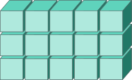

Матрицы создают при помощи функции `matrix()`, которой нужно передать вектор с данными и размер будущей матрицы (число строк или столбцов).

```{r}
# Матрица с числовыми данными
matrix(data = 1:12, nrow = 4)
# Матрица с текстовыми данными
matrix(data = LETTERS[1:12], ncol = 6)
```

Обычно элементы записываются в матрицу столбцами
```{r}
matrix(data = 1:6, ncol = 3)
```

Порядок заполнения матрицы элементами можно изменить, если указать `byrow = TRUE`.

```{r}
matrix(data = 1:6, ncol = 3, byrow = TRUE)
```

### Адресация в матрицах

Поскольку матрицы --- это двумерные объекты, позиции элементов в них можно описать при помощи двух индексов, в отличие от векторов. Первым в квадратных скобках следует номер строки, вторым --- номер столбца

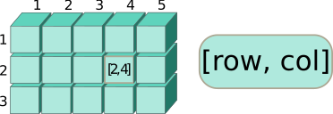

```{r}
mat <- matrix(data = LETTERS[1:12], ncol = 3)
mat
mat[3, 2]
mat[1, ]
mat[, 3]
mat[, -1]
mat[1:3, c(1, 3)]
```

#### Задание 14

Создайте матрицу `calendar` с названиями месяцев, так, чтобы в первой строке был первый квартал.

<div class="spoiler">
```{r purl=FALSE}
calendar <- matrix(data = month.name, ncol = 3, byrow = TRUE)
calendar
```
</div>

#### Задание 15

Выберите из матрицы `calendar` месяцы третьего квартала.

<div class="spoiler">
```{r purl=FALSE}
calendar[3, ]
```
</div>

#### Задание 16

Выберите из матрицы `calendar` июнь.

<div class="spoiler">
```{r purl=FALSE}
calendar[2, 3]
```
</div>

## Массивы (arrays)

Массивы --- это многомерные объекты, в которых можно хранить данные одного и того же типа. По структуре они очень похожи на матрицы

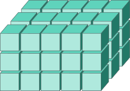

```{r}
ar <- array(data = 1:24, dim = c(2, 4, 3))
ar
```

### Адресация в массивах

Адреса в массивах указываются в том же порядке: сначала идет строка, за ней столбец, затем следуют прочие измерения.

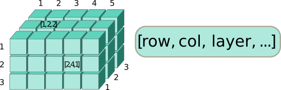

```{r}
ar[1, 2, 3]
ar[, , 1]
ar[, 1, ]
ar[1, , ]
ar[1, 1:3, 1]
ar[, , -1]
```

## Датафреймы (data frames)

Датафреймы --- это такие двумерные таблицы, в которых столбцы могут содержать данные разных типов.

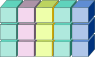

```{r}
x <- 2014:2017
y <- LETTERS[1:4]
z <- c(TRUE, TRUE, FALSE, TRUE)
dat <- data.frame(year = x, type = y, test_passed = z, stringsAsFactors = FALSE)
dat
```

### Адресация в датафреймах

Чтобы вытащить фрагмент датафрейма, можно использовать несколько вариантов действий.

Во-первых, оператор `[]` работает с датафреймами точно так же как и с матрицами. Поскольку датафреймы --- это двумерные объекты, позиции элементов в них можно описать при помощи двух индексов. Первым в квадратных скобках `[]`, как обычно, следует номер строки, вторым --- номер столбца.

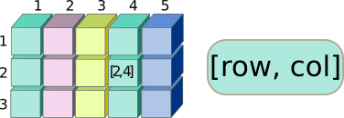

```{r}
dat[2, 2]
```

На месте индекса столбцов в `[]` квадратных скобках можно указать вектор имен переменных вместо их номеров.

```{r}
dat[, c("year", "test_passed")]
```

Во-вторых, оператор `$` позволяет выбрать одну из переменных по имени

```{r}
dat$year
```

Можно использовать комбинацию предыдущих техник.

```{r}
dat$test_passed[3]
```

#### Задание 17

Создайте датафрейм `year`, в котором будет две переменные: `month` и `season`.

<div class="spoiler">
```{r purl=FALSE}
# Названия месяцев возьмем из month.name
# А вектор season создадим сами
ss <- c(rep("winter", 2), 
            rep(c("spring", "summer", "autumn"), each = 3), 
            "winter")
# собираем в датафрейм
year <- data.frame(month = month.name, season = ss)
year
```
</div>

#### Задание 18

Выберите из датафрейма `year` 

- строки, соответствующие весенним месяцам
- время года, которому соответствует июнь
- всю колонку, кодирующую сезон

<div class="spoiler">
```{r purl=FALSE}
# - строки, соответствующие весенним месяцам
year[3:5, ]
# - всю колонку, кодирующую сезон
year$season
year[, "season"]
year[, 2]
# - время года, которому соответствует июнь
year[6, 2]
year[6, "season"]
year$season[6]
```
</div>


## Списки (lists)

Списки позволяют хранить данные различных типов, и при этом разной длины.

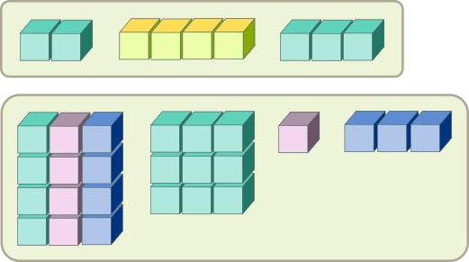

```{r}
list(dat, mat, vect_num, colours)
```

Можно создавать именованные списки

```{r}
lst <- list(Dfr = dat, Matr = mat, Vect1 = vect_num, Vect2 = colours)
lst
```

Кстати, датафрейм можно определить как список векторов одинаковой длины.

### Адресация в списках

Для выбора данных из списков существует несколько вариантов действий.

1) Хорошо нам знакомый оператор `[]` работает и со списками. Он позволяет извлечь элементы списков в виде списков.

```{r}
lst[1:2] # список из двух элементов
lst[1] # список из одного элемента
```

2) Чтобы извлечь содержимое элемента списка, нужно использовать двойные квадратные скобки `[[]]`. С элементом списка дальше можно производить любые действия в обычном порядке.

```{r}
lst[[1]]
lst[[1]]$v2
```

3) При помощи оператора `$` можно извлечь элементы из именованного списка по их именам. Дальше с этими элементами можно проводить любые манипуляции.

```{r}
lst$Vect1
lst$Matr[, 1]
```

# Факторы (factors) --- особый тип данных

Факторы - это способ хранения дискретных (= категориальных данных). Например, если вы поймали 10 улиток и посмотрели их цвет. У большого количества улиток небольшое счетное количество возможных цветов.

```{r}
snail_colours <- c("red", "green", "green", "green", "yellow", "yellow", "yellow", "yellow")
snail_colours # это текстовый вектор.
```

Но цвет "желтый" обозначает одно и то же для каждой из улиток. Поэтому в целях экономии места можно записать цвета этих улиток в виде вектора, в котором численным значениям будут сопоставлены "этикетки" (называются "уровни" - levels) - названия цветов. Мы можем создать "фактор" цвет улиток.

```{r}
f_snail_alphabet <- factor(snail_colours)
f_snail_alphabet
```

Уровни этого фактора: `1 - green`, `2 - red`, `3 - yellow`. По умолчанию, R назначает порядок уровней по алфавиту. Можно изменить порядок (см. `help("factor")`). Нам это пригодится позже.

```{r}
f_snail_ryg <- factor(snail_colours, levels = c("red", "yellow", "green"))
f_snail_ryg
f_snail_yrg <- relevel(f_snail_ryg, ref = "yellow")
f_snail_yrg
```


#### Задание 19

Из вектора `season`, созданного ранее, создайте фактор `season_f` с алфавитным порядком уровней.

<div class="spoiler">
```{r purl=FALSE}
season
# Если создать фактор, не указав уровни, то порядок будет алфавитный
factor(season)
```
</div>

#### Задание 20

Из вектора `season`, созданного ранее, создайте фактор `season_f` , в котором уровни следуют в том же порядке, что и времена года в году.

<div class="spoiler">
```{r purl=FALSE}
# Чтобы уровни следовали в нужном порядке, это нужно специально указать
factor(season, levels = c("winter", "spring", "summer", "autumn"))
```
</div>

#### Задание 21

Из вектора `season`, созданного ранее, создайте фактор `season_f`, в котором уровни следуют в том же порядке, что и времена года в году, и называются первыми двумя буквами.

<div class="spoiler">
```{r purl=FALSE}
# Можно переименовать уровни
factor(season, 
       levels = c("winter", "spring", "summer", "autumn"),
       labels = c("wi", "sp", "su", "au"))
```
</div>

# Работа с логическими данными

## Операторы сравнения

Операторы сравнения используются для проверки условий.

- `==` --- равно 
- `>` --- больше 
- `<` --- меньше 
- `!=` ---  не равно
- `>=` --- больше или равно
- `<=` --- меньше или равно

Кроме операторов сравнения есть функции, названия которых начинаются на `is` (например, `is.numeric()`, `is.na()`), оператор сопоставления `%in%` и т.п.

```{r eval=FALSE}
?Comparison # справка об операторах сравнения
?match      # о сопоставлении
```

Пример:

```{r}
vect_num # ранее созданный вектор

vect_num > 8

vect_num != 2
```


## Логические операторы

Логические операторы используются для того, чтобы проверить сразу несколько условий

`&` --- логическое "И":

- `TRUE & TRUE` --- `TRUE`
- `TRUE & FALSE` --- `FALSE`
- `FALSE & FALSE` --- `FALSE`

`|` --- логическое "ИЛИ":

- `TRUE | TRUE` --- `TRUE`
- `TRUE | FALSE` --- `TRUE`
- `FALSE | FALSE` --- `FALSE`

`!` --- логическое отрицание:

- `!TRUE`  --- `FALSE`
- `!FALSE` --- `TRUE`

```{r eval=FALSE}
?Logic # Справка о логических операторах
```

Пример:

```{r}
vect_num # ранее созданный вектор

(vect_num != 2) & (vect_num < 8)

season # ранее созданный вектор

season == "spring"
```


#### Задание 22

При помощи вектора `season`, создайте логический вектор, где `TRUE` стоит везде, кроме зимних месяцев.

<div class="spoiler">
```{r purl=FALSE}
season != "winter"
```
</div>

## Отбор данных с помощью логических векторов

Логический вектор можно использовать внутри оператора `[]` для извлечения данных. Например, давайте извлечем месяц, который называется "June".

```{r}
month.name[month.name == "June"]
```

Если есть несколько сопряженных векторов, то проверку условия по одному из них вполне можно использовать для отбора значений в другом. Например, можно извлечь только весенние месяцы при помощи проверки условия. Это проще, чем вручную.

```{r}
month.name[season == "spring"]
```

Аналогичным образом, можно использовать логические векторы для фильтрации датафреймов. Отберем строки с зимними месяцами из датафрейма `year`.

```{r}
year[year$season == "winter", ]
```

Можем отобрать не строки целиком, а только значение переменной `month`.

```{r}
year$month[year$season == "winter"]
year[year$season == "winter", "month"]
```


Следующие несколько заданий используют данные о продолжительности сна млекопитающих (датасет `msleep` из пакета `ggplot2`). Данные можно загрузить так:

```{r}
library(ggplot2) # активируем пакет ggplot2
data("msleep")   # активируем встроенный датасет msleep
```

#### Задание 23

Добудьте из `msleep` английские названия видов, у которых общая продолжительность сна больше 15 часов.

<div class="spoiler">
```{r purl=FALSE}
msleep$name[msleep$sleep_total > 17]
```
</div>

#### Задание 24

По данным `msleep` посчитайте, какова средняя продолжительность сна хищников.

<div class="spoiler">
```{r purl=FALSE}
mean(msleep$sleep_total[msleep$vore == "carni"], na.rm = TRUE)
```
</div>

#### Задание 25

По данным `msleep` посчитайте, какова минимальная продолжительность сна травоядных.

<div class="spoiler">
```{r purl=FALSE}
min(msleep$sleep_total[msleep$vore == "herbi"], na.rm = TRUE)
```
</div>

#### Задание 26

По данным `msleep` найдите, у какого животного минимальная продолжительность сна.

<div class="spoiler">
```{r purl=FALSE}
msleep$name[msleep$sleep_total == min(msleep$sleep_total, na.rm = TRUE)]
msleep$name[which.min(msleep$sleep_total)]
```
</div>


# Как узнать, к какому классу структур данных относится содержимое переменной?

Для того, чтобы узнать к какой структуре данных относится переменная, можно воспользоваться функцией `class()`

```{r}
class(f_snail_alphabet)
class(vect_log)
class(vect_num)
class(colours)
class(mat)
class(ar)
class(dat)
class(lst)
```

# Приведение (coercion), проверка принадлежности к классу/типу.

Приведение (coercion) --- это преобразование объекта из одного типа данных в другой. Функции для конверсии называются по единому паттерну: `as.имя_типа()`. Функции для проверки называются `is.имя_типа()`. Аналогичные функции есть для принадлежности разным классам структур данных (`as.имя_класса()`, `is.имя_класса()`).

```{r}
vect_num
as.character(vect_num)

vect_log
as.numeric(vect_log)
as.character(vect_log)
as.character(as.numeric(vect_log))

as.numeric(as.character(vect_log))

is.character(vect_num)
is.numeric(vect_num)
is.logical(vect_log)

is.vector(vect_log)
is.matrix(vect_log)
as.matrix(vect_log)

is.matrix(mat)
is.array(dat)
as.data.frame(mat)
```


# Функции (functions)

Вы уже видели массу функций, их легко узнать по скобкам после ключевого слова.

Познакомимся еще с несколькими и научимся писать пользовательские функции. Пользовательские функции позволяют автоматизировать повторяющиеся действия и делают код легко читаемым.

Вспомним, как выглядят наши векторы

```{r}
vect_num
vect_num_1
```

Помните, мы говорили, что длину вектора можно вычислить при помощи функции `length()`, а сумму элементов вектора при помощи функции `sum()`, среднее --- при помощи `mean()`.

```{r}
mean(vect_num)
mean(vect_num_1)
```

Вектор `vect_num_1` содержит `NA`. Чтобы не учитывать `NA` при подсчете, нужно использовать аргумент `na.rm = TRUE`.

```{r}
mean(vect_num_1, na.rm = TRUE)
```

Попробуем написать пользовательскую функцию `my_mean()`, которая будет по умолчанию считать среднее значение элементов в векторе с учетом пропущенных значений (`NA`)

```{r}
my_mean <- function(x){
  mean(x, na.rm = TRUE)
  }
```

В этом коде:

- `my_mean` --- переменная, название функции. В эту переменную мы складываем функцию, которую создает функция `function()`
- `function()` --- функция, которая делает функции. В скобках перечисляются аргументы (названия переменных, которые мы передаем в функцию, чтобы она что-то сделала с ними)
`{ }` --- в фигурных скобках тело функции --- последовательность действий, которую нужно сделать с аргументами

Иногда у функций бывает еще инструкция `return()`, которая сообщает, что именно должна возвращать наша функция. Вот как выглядела бы наша функция с этой инструкцией

```{r}
my_mean <- function(x){
  res <- mean(x, na.rm = TRUE)
  return(res)
}
```

Любую пользовательскую функцию нужно протестировать. Несмотря на то, что наша функция `my_mean()` очень простая и проверка будет выглядеть несколько натянуто, давайте проверим ее при помощи встроенной функции.

```{r}
mean(vect_num_1, na.rm = TRUE)
my_mean(vect_num_1)
```

Наша функция работает правильно.


# Чтение данных из файлов

## Рабочая директория

Напомним, как можно организовать хранение файлов:

- `C:\Proteomics\` --- файлы со скриптами .R и другие материалы курса. 
- `C:\Proteomics\data\` --- файлы с данными.

Скачайте файлы с данными к этому занятию и поместите их в папке `data` внутри вашей рабочей директории.

- Данные [@kikuta_proteome_2009]:
    - [expression_3.csv](https://varmara.github.io/proteomics/data/expression_3.csv)
    - [expression_3.xlsx](https://varmara.github.io/proteomics/data/expression_3.xlsx)
    - [expression_3.zip](https://varmara.github.io/proteomics/data/expression_3.zip)

Чтобы при открытии не пришлось полностью прописывать пути к файлам, удобно попросить `R` считать `C:\Proteomics\` __рабочей директорией__. Тогда можно будет указывать [относительный путь к файлам](https://ru.wikipedia.org/wiki/%D0%9F%D1%83%D1%82%D1%8C_%D0%BA_%D1%84%D0%B0%D0%B9%D0%BB%D1%83).

Например, пусть вам нужно открыть файл `expression_3.csv`, лежащий в `C:\Proteomics\data\`. Если ваша рабочая директория `C:\Proteomics\`, достаточно написать `"data/expression_3.csv"`. Если рабочей будет какая-то другая директория, то придется писать полный путь к файлу.

Я рекомендую использовать относительные пути, т.к. это позволяет легче переносить файлы с одной машины на другую с сохранением структуры проекта.

## Способы установки пути к рабочей директории (working directory)

1) Выберите в меню `Session` -> `Set working Directory...` -> `To Source File Location` (Если вы уже сохранили код).
2) На вкладке `Files` в одной из рабочих областей `RStudio` выберите многоточие `...` -> в открывшемся системном диалоге выбора файлов найдите директорию, в которой лежит ваш код и нажмите OK
3) Можно вручную прописать путь к рабочей директории в кавычках в качестве аргумента функции `setwd()` (например, `setwd("/media/data/proteomics")`).

## Чтение из текстовых файлов

Один из часто используемых форматов файлов для хранения табличных данных --- текстовые файлы с разделителями (`.csv`, `.delim`, `.txt`).

Если открыть в текстовом редакторе файл `expression_3.csv`, можно заметить, что в нем есть названия переменных в первой строке, отдельные столбцы отделены друг от друга запятыми, а десятичные разряды в числах --- точками.

Для чтения данных из текстовых файлов с разделителями существует масса функций, но все они --- это модификации одной главной функции `read.table()`. У этой функции очень много аргументов, которые позволяют настроить ее для открытия самых разных типов текстовых файлов. О назначении аргументов можно узнать в файле справки `?read.table`

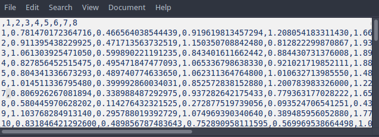

Чтобы открыть этот файл в R, можно выполнить команду:

```{r}
dat <- read.table(file = "data/expression_3.csv", header = TRUE, sep = ",", dec = ".")
```

- `file` --- абсолютный или, как в данном случае, относительный (относительно рабочей директории) путь к файлу с данными.
- `header` --- есть в файле заголовок или нет
- `sep` --- разделитель столбцов
- `dec` --- разделитель десятичных разрядов

Есть еще одна полезная опция

- `stringsAsFactors` --- автоматически преобразовывать переменные с текстовыми значениями в факторы. По умолчанию ее значение `TRUE`, но это не всегда удобно. Сейчас мы не станем ею пользоваться, но просто будем помнить о такой возможности.

После открытия файла стоит убедится, все ли правильно прочитано.

```{r}
head(dat)
```

На первый взгляд, все выглядит хорошо, но не тут то было. Давайте проверим, правильно ли R определил классы переменных.

```{r}
sapply(dat, class)
```

Странным образом, столбцы `X2` и `X6` были преобразованы в факторы. Скорее всего, это произошло из-за того, что кроме цифр там встречались какие-то другие символы. В данном случае, мы точно знаем, что там должны быть только числа, поэтому принудительно преобразуем факторы в числа.

```{r}
dat1 <- within(dat, {
  X2 <- as.numeric(as.character(X2))
  X6 <- as.numeric(as.character(X6))
}
)
```

R предупреждает нас о появлении NA. Теперь мы можем разобраться из-за чего это произошло. Отфильтруем те значения в старом датафрейме, на месте которых получились NA.

```{r}
dat$X2[is.na(dat1$X2)]
dat$X6[is.na(dat1$X6)]
```

Видно, что в исходном файле пропущенные значения были обозначены `-`.

Проверим, правильно ли определены типы переменных после преобразования.

```{r}
sapply(dat1, class)
```

Теперь все правильно.

## Чтение из архивированных файлов

`unz()` позволяет извлекать файлы из архивов. В том числе, если внутри архивов они лежат в своих директориях.

```{r}
dat2 <- read.table(unz("./data/expression_3.zip", "expression_analysis/3.csv"), header=T, sep=",", stringsAsFactors = FALSE)
head(dat2)
sapply(dat2, class)
```

Дальше все те же самые манипуляции, что мы проделывали в прошлом разделе.

## Чтение файлов Excel

Для чтения данных из файлов Excel мы будем использовать пакет `readxl` `r citep(citation("readxl"))`. При необходимости инсталлируйте его командой `install.packages("readxl")`.

```{r}
library(readxl)
dat3 <- read_excel(path = "data/expression_3.xlsx")
```

В пакете `readxl` используется более совершенный алгоритм автоматического определения классов переменных. Нас предупреждают, что в некоторых переменных, которые должны быть числовыми, встретились неожиданные текстовые значения. Тем не менее, `read_excel` правильно импортирует данные, превращая `-` в `NA`.

```{r}
sapply(dat3, class)
sum(is.na(dat3$`2`))
sum(is.na(dat3$`6`))
```

Но есть другая особенность. `readxl` пытается сохранить исходные названия переменных. В том числе пустое имя первого столбца с номерами пятен.

```{r}
colnames(dat3)
```

Мы можем создать свои собственные имена переменных.

```{r}
new_names <- paste0("X", colnames(dat3))
colnames(dat3) <- new_names
```

# Ссылки

```{r include=FALSE}
write.bibtex(file="bibs/01_packages.bib")
```
