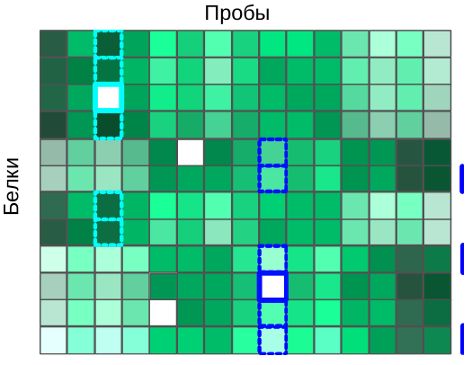
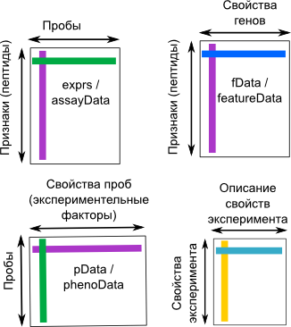

```{r setup, include=FALSE}
knitr::opts_chunk$set(echo = TRUE)
library("knitcitations")
cleanbib()
options("citation_format" = "pandoc")

# Knitr hooks
knitr::knit_hooks$set(
  hide_button = function(before, options, envir) {
    if (is.character(options$hide_button)) {
      button_text = options$hide_button
    } else {
      button_text = "Решение"
    }
    block_label <- paste0("hide_button", options$label)
    if (before) {
      return(paste0(sep = "\n",
                   '<button class="btn btn-primary btn-sm" data-toggle="collapse" data-target="#', block_label, '"> ', button_text, ' </button>\n',
                   '<div id="', block_label, '" class="collapse">\n'))
    } else {
      return("</div><br />\n")
    }
  },
  output = function(x, options){
    x <- gsub(x, pattern = "<", replacement = "&lt;")
    x <- gsub(x, pattern = ">", replacement = "&gt;")
    paste0(
      "<pre class=\"r-output\"><code>",
      fansi::sgr_to_html(x = x, warn = TRUE, term.cap = "256"),
      # ansistrings::ansi_to_html(text = x, fullpage = FALSE),
      "</code></pre>"
    )
  }
)
```

---

В этом разделе мы поговорим о том, как готовить данные 2-DIGE для статистической обработки в R `r citep(citation())`.

- [Код к этому занятию](02_data_preprocessing.R)

- Данные о протеоме жабр гребешка _Pecten maximus_ от авторов пакета `prot2D` [@Artigaud_2013]:
    - [pecten.xlsx](data/pecten.xlsx)
    - [pecten.zip](data/pecten.zip)

- Данные о протеоме сыворотки крови пациентов, страдающих разной степенью гиперплазии предстательной железы, из пакета `digeR` [@fan2009diger]:
    - [prostate.xlsx](data/prostate.xlsx)
    - [prostate.zip](data/prostate.zip)

- Пакеты (инсталлируйте при необходимости):

```{r eval=FALSE}
# Из репозитория CRAN
install.packages(c("Hmisc", "RColorBrewer"))
# С сайта Bioconductor
if (!requireNamespace("BiocManager", quietly = TRUE))
    install.packages("BiocManager")
BiocManager::install(c("Biobase", "impute", "pcaMethods", "limma", "hexbin"))
```

---

# Пример: протеом жабр гребешка _Pecten maximus_

Для работы мы будем использовать данные о протеоме жабр гребешка _Pecten maximus_ от авторов пакета `prot2D` [@Artigaud_2013]. Гребешков подвергали воздействию двух разных температур (15 и 25 градусов, по 6 гребешков в каждой группе). В этом исследовании, в общей сложности, было обнаружено 766 пятен.

Пакет `prot2D` [@Artigaud_2013], в котором хранятся данные, был удален из `Bioconductor` начиная с версии 3.9, поэтому давайте будем загружать данные из файлов, а не из пакета (но названия сохраним как в пакете).


В файле "pecten.xlsx" на листе "exprs" хранятся необработанные данные интенсивностей пятен (_raw volume data_).

```{r, message=FALSE, warning=FALSE}
library(readxl)
pecten <- read_excel(path = "data/pecten.xlsx", sheet = "exprs")
head(pecten)
```

Функция `str()` позволяет нам взглянуть на структуру любого объекта в R. О датафреймах она сообщит число строк и колонок, а так же покажет, к какому типу данных относятся колонки и первые несколько значений.

```{r}
str(pecten)
```

Мы видим, что в датасете `pecten` есть данные о 766 белках в 12 пробах, в первом столбце записаны номера пятен, а колонки называются кодовыми обозначениями проб. Имеет смысл из номеров пятен сделать названия строк при помощи функции `rownames()` и удалить столбец с номерами пятен:

```{r}
spot_names <- pecten$Spot
pecten <- as.matrix(pecten[, -1])
rownames(pecten) <- spot_names
```

Вторая составляющая данных, которая у нас есть --- это данные о принадлежности гребешков к разным вариантам экспериментальной обработки, которые записаны на листе "pheno" в том же файле.

```{r}
pecten.fac <- read_excel(path = "data/pecten.xlsx", sheet = "pheno")
head(pecten.fac)
str(pecten.fac)
```

В датасете `pecten.fac` описаны свойства 12 проб. В данном случае, всего одно свойство известно --- это `Condition`, температура, при которой содержали гребешков. При помощи функции `table()` мы можем посчитать гребешков в каждом варианте эксперимента.

```{r}
table(pecten.fac$Condition)
```

Объект `pecten.fac` лучше превратить в обычный датафрейм. Переменную `Condition` лучше сделать фактором.

```{r}
pecten.fac <- data.frame(pecten.fac)
pecten.fac$Condition <- factor(pecten.fac$Condition)
```


# Импутация пропущенных значений.

Довольно часто бывает так, что в матрице экспрессии могут пустовать некоторые ячейки. Пятно может быть обнаружено на одном геле, но отсутствовать на других в силу различных причин. Например, в силу различий между биологическими репликами, из-за различий между техническими репликами по техническим причинам, из-за ошибок в идентификации пятен, из-за плохой изоэлектрической фокусировки, из-за малого количества белка и т.п.

Отсутствие пятна на геле может обозначать разные вещи: белок может действительно отсутствовать, либо он отсутствует в силу технических причин, либо он все же присутствует в концентрации ниже порога определения. Отсутствие пятна на всех технических повторностях может скорее означать отсутствие белка --- в таких ячейках можно записать нули. Однако, если пропущенные значения появились в результате неправильного сопоставления пятен, то замена их нулями может исказить данные. Если мы имеем дело с истинно пропущенными значениями, то такие ячейки мы оставим пустыми, а R во время чтения данных автоматически преобразует их в `NA` (специальное обозначение пропущенных данных, от англ. _not available_).

Как поступать с пропущенными значениями? Есть несколько возможных вариантов. Ниже приведены некоторые распространенные способы заполнения пропущенных значений. Не все из них одинаково хороши, кроме того, есть и много других, помимо этого списка [см., например, @sellers_statistical_2012].

(а) Исключение переменных, в которых есть пропущенные значения (использование только "надежных" белков) сильно снижает "интересность" анализа, потому что многие белки будут исключены, и в результате останется меньше пятен. 

(б) Замена пропущенных значений средними значениями экспрессии данного белка в разных образцах (mean substitution). Это довольно грубый вариант, который вносит искажения в данные.  

(в) Замена `NA` средним по _k_-ближайшим соседям --- хороший метод импутации [_k-nearest neighbour averaging_; @troyanskaya_missing_2001]. Как работает этот метод мы разберем подробнее и потренируемся его использовать.

Для импутации используют данные по всем техническим и биологическим репликам. После импутации можно будет усреднить технические реплики, либо анализировать их отдельно.

Очень сложный и противоречивый вопрос о том, в какой момент нужно делать импутацию --- до или после того, как данные были нормализованы. К сожалению, однозначного ответа нет. Многие методы нормализации требуют, чтобы не было пропущенных значений, это побуждает исследователей начинать с импутации. Однако, при импутации по "сырым" данным существует опасность искажения данных, поэтому все время стараются разработать методы нормализации, которые могут работать с пропущенными значениями и учитывают известные источники изменчивости экспрессии [@karpievitch2012normalization]. Эти методы позволяют делать импутацию по нормализованным данным. Здесь мы будем придерживаться традиционного подхода с предварительной импутацией (пусть он и не лучший из возможных).

## Данные для демонстрации методов импутации

В нашем примере пропущенных значений нет. В этом легко убедиться при помощи комбинации из нескольких функций. 

```{r}
colSums(is.na(pecten))
```

Функция `is.na()` --- проверяет, равно ли значение ее аргумента `NA` и возвращает логическое значение. `is.na(pecten)` вернет двумерную таблицу, в которой `TRUE` будет встречаться, только если соответствующий элемент в датафрейме `pecten` был `NA`. Логическим значениям `TRUE` и `FALSE` соответствуют 1 и 0. Если мы посчитаем суммы значений в каждом из столбцов таблицы при помощи функции `colSums()`, то мы получим число `NA` для каждого из них.

Чтобы можно было сейчас продемонстрировать, как работает импутация пропущенных значений, нам потребуется, чтобы в датасете `pecten` все-таки они были, поэтому мы в учебных целях специально заменим случайно выбранные ячейки на `NA`.

```{r}
# "Портим" данные пропущенными значениями, чтобы создать пример для демонстрации работы методов импутации.

# Сколько всего чисел в pecten?
N <- prod(dim(pecten))
N

# зерно генератора случайных чисел
set.seed(392408154) 
# выбираем 1000 случайных ячеек
id <- sample(1:N, size = 1000) 
spect <- as.matrix(pecten)
spect[id] <- NA 

# Вот что получилось:
colSums(is.na(spect))

table(rowSums(is.na(spect)))
```

Теперь можно приступать к тренировке заполнения пропущенных значений. Мы испробуем разные способы, а поскольку в этом учебном примере у нас есть доступ к настоящим значениям экспрессии из исходного датасета, то мы сможем сравнить их со значениями после импутации.

## Исключение переменных, в которых есть `NA`

Исключение переменных, в которых есть `NA` (использование только "надежных" белков) сильно снижает "интересность" анализа, потому что многие белки будут исключены.

```{r}
f_na <- rowSums(is.na(spect)) < 1
ipect_none <- spect[f_na, ] 
```

Если сравнить размеры получившихся датафреймов, видно, что пришлось исключить очень много белков.

```{r}
dim(spect)
dim(ipect_none)
```

Именно поэтому такой метод никто не использует.

## Замена `NA` средними значениями

Замена `NA` средними значениями экспрессии данного белка в разных образцах (mean substitution). Это довольно грубый вариант, который вносит искажения в данные.


```{r, message=FALSE, warning=FALSE}
library(Hmisc) # для функции impute
ipect_mean <- t(apply(X = spect, MARGIN = 1, FUN = impute, fun = mean))
```


## Замена средним по _k_-ближайшим соседям

Метод импутации по k-ближайшим соседям заменяет каждое пропущенное значение взвешенным средним, рассчитанным по _k_-ближайшим белкам-соседям, у которых это значение не пропущено [_k-nearest neighbour averaging_; @troyanskaya_missing_2001]. По качеству импутации с этим методом может соперничать только баесовский метод. Метод _k_-ближайших соседей реализован в пакете `impute` на Bioconductor `r citep(citation("impute"))`.



Допустим, у белка _#1_ есть пропущенное значение экспрессии в пробе _A_. Алгоритм вначале находит _k_ белков с похожим паттерном экспрессии (соседей). Соседство определяется при помощи евклидова расстояния между белками, рассчитанного по пробам с известным уровнем экспрессии. Далее, в пробе _А_ рассчитывается взвешенное среднее уровней экспрессии этих _k_ похожих белков. Вклад каждого белка взвешивают по степени его сходства с белком _#1_.

Может случиться так, что у некоторых похожих белков есть пропущенные значения интенсивности экспрессии в некоторых других пробах. В этом случае, сходство между белками определяется как среднее сходств, рассчитанных по пробам без пропущенных для этих белков данных. Наконец, если вдруг так оказалось, что у нескольких похожих белков неизвестна интенсивность экспрессии в одной и той же пробе, тогда пропущенные значения алгоритм заменяет средним значением интенсивности по пробе.

Для импутации при помощи среднего по _k_-ближайшим соседям в матрице интенсивностей белки должны быть в строках, а пробы в столбцах. 

```{r, message=FALSE, warning=FALSE}
library(impute)
knn_dat <- impute.knn(spect, k = 5)
# в результате импутации получился сложный объект - список
str(knn_dat)
# нам понадобится из него взять элемент data
ipect_knn <- knn_dat$data
# Теперь нет пропущенных значений
colSums(is.na(ipect_knn))
```

## Импутация пропущенных значений при помощи байесовского анализа главных компонент

Замена `NA` при помощи байесовского анализа главных компонент [_Bayesian principal component analysis_, BPCA; @bishop_bayesian_1999]. Сравнение результатов импутации пропущенных значений при помощи различных методов показало, что этот метод --- явный фаворит по качеству результата [@pedreschi_treatment_2008]. Байесовский анализ главных компонент реализован в пакете `pcaMethods` на Bioconductor `r citep(citation("pcaMethods"))`. Здесь мы только бегло перечислим основные особенности метода, а в последнем разделе курса рассмотрим подробнее, как работает обычный анализ главных компонент.

Байесовский анализ главных компонент был адаптирован для заполнения пропущенных значений [@oba_bayesian_2003]. Он состоит из двух частей: из анализа главных компонент (на основе максимизации ожидания) и байесовской модели. BPCA представляет многомерный массив векторов экспрессии в виде линейной комбинации меньшего числа главных осей и ошибки (ошибки и факторные координаты нормально распределены). Оптимальное для представления данных число главных осей находят при помощи кросс-валидации (метод называется `kEstimate`). Главные оси, найденные при помощи BPCA, чаще всего не будут ортогональны, в отличие от обычного PCA. Поскольку в исходной матрице есть пропущенные значения, главные оси будут состоять из известной и неизвестной частей. На заключительном этапе при помощи байесовского оценивания находят одновременно пропущенные значения, неизвестную часть главных осей и параметры нормального распределения.

В реализации BPCA из пакета `pcaMethods` пробы служат наблюдениями, гены --- переменными, т.е. для применения BPCA нужно транспонировать матрицу экспрессии `r citep(citation("pcaMethods"))`. Кроме того, нужно предварительно центрировать (вычесть среднее) и стандартизовать (разделить на стандартное отклонение) значения экспрессии в каждом столбце.

```{r, message=FALSE, warning=FALSE}
library(pcaMethods)
# транспонируем
trans_spect <- t(spect) 
# центрируем и стандартизуем каждый столбец при помощи функции prep() из пакета pcaMethods.
scaled_spect <- prep(trans_spect, scale = "uv", center = TRUE, simple = FALSE)
# bpca
pc <- pca(scaled_spect$data, method="bpca", nPcs=2)
# восстановленные полные данные (центрированные и стандартизованные)
complete_obs <- completeObs(pc)
# возвращаем восстановленные данные в исходный масштаб
scaled_spect_complete <- prep(complete_obs, scale = scaled_spect$scale, center = scaled_spect$center, reverse = TRUE)
dim(scaled_spect_complete)
# транспонируем обратно
ipect_bpca <- t(scaled_spect_complete)
# убеждаемся, что размерность правильная
dim(ipect_bpca)
```

## Сравнение результатов импутации разными методами.

В данном случае, у нас есть полные исходные данные, поэтому мы можем для интереса проверить, какой из методов импутации дал наилучший результат. В качестве меры ошибки мы посчитаем корень из средней суммы квадратов отклонений исходных полных данных и восстановленных. Эта величина называется _root mean squared deviation_ и используется, например, для оценки качества предсказаний разных линейных моделей.

$$RMSE = \sqrt{\frac {\sum_{i=1}^{n} (y_{1,i} - y_{2,i})^2} {n}}$$

Здесь $y_{1,i}$ и $y_{2,i}$ --- сравниваемые величины. Например, предсказанные моделью и наблюдаемые значения. А в нашем случае истинные и импутированные значения экспрессии.

Чем меньше значение RMSE, тем лучше.

Иногда величину RMSE нормализуют --- делят либо на среднее значение, либо на диапазон значений. Полученная величина называется _normalized RMSE_(NRMSE). Нормализация позволяет сравнивать NRMSE для данных, измеренных в разных единицах.

$NRMSE = \frac {RMSE} {y_{max} - y_{min}}$

Мы напишем функцию для расчета RMSE.

```{r}
RMSE <- function (act, imp, norm = FALSE){
  act <- as.matrix(act)
  imp <- as.matrix(imp)
  max_val <- max(rbind(act, imp))
  min_val <- min(rbind(act, imp))
  N <- nrow(act) * ncol(act)
  res <- sqrt(sum((act - imp)^2) / N)
  if (norm == TRUE) res <- res / (max_val - min_val)
  return(res)
}
# Пример расчета RMSE
RMSE(act = pecten, imp = ipect_mean)
```

Заметьте, чтобы на самом деле адекватно оценить качество работы разных алгоритмов импутации, нужно повторить всю процедуру, включая генерацию `NA`, много много раз --- сделать бутстреп --- здесь мы сделаем только грубую оценку.

Вот значения RMSE

```{r}
results <- list("Mean" = ipect_mean, "KNN" = ipect_knn, "BPCA" = ipect_bpca)
sapply(results, RMSE, act = pecten)
```

И вот значения NRMSE

```{r}
sapply(results, RMSE, act = pecten, norm = TRUE)
```

```{r echo=FALSE}
best_rmse <- c("импутация средним показала", "`knn` показал", "`bpca` показал")[which.min(sapply(list(ipect_mean, ipect_knn, ipect_bpca), RMSE, act = pecten, norm = TRUE))]
```

Как видно, в данном примере `r best_rmse` себя лучше всех (это, правда, не значит, что это всегда будет лучшим решением). `knn` --- очень часто используемый метод.

На этом наше знакомство с методами импутации закончено. В следующей части мы будем работать с первоначальными данными из датасета `pecten`.

# Проблемы с использованием сырых данных экспрессии

Сырые данные нельзя использовать для анализа по нескольким причинам.

(1) Общий уровень интенсивностей пятен на разных сканах (и на разных образцах) может быть "смещен". Это может быть вызвано множеством факторов, от технических параметров до батч-эффекта.

(2) Распределение интенсивностей пятен на одном геле асимметрично. Много пятен с низкой интенсивностью и несколько --- с большой.

```{r box-raw}
# Создаем палитру и вектор цветов
library(RColorBrewer)
pal <- brewer.pal(n = 9, name = "Set1")
cols <- pal[pecten.fac$Condition]

# Строим боксплот, чтобы посмотреть на распределение
boxplot(pecten, outline = FALSE, col = cols, main = "Исходные данные")
legend("topright", levels(pecten.fac$Condition), fill = pal, bty = "n", xpd = T)
```


Перед анализом данные сначала логарифмируют (чтобы сделать распределения интенсивностей более симметричными), затем нормализуют (чтобы сделать разные образцы более сравнимыми друг с другом).

# Логарифмирование

Обычно исследователей интересует отношение уровней экспрессии. Беда в том, что отношение несимметрично относительно 1. Например, пусть в пробе A уровень экспрессии 10, а в пробе B --- 1. Если мы посчитаем соотношение уровней экспрессии $A/B = 10/1 = 10$, если наоборот $B/A = 1/10 = 0.1$. Уровень экспрессии в пробе А в 10 раз больше, чем в B, но величина соотношения зависит от порядка действий --- это неудобно. Если мы будем использовать логарифмы, эта проблема исчезнет. Логарифм соотношения равен разнице логарифмов: $log_{10}(A/B) = log_{10}(A) - log_{10}(B) = 10 - 1 = 9$, аналогично $log_{10}(B/A) = log_{10}(B) - log_{10}(A) = 1 - 10 = -9$. Разница логарифмов распределена симметрично вокруг нуля, от порядка действий зависит только знак. 

Обычно данные логарифмируют по основанию 2. С логарифмами по основанию 2 принято работать из-за удобства вычислений (числа получаются меньше по абсолютной величине) и удобства интерпретации (если мы считаем разницу логарифмов экспрессии в опыте и контроле и она равна единице, то это означает, что экспрессия различается в два раза). Подробнее об этом можно прочесть в разделе _Соотношение уровней экспрессии_.

Если в ваших исходных данных есть нули, то можно перед логарифмированием прибавить к ним небольшую константу, чтобы не получить `-Inf`. Т.е. преобразовать `log2(x + 1)`.

```{r box-log, message=FALSE, warning=FALSE}
# Логарифмируем данные
pecten_log <- log2(pecten)

# Строим боксплот
boxplot(pecten_log, col = cols, main = "Логарифмированные\nданные")
legend("topright", levels(pecten.fac$Condition), fill = pal, bty = "n", xpd = T)
```

После логарифмирования распределения интенсивностей стали более симметричными, но осталась на месте разница общего уровня экспрессии в разных образцах.

# Нормализация

Для того, чтобы выровнять форму распределений применяют квантильную нормализацию.

Во время квантильной нормализации двух и более распределений значения переменных сначала сортируют. Затем, исходные значения одинакового ранга заменяют их средними значениями. Так, например, максимальные значения переменных станут средним максимальных значений и так далее.

Рассмотрим, что происходит при квантильной нормализации, на игрушечном примере.

Вот "матрица экспрессии":

```{r box-mat}
mat <- matrix(c(1, 7, 2, 10, 6, 3, 1, 4, 4, 7, 9, 2), ncol = 3)
rownames(mat) <- paste0("spot", 1:4)
colnames(mat) <- LETTERS[1:3]
mat
boxplot(mat)
```

Если ранжировать значения каждой из переменных, то матрица рангов будет выглядеть так:

```{r}
ranks <- apply(mat, 2, rank)
ranks
```

Теперь нужно переставить значения в каждой из переменных в порядке, заданном их рангами. Если это сделать с переменной A (первый столбец), получится

```{r}
mat[ranks[, 1], 1]
```

А вот и вся ранжированная матрица

```{r}
ranked_mat <- apply(mat, 2, function(x) x[order(x)])
ranked_mat
```

На следующем этапе нужно посчитать среднее значение для каждой  из строк --- "цену" каждого ранга.

```{r}
value <- rowMeans(ranked_mat)
value
```

Теперь эти "цены рангов" можно подставить вместо рангов в исходную матрицу. Если это сделать с первым столбцом, то получится:

```{r}
value[ranks[, 1]]
```

Подставляем цены рангов вместо рангов во всю исходную матрицу:

```{r}
mat_norm <- apply(ranks, 2, function(x) value[x])
mat_norm
```

После нормализации форма распределения всех переменных выравнялась.

```{r box-mat-norm}
boxplot(mat_norm)
```

Теперь давайте применим квантильную нормализацию к данным о протеоме гребешков.

```{r box-pecten-norm}
library(limma)
# Квантильная нормализация
pecten_norm <- normalizeQuantiles(as.matrix(pecten_log))

boxplot(pecten_norm, col = cols, main = "Нормализованные данные")
legend("topright", levels(pecten.fac$Condition), fill = pal, bty = "n", xpd = T)
```

После логарифмирования и нормализации распределение стало симметричным и приблизительно одинаковым во всех образцах --- с данными можно работать дальше.

# MA-plot (RI-plot)

MA-plot (Mean--Average plot) был изобретен для контроля качества данных экспрессии [@dudoit_comparison_2002]. Для протеомики он был адаптирован немного позднее и получил название RI-plot (Ratio--Intensity plot)[@meunier_data_2005].

## Как устроен MA-plot и что на нем видно?

```{r ma-plot, echo=FALSE, purl=FALSE}
X1 <- pecten_norm[, 1:6]
X2 <- pecten_norm[, 7:12]
X <- (rowMeans(X2) + rowMeans(X1)) / 2
Y <- rowMeans(X2) - rowMeans(X1)

# Генерируем цвета
ramp_ylgn <- colorRampPalette(brewer.pal(9,"YlGn")[-1:-3])
col_density <- adjustcolor(densCols(X, Y, colramp = ramp_ylgn), alpha.f = 0.5)

plot(x = X, y = Y, main = "MA-plot", pch = 19, xlab = "Average log-expression", ylab = "Expression log-ratio", col = col_density)
abline(h = c(-1, 0, 1), lty = c(2, 1, 2))
```

- По оси X --- общий средний уровень (интенсивность) экспрессии во множестве образцов (= Intensity = Average). Слева --- белки с низким уровнем экспрессии, справа --- с высоким.
- По оси Y --- логарифм соотношения уровней экспрессии т.е. разница логарифмов уровней экспрессии (= Ratio = Mean) --- либо в конкретном образце против всех остальных, либо в двух группах образцов. Сверху пробы, где в одной группе образцов белок экспрессируется сильнее, чем в другой, снизу --- наоборот. 

Предполагается, что у большинства белков уровень экспрессии не будет меняться в группах сравнения (большинство точек должно быть расположено вдоль сплошной линии). Зона, где лежит большинство точек не должна быть изогнута, т.к. так должно быть при любой интенсивности экспрессии. Лишь у немногих белков уровень экспрессии в пробах будет различаться (пунктирные линии на графике показывают различие в 2 раза). 

Таким образом, по наличию паттернов на этом графике можно определить, нужно ли преобразовывать данные. Увеличивающийся разброс значений или искривленный график говорит о плохой нормализации.

## MA-plot для одной пробы против всех

Во многих пакетах есть функции для рисования MA-плотов, например, в пакете limma есть функция `plotMA`, которая умеет рисовать такие графики для какой-то конкретной пробы в сравнении с остальными.

```{r ma-limma}
plotMA(pecten_norm, array = 1) # MA-plot из пакета `limma`
abline(h = c(-1, 0, 1), lty = c(2, 1, 2))
```

Это не всегда удобно. Если у нас всего 12 проб, то пришлось бы рисовать 12 графиков. 

## MA-plot для сравнения двух групп проб

Если $N$ проб делятся на некоторое количество категорий, то вместо $N$ индивидуальных графиков можно построить графики, где по оси Y разница средних уровней экспрессии по группам.

Построим MA-plot для исходных данных, образцы из одного тритмента усредним.

```{r ma-pecten-log}
X1 <- pecten_log[, 1:6]
X2 <- pecten_log[, 7:12]
X <- (rowMeans(X2) + rowMeans(X1)) / 2
Y <- rowMeans(X2) - rowMeans(X1)

scatter.smooth(x = X, y = Y, main = "Log-expression data", pch = 21, xlab = "Average log-expression", ylab = "Expression log-ratio", lpars = list(col = "blue", lwd = 2))
abline(h = c(-1, 0, 1), lty = c(2, 1, 2))
```


На графике исходных данных видно, (1) чем больше уровень экспрессии, тем больше разброс различий ; (2) график искривлен --- это видно по положению плотной массы точек в центре.

Чтобы не повторять код много раз, создадим функцию `maplot`, которая создает MA-plot для двух групп образцов.

```{r}
maplot <- function(X1, X2, pch = 21, main = "MA-plot", xlab = "Average log-expression", ylab = "Expression log-ratio", lpars = list(col = "blue", lwd = 2), ...){
  # Координаты
  X <- (rowMeans(X2) + rowMeans(X1)) / 2
  Y <- rowMeans(X2) - rowMeans(X1)
  # График
  scatter.smooth(x = X, y = Y, main = main, pch = pch, xlab = xlab, ylab = ylab, lpars = lpars, ...)
  abline(h = c(-1, 0, 1), lty = c(2, 1, 2))
}
```

После нормализации проблемы практически исчезнут.

```{r maplot-ani, fig.show='animate', interval=1, aniopts="controls,loop", animation.hook='gifski', cache=FALSE}
maplot(pecten_log[, 1:6], pecten_log[, 7:12], main = "Log-expression data")
maplot(pecten_norm[, 1:6], pecten_norm[, 7:12], main = "Normalized data")
```


## Боремся с оверплотингом (overplotting)

У приведенных выше графиков есть неприятные свойства --- из-за того, что много точек данных 1) они накладываются друг на друга; 2) график долго рисуется, большой объем векторного файла при сохранении. Можно усовершенствовать график одним из способов.

Для решения первой проблемы --- если вас волнует лишь наложение точек, но не волнует объем файла --- можно сделать точки полупрозрачными.

```{r ma-pecten-norm}
# 1) График с полупрозрачными точками на светлом фоне
# Генерируем полупрозрачные цвета
col_btransp <- adjustcolor("darkgreen", alpha.f = 0.2)
maplot(pecten_norm[, 1:6], pecten_norm[, 7:12], main = "Normalized data\ntransparent markers", col = col_btransp)
```

Чтобы решить вторую проблему --- и уменьшить объем файла --- можно визуализировать число точек внутри гексагональных ячеек при помощи пакета `hexbin` `r citep(citation("hexbin"))`. Подробнее о настройках можно посмотреть в справке `?gplot.hexbin`. При помощи цвета ячеек мы покажем плотность их распределения. Для раскраски будем использовать [Брюеровскую](https://en.wikipedia.org/wiki/Cynthia_Brewer) 
[@harrower_colorbrewer._2003] желто-зеленую палитру из пакета `RColorBrewer` `r citep(citation("RColorBrewer"))`.

```{r maplot-hex-ani, fig.show='animate', interval=1, aniopts="controls,loop", animation.hook='gifski', cache=FALSE}
maplot_hex <- function(X1, X2, xbins = 30, main = "MA-plot,\nhexagonal binning", xlab = "Average log-expression", ylab = "Expression log-ratio", legend = 1, ...){
  library(hexbin)
  library(RColorBrewer)
  # Координаты
  X <- (rowMeans(X2) + rowMeans(X1)) / 2
  Y <- rowMeans(X2) - rowMeans(X1)
  binned <- hexbin(cbind(X, Y), xbins = xbins)
  # Генерируем цвета
  ramp_ylgn <- colorRampPalette(brewer.pal(9,"YlGn")[-1])
  # График
  hexbin::plot(binned, colramp = ramp_ylgn, main = main, xlab = xlab, ylab = ylab, legend = legend, ...)
}

maplot_hex(pecten_log[, 1:6], pecten_log[, 7:12], main = "Log-expression data,\nhexagonal binning")

maplot_hex(pecten_norm[, 1:6], pecten_norm[, 7:12], main = "Normalized data,\nhexagonal binning")
```

<!-- # Поиск выбросов. -->

# Сохранение графиков в R


```{r, eval=FALSE}
# Создаем директорию для картинок, чтобы не захламлять рабочую директорию. В данном случае, используем относительный путь.
dir.create(file.path("./figs"))

# pdf нужны размеры в дюймах
library(grid)
wid <- convertX(unit(12, "cm"), "inches")
hei <- convertY(unit(8, "cm"), "inches")

pdf("figs/f1.pdf", width = wid, height = hei, bg = "white", paper = "special", onefile = FALSE)
op <- par(cex = 0.6)
plot(I, R, main = "Normalized data", pch = 19, xlab = "Intensity", ylab = "Ratio", col = col_btransp)
abline(h = 0)
par(op)
dev.off()
# можем встроить шрифты
embedFonts(file = "figs/f1.pdf", outfile = "figs/f1emb.pdf")

# png сам умеет переводить единицы длины-ширины.
png("figs/f1.png", width = 12, height = 8, units = "cm", res = 300, type = "cairo-png")
op <- par(cex = 0.6)
plot(I, R, main = "Normalized data", pch = 19, xlab = "Intensity", ylab = "Ratio", col = col_btransp)
abline(h = 0)
par(op)
dev.off()
```


# `ExpressionSet` Objects

Результаты измерения интенсивности пятен на гелях обычно записываются в виде нескольких таблиц:

- Данные об интенсивности пятен --- таблица $p \times n$, где _n_ гелей записаны в столбцах, а интенсивности _p_ белков в строках.
- Данные о пробах --- таблица $n \times q$, в которой содержится информация о _q_ свойствах проб (об экспериментальных факторах, повторностях).
- Данные о белках --- таблица $p \times r$, в которой описаны _r_ свойств белков (например, тривиальное название, функция).
- Данные об эксперименте в целом --- список произвольной длины, в котором содержатся свойства эксперимента и их значения (например, информация об экспериментальном объекте, имя экспериментатора, ссылка на публикацию и т.п.).

Класс `ExpressionSet` разработан специально для того, чтобы хранить данные из этих нескольких таблиц вместе. Многие пакеты с `Bioconductor` работают с данными в этом формате. К счастью, пакет `limma` для анализа дифференциальной экспрессии `r citep(citation("limma"))` может работать и с обычными данными, но бывают пакеты, которые используют только `ExpressionSet`, поэтому полезно уметь их создавать.



## Создаем `ExpressionSet` вручную

Давайте научимся создавать самостоятельно объекты `ExpressionSet`. Чтобы работать с этим классом объектов нам понадобятся функции из пакета `Biobase` с `Bioconductor`. 

```{r, message=FALSE, warning=FALSE}
library(Biobase)
```

Для создания `ExpressionSet` нам понадобится несколько вещей:

### `assayData` --- данные об интенсивности пятен

В данном случае, это уже логарифмированные и нормализованные данные интенсивности пятен `pecten_norm`. Важно, чтобы это была матрица (т.е. `is.matrix(pecten_norm)` в данном случае д.б. `TRUE`). Если у вас это почему-то не матрица, превратите объект в матрицу при помощи `as.matrix()`.

```{r}
is.matrix(pecten_norm)
assay_data <- pecten_norm
```

OK, можем продолжать.

### `phenoData` --- данные о пробах

Это аннотированный датафрейм (`AnnotatedDataFrame`), который состоит из двух частей: датафрейм с экспериментальными факторами, информацией о повторностях и т.п., а так же метаданные, в которых записаны расшифровки названий факторов. Подробнее см. в справке `?AnnotatedDataFrame`

Названия строк в объекте с мета-данными должны быть такими же, как названия столбцов в матрице экспрессии.

```{r}
all(rownames(pecten.fac) == colnames(pecten_norm))
# Переименовываем строки в объекте с метаданными, чтобы они назывались так же, как столбцы в матрице экспрессии.
rownames(pecten.fac) <- pecten.fac[, "Sample"]

pheno_metadata <- data.frame(
  labelDescription = c("Sample name", "Experimental condition"), 
  row.names=c("Sample", "Condition"))

pheno_data <- new("AnnotatedDataFrame", 
                 data = pecten.fac, 
                 varMetadata = pheno_metadata)
```

### `featureData` --- данные о белках, если они есть

В данном случае, у нас нет никакой информации о белках в датасете о гребешках, хотя обычно такая информация бывает (появляется после MS/MS анализа пятен). Поэтому давайте сейчас в качестве тренировки создадим таблицу с данными о белках с единственной переменной --- номерами пятен. Имена строк в этой таблице должны совпадать с именами строк в данных об интенсивности пятен.

```{r}
pecten.spots <- data.frame(Spot = rownames(pecten))
rownames(pecten.spots) <- rownames(assay_data)

feature_metadata <- data.frame(
  labelDescription = c("Spot number"),
  row.names = c("Spot"))

feature_data <- new("AnnotatedDataFrame", 
              data = pecten.spots, 
              varMetadata = feature_metadata)
```

### `experimentData` --- данные о самом эксперименте

Их особенно важно добавить, если вы вдруг собираетесь делиться данными с кем-то. Данные об эксперименте для включения в `ExpressionSet` должны записаны в объект класса `MIAME`. В файле справки по этому объекту описаны названия и содержание полей (`?MIAME`). Мы заполним только некоторые для примера.

```{r}
experiment_data <-
  new("MIAME",
      name = "Sebastien Artigaud et al.",
      lab = "lab",
      contact = "sebastien.artigaud@gmx.com",
      title = "Identifying differentially expressed proteins in two-dimensional electrophoresis experiments: inputs from transcriptomics statistical tools.",
      abstract="Abstract",
      other = list(notes = "dataset from prot2D package"))
```

### Собираем `ExpressionSet`

Наконец, когда у нас есть все четыре элемента (на самом деле, достаточно минимум данных об интенсивности пятен), мы можем собрать из них `EspressionSet`. Подробнее см. в справке `?ExpressionSet`

```{r}
eset <- 
  ExpressionSet(assayData = assay_data,
                phenoData = pheno_data,
                featureData = feature_data,
                experimentData = experiment_data)
```


## Операции с `ExpressionSet` объектами.


```{r}
class(eset)
eset # то же самое, что print(eset)
```

Извлекаем данные о пробах

```{r}
pData(eset)
phenoData(eset)$Condition
phenoData(eset)
```

Названия факторов

```{r}
varLabels(eset)
```

Информация о факторах (более длинное имя, например, если есть)

```{r}
varMetadata(eset)
```

Можно, например, посчитать, сколько в каждой группе было образцов при помощи функции `table()`

```{r}
table(eset$Condition)
```

Можно извлечь информацию о белках. В данном случае ее нет - просто номера пятен.

```{r}
head(fData(eset))
fvarLabels(eset)
featureData(eset)
```

Извлечение данных экспрессии

```{r}
# exprs(eset) # полностью
exprs(eset)[1:5,1:3]
```

Создание сабсетов

```{r}
dim(eset)
sub_15 <- eset[, eset$Condition == "15C"]
dim(sub_15)
```


# Сохранение файлов с данными в R

Можно сохранить данные на разных стадиях работы, но самое важное --- это сохранить данные после логарифмирования и нормализации, потому что они нужны для других видов анализа. Вообще все данные сохранять не нужно, ведь вы всегда можете их создать заново при помощи вашего скрипта.


```{r, eval=FALSE}
write.csv(x = pecten_norm, file = "data/pecten_log2_normalized.csv")

# # Чтобы потом прочитать данные
# pecten_norm <- read.csv(file = "data/pecten_log2_normalized.csv", row.names = 1)
```

Если вы создали ExpressionSet, то его тоже можно сохранить в файл, чтобы не пересоздавать.

```{r, eval=FALSE}
save(eset, file = "data/pecten_eset.RData")

# # Чтобы потом прочитать данные
# load("data/pecten_eset.RData")
```

# Задания для самостоятельной работы

Для выполнения этих заданий вы можете использовать либо свои собственные данные, либо (уже логарифмированные) данные о протеоме сыворотки крови пациентов, страдающих разной степенью гиперплазии предстательной железы, из пакета `digeR` [@fan2009diger]:  
    - [prostate.xlsx](data/prostate.xlsx)
    - [prostate.zip](data/prostate.zip)


## Задание 1

Создайте искусственным образом пропущенные значения в данных. Потренируйтесь их заполнять разными способами. Пользуясь тем, что в этом датасете вам известны истинные значения экспрессии, сравните качество работы методов импутации.

## Задание 2

Оцените распределение данных (боксплот, MA-plot). Выполните нормализацию, если это необходимо. Сохраните графики и нормализованные данные.

## Задание 3

Создайте `ExpressionSet` и сохраните его.

# Ссылки

```{r include=FALSE}
write.bibtex(file="bibs/02_packages.bib")
```
