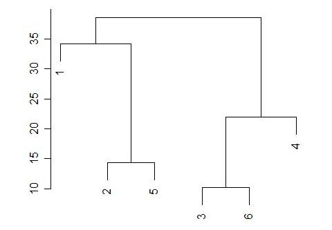
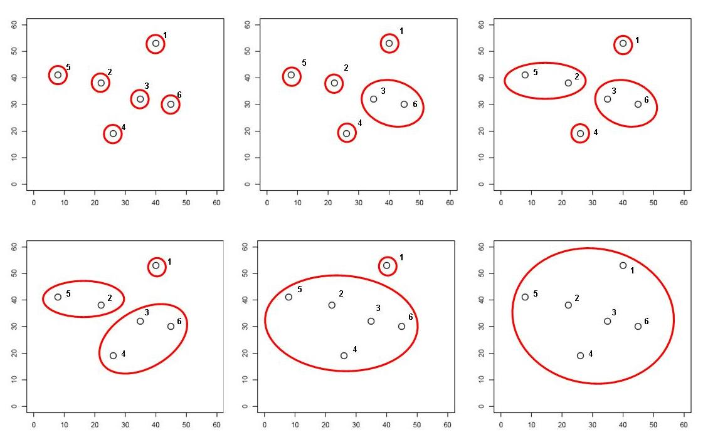

```{r setup, include=FALSE}
knitr::opts_chunk$set(echo = TRUE)
library("knitcitations")
cleanbib()
options("citation_format" = "pandoc")
```

# Методы построения деревьев

Существует много методов классификации. Их можно разделить на две основные группы (хотя есть много других вариантов)

__Методы класстеризации на основании расстояний:__

- Метод ближайшего соседа
- Метод отдаленного соседа
- Метод среднегруппового расстояния
- Метод Варда
- и т.д. и т.п.

__ Методы кластеризации на основании признаков:__

- Метод максимальной бережливости
- Метод максимального правдоподобия

В этом курсе мы будем затрагивать только методы иерархической класстеризации на основании расстояний.

Классификация данных проходит в несколько этапов. Рзультат кластеризации будет сильнее всего зависеть (1) от выбора коэффициента сходства-различия и (2) от алгоритма кластеризации. Нет формальных способов выбрать наиболее подходящий коэффициент и алгоритм.

```{r echo=FALSE, fig.width=10, fig.height=6, cache=FALSE}
library(DiagrammeR)
DiagrammeR("images/clust-stages.gv", type = "grViz")
```

# Коэффициенты сходства-различия

## Евклидово расстояние

## Коэффициент Жаккара

## Расстояние на основе коэффициента корреляции

# Алгоритмы иерархической класстеризации на основании расстояний

Мы рассмотрим несколько алгоритмов, которые строят иерархическую кластеризацию объектов на основании матрицы расстояний / сходств между ними:

- Метод ближайшего соседа
- Метод отдаленного соседа
- Метод среднегруппового расстояния
- Метод Варда

```{r, echo=FALSE, fig.height=6, message=FALSE }
library(ggplot2)
library(gridExtra)
theme_set(theme_bw())
cl_dat <- data.frame(cl = c(rep("A", 5), rep("B", 4)), 
           x = c(1, 2.7, 2, 1.5, 2, 5, 6, 5.5, 5.8),
           y = c(1, 1.2, 3, 2, 1.5, 1.2, 1, 3, 2))

segm_between <- function(ind1, ind2, dat){
i_betw <- expand.grid(ind1, ind2)
segm <- lapply(1:nrow(i_betw), function(i) cbind(dat[i_betw[i, 1], ], dat[i_betw[i, 2], ]))
segm <- Reduce(rbind, segm)
colnames(segm) <- c("x", "y", "xend", "yend")
return(segm)
}

segm_within <- function(ind1, ind2, dat){
  # for ward
  dat1 <- dat[ind1, ]
  dat2 <- dat[ind2, ]
with1 <- segm_between(1:nrow(dat1), nrow(dat1)+1, rbind(dat1, colMeans(dat1)))
with2 <- segm_between(1:nrow(dat2), nrow(dat2)+1, rbind(dat2, colMeans(dat2)))
segm <- rbind(with1, with2)
return(segm)
}

betw_segm <- segm_between(1:5, 6:9, cl_dat[, 2:3])
with_segm <- segm_within(1:5, 6:9, cl_dat[, 2:3])

library(dplyr)
cl_means <- cl_dat %>% group_by(cl) %>% summarise(
  x = mean(x), y = mean(y)
)
betw <- as.matrix(dist(cl_dat[, 2:3]))[6:9, 1:5]
# which.min(betw)
# which.max(betw)
th <- theme_classic() + theme(axis.line = element_blank(), axis.title = element_blank(), axis.ticks = element_blank(), axis.text = element_blank(), legend.position = "none")

gg <- ggplot(cl_dat, aes(x = x, y = y, colour = cl)) + geom_point() + stat_ellipse(level = 0.8) + geom_point(data = cl_means, size = 4, shape = 5) + th

gg_single <- gg +  annotate(geom = "segment", x = 2.7, y = 1.2, xend = 5, yend = 1.2, colour = "grey60")

gg_complete <- gg +  annotate(geom = "segment", x = 1, y = 1, xend = 6, yend = 1, colour = "grey60")

gg_average <- gg + geom_segment(data = betw_segm, aes(x = x, y = y, xend = xend, yend = yend, colour = NULL), colour = "grey60")

gg_ward <- gg + geom_segment(data = with_segm, aes(x = x, y = y, xend = xend, yend = yend, colour = NULL), colour = "grey60")

grid.arrange(gg_single + ggtitle("Метод ближайшего соседа"), gg_complete + ggtitle("Метод отдаленного соседа"), gg_average + ggtitle("Метод среднегруппового расстояния"), gg_ward + ggtitle("Метод Варда"), ncol = 2)
```


## Метод ближайшего соседа (= nearest neighbour = single linkage)

- к кластеру присоединяется ближайший к нему кластер/объект
- кластеры объединяются в один на расстоянии, которое равно расстоянию между ближайшими объектами этих кластеров

```{r, echo=FALSE, fig.width=4.5, fig.height=3.5}
gg_single
```

Особенности:

- Может быть сложно интерпретировать, если нужны группы
  - объекты на дендрограмме часто не образуют четко разделенных групп
  - часто получаются цепочки кластеров (объекты присоединяются как бы по-одному)
- Хорош для выявления градиентов

Работа метода ближайшего соседа


<small>http://www-m9.ma.tum.de/material/felix-klein/clustering/Methoden/Hierarchisches_Clustern_Beispiel.php</small>

## Метод отдаленного соседа (= furthest neighbour = complete linkage)


```{r, echo=FALSE, fig.width=4.5, fig.height=3.5}
gg_complete
```

- к кластеру присоединяется отдаленный кластер/объект
- кластеры объединяются в один на расстоянии, которое равно расстоянию между самыми отдаленными объектами этих кластеров (следствие - чем более крупная группа, тем сложнее к ней присоединиться)

Особенности:

- На дендрограмме образуется много отдельных некрупных групп
- Хорош для поиска дискретных групп в данных

Как работает метод отдаленного соседа




<small>http://www-m9.ma.tum.de/material/felix-klein/clustering/Methoden/Hierarchisches_Clustern_Beispiel.php</small>

## Метод невзвешенного попарного среднего (= UPGMA = Unweighted Pair Group Method with Arithmetic mean)

- кластеры объединяются в один на расстоянии, которое равно среднему значению всех возможных расстояний между объектами из разных кластеров.

```{r, echo=FALSE, fig.width=4.5, fig.height=2.5}
gg_average
```

Особенности:

- UPGMA и WUPGMС иногда могут приводить к инверсиям на дендрограммах


<small>из Borcard et al., 2011</small>

Как работает метод среднегруппового расстояния




<small>http://www-m9.ma.tum.de/material/felix-klein/clustering/Methoden/Hierarchisches_Clustern_Beispiel.php</small>

## Метод Варда (= Ward's Minimum Variance Clustering)

```{r, echo=FALSE, fig.width=4.5, fig.height=3.5}
gg_ward
```

- объекты объединяются в кластеры так, чтобы внутригрупповая дисперсия расстояний была минимальной

Особенности:

- метод годится и для неевклидовых расстояний несмотря на то, что внутригрупповая дисперсия расстояний рассчитывается так, как будто это евклидовы расстояния

# Кластерный анализ в R

## Пример: Ирисы

```{r}
data("iris")
```

Давайте познакомимся с данными.

```{r}
dim(iris)
colnames(iris)
head(rownames(iris))
```

Делаем осмысленные имена строк

```{r}
Species <- substr(iris$Species, 0, 2)
rownames(iris) <- make.unique(Species)
```

Делаем случайную выборку для этой демонстрации

```{r}
set.seed(191231)
ids <- sample(nrow(iris), 50)
siris <- iris[ids, ]
```

Давайте построим деревья при помощи нескольких алгоритмов кластеризации (по стандартизованным данным, с использованием Евклидова расстояния) и сравним их. Нам понадобится матрица расстояний.

```{r}
d <- dist(x = siris[, -5], method = "euclidean")
```

## Метод ближайшего соседа в R

```{r fig.height=5, fig.width=10}
hc_single <- hclust(d, method = "single")
```

Визуализируем при помощи базовой графики

```{r}
plot(hc_single)
```

Визуализируем средствами пакета `ape` `r citep(citation("ape"))`.

```{r}
library(ape)
ph_single <- as.phylo(hc_single)
plot(ph_single, type = "phylogram", cex = 0.7)
axisPhylo()
```

Визуализируем средствами `dendextend` `r citep(citation("dendextend"))`.

```{r message=FALSE}
library(dendextend)
den_single <- as.dendrogram(hc_single)
plot(den_single)
```


## Метод отдаленного соседа в R

```{r  fig.height=5, fig.width=10}
hc_compl <- hclust(d, method = "complete")
ph_compl <- as.phylo(hc_compl)
plot(ph_compl, type = "phylogram", cex = 0.7)
axisPhylo()
```

Визуализируем дерево, полученное методом отдаленного соседа, средствами `dendextend`

```{r}
den_compl <- as.dendrogram(hc_compl)
plot(den_compl)
```

## Метод невзвешенного попарного среднего в R

```{r  fig.height=5, fig.width=10}
hc_avg <- hclust(d, method = "average")
ph_avg <- as.phylo(hc_avg)
plot(ph_avg, type = "phylogram", cex = 0.7)
axisPhylo()
```

Визуализируем дерево, полученное методом невзвешенного попарного среднего, средствами `dendextend`

```{r}
den_avg <- as.dendrogram(hc_avg)
plot(den_avg)
```

## Метод Варда в R

```{r  fig.height=5, fig.width=10}
hc_w2 <-hclust(d, method = "ward.D2")
ph_w2 <- as.phylo(hc_w2)
plot(ph_w2, type = "phylogram", cex = 0.7)
axisPhylo()
```

Визуализируем дерево, полученное методом Варда, средствами `dendextend`

```{r}
den_w2 <- as.dendrogram(hc_w2)
plot(den_w2)
```


# Оценка качества кластеризации

## Кофенетическая корреляция

Кофенетическое расстояние - расстояние между объектами на дендрограмме

Кофенетическую корреляцию можно рассчитать как пирсоновскую корреляцию (обычную) между матрицами исходных и кофенетических расстояний между всеми парами объектов 

Метод, который дает наибольшую кофенетическую корреляцию дает кластеры лучше всего отражающие исходные данные

Можно рассчитать при помощи функции из пакета `ape`

### Кофенетическая корреляция в R

```{r}
c_single <- cophenetic(ph_single)
c_compl <- cophenetic(ph_compl)
c_avg <- cophenetic(ph_avg)
c_w2 <- cophenetic(ph_w2)

cor(d, as.dist(c_single))
cor(d, as.dist(c_compl))
cor(d, as.dist(c_avg))
cor(d, as.dist(c_w2))
```

### Задание:

Оцените при помощи кофенетической корреляции качество кластеризаций, полученных разными методами.

Какой метод дает лучший результат?

## Качество и количество кластеров

На каком уровне нужно делить дендрограмму на кластеры?

- Можно субъективно, на любом выбранном уровне. Главное, чтобы кластеры были осмысленными и интерпретируемыми.
- Можно выбрать, глядя на распределение расстояний ветвления
- Можно оценить стабильность кластеризации при помощи бутстрепа и выбрать оптимальное число кластеров.

### Стабильность кластеров

На хорошей кластеризации кластеры должны воспроизводиться.

Оптимальное число кластеров можно определить рассчитывая меру нестабильности для каждой из выборок бутстрепа (Fang and Wang (2012))

Много раз берем по 2 выборки бутстрепом, и оцениваем стабильность.

Здесь мы используем всего 300 итераций. Для реальной жизни нужно 1000 и больше.

```{r}
library(fpc)
```

```{r nsel, cache=TRUE}
nsel <- nselectboot(d, B = 300, clustermethod = hclustCBI, seed = 9646, method = "complete", krange=3:11)
```

Оптимальное число кластеров --- с минимальным значением нестабильности

```{r fig.height}
nsel$kopt # оптимальное число кластеров
nsel$stabk # средние значения нестабильности
```

Чтобы легче было выбирать, и чтобы понять, что происходит, изобразим значения нестабильности на графике

```{r}
plot(1:11, nsel$stabk)
# nsel$stab # матрица с результатами бутстрепа
```

## Ширина силуэта

Ширина силуэта --- мера степени принадлежности объекта к кластеру. Это среднее расстояние от данного объекта до других объектов из того же кластера, в сравнении с аналогичной величиной для ближайшего кластера.

Чем больше, тем лучше

Оценим ширину силуэта для 3 или 6 кластеров

```{r}
complete3 <- cutree(hclust(d), 3)
qual3<- cluster.stats(d, complete3)
qual3$clus.avg.silwidths

complete6 <- cutree(hclust(d), 6)
qual6<- cluster.stats(d, complete6)
qual6$clus.avg.silwidths

mean(qual3$clus.avg.silwidths); mean(qual6$clus.avg.silwidths)
```

## Бутстреп поддержка ветвей

"An approximately unbiased test of phylogenetic tree selection" (Shimodaria, 2002)

Этот тест использует специальный вариант бутстрепа --- multiscale bootstrap. Мы не просто многократно берем бутстреп-выборки и оцениваем для них вероятность получения топологий (BP p-value), эти выборки еще и будут с разным числом объектов. По изменению BP при разных объемах выборки можно вычислить AU (approximately unbiased p-value). 

```{r}
library(pvclust)
```

```{r pvclust, cache=TRUE}
# итераций должно быть 1000 и больше, здесь мало для скорости
set.seed(42)
cl_boot <- pvclust(t(siris[, -5]), method.hclust = "average", nboot = 100, method.dist = "euclidean")
```

Дерево с величинами поддержки

AU --- approximately unbiased p-values (красный),
BP --- bootstrap p-values (зеленый)

```{r fig.width=10, fig.height=6}
plot(cl_boot)
# pvrect(cl_boot) # достоверные ветвления
```

Для диагностики качества оценок AU нам понадобится график стандартных ошибок для AU p-value. Он нужен, чтобы оценить точность оценки самих AU. Чем больше было бутстреп-итераций, тем точнее будет оценка.

```{r}
seplot(cl_boot, cex = 0.5)
# print(cl_boot) # все значения
```

# Сопоставление деревьев: Танглграммы

## Танглграмма

Два дерева (с непохожим ветвлением) выравнивают, вращая случайным образом ветви вокруг оснований. Итеративный алгоритм. Картина каждый раз разная.

```{r tang}
set.seed(395)
untang_w <- untangle_step_rotate_2side(den_compl, den_w2, print_times = F)

# танглграмма
tanglegram(untang_w[[1]], untang_w[[2]],
           highlight_distinct_edges = FALSE,
           common_subtrees_color_lines = F,
           main = "Tanglegram",
           main_left = "Left tree",
           main_right = "Right tree",
           columns_width = c(8, 1, 8),
           margin_top = 3.2, margin_bottom = 2.5,
           margin_inner = 4, margin_outer = 0.5,
           lwd = 1.2, edge.lwd = 1.2, 
           lab.cex = 1, cex_main = 1)
```


### Задание

Постройте танглграмму из дендрограмм, полученных методом ближайшего соседа и методом Варда.


# Тепловые карты экспрессии.


```{r message=FALSE}
library(gplots) # для тепловых карт
```

## Палитры для тепловых карт

```{r}
# library(RColorBrewer)
pal_green <- colorpanel(75, low = "black", mid = "darkgreen", high = "yellow")
# library(spatstat) # to convert palette to grayscale
# pal_gray <- to.grey(pal_green, weights=c(1,1,1))
```

```{r, fig.height=9}
dat <- as.matrix(siris[, -5])
heatmap.2(dat, col=pal_green, scale = "none", key=TRUE, symkey=FALSE, density.info="none", trace="none", cexRow=1, cexCol = 1, keysize = 1, margins = c(8, 5))

heatmap.2(dat, col=pal_green, scale = "none", key=TRUE, symkey=FALSE, density.info="none", trace="none", cexRow=1, cexCol = 1, keysize = 1, margins = c(8, 5), key.par = list(mgp = c(1.5, 0.9, 0), mar = c(3, 1, 3, 0.1), cex = 1), key.title = NA, key.xlab = NA)
```

Еще один вариант

```{r}
library(NMF)
aheatmap(dat, color = "-RdBu:256", annRow = siris[, 5])
```


## Ссылки

```{r include=FALSE}
write.bibtex(file="bibs/03_packages.bib")
```
