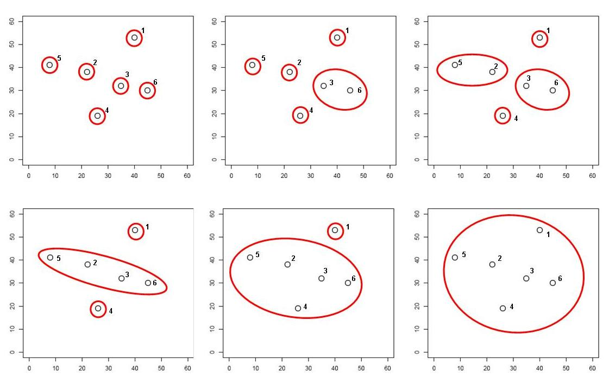
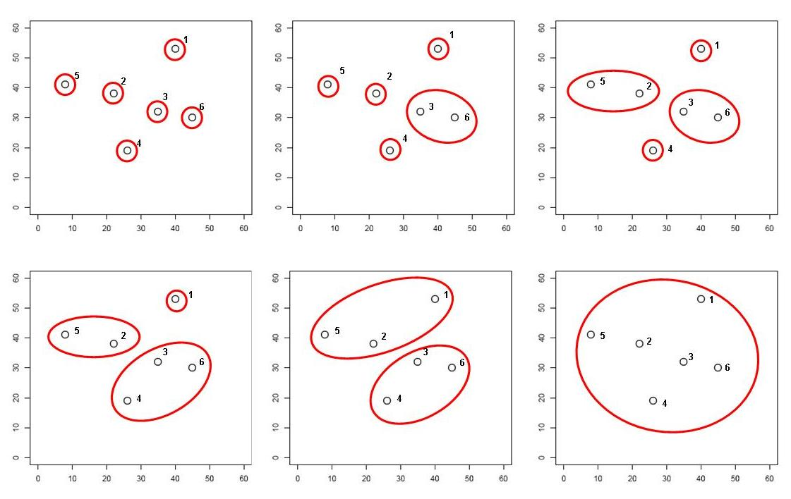
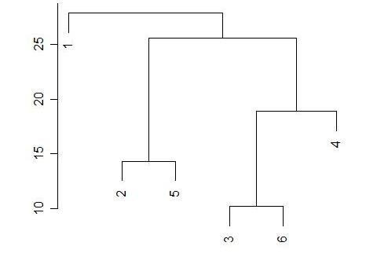

```{r setup, include=FALSE}
knitr::opts_chunk$set(echo = TRUE)
library("knitcitations")
cleanbib()
options("citation_format" = "pandoc")
```

---

В этом разделе мы поговорим о том, как делать кластерный анализ и строить тепловые карты экспрессии в R `r citep(citation())`.

- [Код к этому занятию](https://raw.githubusercontent.com/varmara/proteomics-course/gh-pages/03_classification.R)
- Данные [@artigaud_proteomic_2015]:
    - [Prot_Br_H_T.csv](https://raw.githubusercontent.com/varmara/proteomics-course/gh-pages/data/Prot_Br_H_T.csv)
    - [Prot_Br_H_T_factor.csv](https://raw.githubusercontent.com/varmara/proteomics-course/gh-pages/data/Prot_Br_H_T_factor.csv)
- Пакеты (инсталлируйте при необходимости)

```{r eval=FALSE}
# Из репозитория CRAN
install.packages(c("dendextend", "ape", "fpc", "pvclust", "gplots", "NMF"), dependencies = TRUE)
```

---

# Методы построения деревьев

Существует много методов классификации. Их можно разделить на две основные группы (хотя есть много других вариантов деления):

__Методы класстеризации на основании расстояний:__

- Метод ближайшего соседа
- Метод отдаленного соседа
- Метод среднегруппового расстояния
- Метод Варда
- и т.д. и т.п.

__Методы кластеризации на основании признаков:__

- Метод максимальной бережливости
- Метод максимального правдоподобия

В этом курсе мы будем затрагивать только методы иерархической класстеризации на основании расстояний.

Классификация данных проходит в несколько этапов. Рзультат кластеризации будет сильнее всего зависеть (1) от выбора коэффициента сходства-различия и (2) от алгоритма кластеризации. Нет формальных способов выбрать наиболее подходящий коэффициент и алгоритм.

```{r echo=FALSE, fig.width=6, fig.height=4, cache=FALSE}
library(DiagrammeR)
DiagrammeR("images/clust-stages.gv", type = "grViz")
```

# Коэффициенты сходства-различия

Различия

$d \ge 0$
```{r echo=FALSE, fig.width=4.5, fig.height=0.5}
library(DiagrammeR)
DiagrammeR("images/dist.gv", type = "grViz")
```

Сходства 

$0 \le S \le 1$ или $-1 \le S \le 1$

```{r echo=FALSE, fig.width=4.5, fig.height=0.5}
DiagrammeR("images/sim.gv", type = "grViz")
```

- Используются в качестве исходных данных для многих видов многомерных анализов, в т.ч. для иерархического кластерного анализа
- Из сходств можно получить различия и наоборот
- Свои собственные коэффициенты существуют для количественных и качественных признаков

## Евклидово расстояние

```{r echo=FALSE, message=FALSE, fig.width=4, fig.height=3}
dat <- data.frame(X1 = c(5, 2), X2 = c(1, 4))
library(ggplot2)
theme_set(theme_linedraw())
ggplot(dat, aes(x = X1, y = X2)) + geom_point(size = 6, colour = "steelblue") + scale_x_continuous(breaks = 0:6) + scale_y_continuous(breaks = 0:6) + coord_fixed(expand = 0, xlim = c(0, 6), ylim = c(0, 6)) + geom_line() + geom_segment(aes(xend = c(0, 0), yend = X2), linetype = "dashed") + geom_segment(aes(xend = X1, yend = c(0, 0)), linetype = "dashed") + geom_text(aes(label = paste0("(", X1, ", ", X2, ")")), hjust = 0, vjust = -1)
```

Для двумерного пространства Евклидово расстояние рассчитывается так:

```{r echo=FALSE, fig.width=2, fig.height=0.4}
ggplot() + annotate(geom = "text", x = 0, y = 0, label = "d == sqrt((x[11] - x[12])^{2} + (x[21] - x[22])^{2}) ", parse = TRUE, size = 4) + theme_void()
```

Т.е. Евклидово расстояние в этом гипотетическом примере будет

```{r echo=FALSE, fig.width=2, fig.height=0.4}
ggplot() + annotate(geom = "text", x = 0, y = 0, label = "sqrt((5 - 2)^{2} + (4 - 1)^{2})==4.24", parse = TRUE, size = 4) + theme_void()
```

Для пространства с большим числом измерений формула Евклидова расстояния выглядит так:

```{r echo=FALSE, fig.width=2, fig.height=0.4}
ggplot() + annotate(geom = "text", x = 0, y = 0, label = "d == sqrt(sum((X[ik] - X[jk]))^{2})", parse = TRUE, size = 4) + theme_void()
```

Евклидово расстояние --- это метрика.

Для всех метрик (расстояний) справедливы три свойства:

1) Адекватность: 

$$d_{A, A} = 0$$

```{r, echo=FALSE, fig.width=4, fig.height=.5}
DiagrammeR("images/adequa.gv", type = "grViz")
```

2) Симметричность: 

$$d_{A, B} = d_{B, A}$$

```{r, echo=FALSE, fig.width=4, fig.height=.5}
# DiagrammeR("images/symmetry.mmd")
DiagrammeR("images/symmetry.gv", type = "grViz")
```

3) Триангулярность: 

$$d_{A, B} \le d_{A, C} + d_{C, B}$$

__Триангулярность есть только у метрик!__ Именно потому, что для них выполняется неравенство треугольника, они имеют право называться __расстояниями__, а не просто мерами различия.

```{r, echo=FALSE, fig.width=4, fig.height=1}
DiagrammeR("images/triang.gv", type = "grViz")
```

## Коэффициент Жаккара

Если используются бинарные данные - то посчитать сходство можно, учитывая присутствие-отсутствие признаков.

| объект I / объект J | признак есть | признака нет |
| ----- |-----|-----|
| признак есть | a | b |
| признака нет | c | d |

- $I$, $J$ --- объекты
- $a$ --- число сходств по наличию признака
- $b$ --- число отличий $I$ от $J$
- $c$ --- число различий $J$ от $I$
- $d$ --- число сходств по отсутствию признака
- $n_J$ --- число признаков у объекта $J$
- $n_I$ --- число признаков у объекта $I$
- $n = a + b + c + d$ --- общее число признаков

Коэффициентов сходства-различия для качественных данных придумано великое множество.

Коэффициент Жаккара рассчитывается по формуле:

$S = a / (a + b + c)$, причем $0 \le S \le 1$

Соответствующий коэффициент различия Жаккара можно посчитать так:

$d = 1 - a / (a + b + c) = (b + c) / (a + b + c)$

У коэффициента Жаккара есть одно забавное свойство. Обратите внимание, в знаменателе фигурирует не общее число признаков --- сходство по отсутствию не учитывается! Это свойство очень полезно для работы с протеомными данными. Пятно может отсутствовать на геле не только потому, что пептида не было в пробе, но и в силу самых разных других причин (например, экспрессия ниже порога определения, плохо прокрашен образец и проч.).

Например, пусть у нас есть три пробы, у которых мы нашли всего 5 пятен. 

```{r echo=FALSE, results='asis'}
library(knitr)
tab <- data.frame(Objects = paste("Object ", 1:3), 
                  'Spot 1' = c(1, 1, 0),
                  'Spot 2' = c(1, 1, 0),
                  'Spot 3' = c(0, 1, 0),
                  'Spot 4' = c(1, 1, 1),
                  'Spot 5' = c(0, 0, 0))
kable(tab, format = "markdown")
```

Чтобы оценить различие между этими пробами, можно посчитать коэффициент Жаккара.

```{r echo=FALSE, results='asis'}
djac_samples <- as.data.frame(as.matrix(round(dist(tab[, -1], method = "binary"), 2)))
colnames(djac_samples) <- rownames(djac_samples) <- paste0("Object ", 1:3)
kable(djac_samples, format = "markdown")
```

Точно так же, чтобы оценить различие пептидов, можно посчитать коэффициент Жаккара между пептидами

```{r echo=FALSE, results='asis'}
djac_spot <- as.data.frame(as.matrix(round(dist(t(tab[, -1]), method = "binary"), 2)))
colnames(djac_spot) <- rownames(djac_spot) <- paste0("Spot ", 1:5)
kable(djac_spot, format = "markdown")
```

# Алгоритмы иерархической класстеризации на основании расстояний

Мы рассмотрим несколько алгоритмов, которые строят иерархическую кластеризацию объектов на основании матрицы расстояний / сходств между ними:

- Метод ближайшего соседа
- Метод отдаленного соседа
- Метод среднегруппового расстояния
- Метод Варда

```{r, echo=FALSE, fig.height=5, message=FALSE }
library(ggplot2)
library(gridExtra)
theme_set(theme_bw())
cl_dat <- data.frame(cl = c(rep("A", 5), rep("B", 4)), 
           x = c(1, 2.7, 2, 1.5, 2, 5, 6, 5.5, 5.8),
           y = c(1, 1.2, 3, 2, 1.5, 1.2, 1, 3, 2))

segm_between <- function(ind1, ind2, dat){
i_betw <- expand.grid(ind1, ind2)
segm <- lapply(1:nrow(i_betw), function(i) cbind(dat[i_betw[i, 1], ], dat[i_betw[i, 2], ]))
segm <- Reduce(rbind, segm)
colnames(segm) <- c("x", "y", "xend", "yend")
return(segm)
}

segm_within <- function(ind1, ind2, dat){
  # for ward
  dat1 <- dat[ind1, ]
  dat2 <- dat[ind2, ]
with1 <- segm_between(1:nrow(dat1), nrow(dat1)+1, rbind(dat1, colMeans(dat1)))
with2 <- segm_between(1:nrow(dat2), nrow(dat2)+1, rbind(dat2, colMeans(dat2)))
segm <- rbind(with1, with2)
return(segm)
}

betw_segm <- segm_between(1:5, 6:9, cl_dat[, 2:3])
with_segm <- segm_within(1:5, 6:9, cl_dat[, 2:3])

library(dplyr)
cl_means <- cl_dat %>% group_by(cl) %>% summarise(
  x = mean(x), y = mean(y)
)
betw <- as.matrix(dist(cl_dat[, 2:3]))[6:9, 1:5]
# which.min(betw)
# which.max(betw)
th <- theme_classic() + theme(axis.line = element_blank(), axis.title = element_blank(), axis.ticks = element_blank(), axis.text = element_blank(), legend.position = "none")

gg <- ggplot(cl_dat, aes(x = x, y = y, colour = cl)) + geom_point() + stat_ellipse(level = 0.8) + geom_point(data = cl_means, size = 4, shape = 5) + th

gg_single <- gg +  annotate(geom = "segment", x = 2.7, y = 1.2, xend = 5, yend = 1.2, colour = "grey60")

gg_complete <- gg +  annotate(geom = "segment", x = 1, y = 1, xend = 6, yend = 1, colour = "grey60")

gg_average <- gg + geom_segment(data = betw_segm, aes(x = x, y = y, xend = xend, yend = yend, colour = NULL), colour = "grey60")

gg_ward <- gg + geom_segment(data = with_segm, aes(x = x, y = y, xend = xend, yend = yend, colour = NULL), colour = "grey60")

grid.arrange(gg_single + ggtitle("Метод ближайшего соседа"), gg_complete + ggtitle("Метод отдаленного соседа"), gg_average + ggtitle("Метод среднегруппового расстояния"), gg_ward + ggtitle("Метод Варда"), ncol = 2)
```


## Метод ближайшего соседа (= nearest neighbour = single linkage)

- к кластеру присоединяется ближайший к нему кластер/объект
- кластеры объединяются в один на расстоянии, которое равно расстоянию между ближайшими объектами этих кластеров

```{r, echo=FALSE, fig.width=4.5, fig.height=2.5}
gg_single + ggtitle("Метод ближайшего соседа")
```

Особенности:

- Может быть сложно интерпретировать, если нужны группы
  - объекты на дендрограмме часто не образуют четко разделенных групп
  - часто получаются цепочки кластеров (объекты присоединяются как бы по-одному)
- Хорош для выявления градиентов

Работа метода ближайшего соседа




<small>http://www-m9.ma.tum.de/material/felix-klein/clustering/Methoden/Hierarchisches_Clustern_Beispiel.php</small>

## Метод отдаленного соседа (= furthest neighbour = complete linkage)

- к кластеру присоединяется отдаленный кластер/объект
- кластеры объединяются в один на расстоянии, которое равно расстоянию между самыми отдаленными объектами этих кластеров (следствие - чем более крупная группа, тем сложнее к ней присоединиться)

```{r, echo=FALSE, fig.width=4.5, fig.height=2.5}
gg_complete + ggtitle("Метод отдаленного соседа")
```

Особенности:

- На дендрограмме образуется много отдельных некрупных групп
- Хорош для поиска дискретных групп в данных

Как работает метод отдаленного соседа




<small>http://www-m9.ma.tum.de/material/felix-klein/clustering/Methoden/Hierarchisches_Clustern_Beispiel.php</small>

## Метод невзвешенного попарного среднего (= UPGMA = Unweighted Pair Group Method with Arithmetic mean)

- кластеры объединяются в один на расстоянии, которое равно среднему значению всех возможных расстояний между объектами из разных кластеров.

```{r, echo=FALSE, fig.width=4.5, fig.height=2.5}
gg_average + ggtitle("Метод среднегруппового расстояния")
```

Особенности:

- UPGMA и WUPGMС иногда могут приводить к инверсиям на дендрограммах


<small>из Borcard et al., 2011</small>

Как работает метод среднегруппового расстояния




<small>http://www-m9.ma.tum.de/material/felix-klein/clustering/Methoden/Hierarchisches_Clustern_Beispiel.php</small>

## Метод Варда (= Ward's Minimum Variance Clustering)

- объекты объединяются в кластеры так, чтобы внутригрупповая дисперсия расстояний была минимальной

```{r, echo=FALSE, fig.width=4.5, fig.height=2.5}
gg_ward + ggtitle("Метод Варда")
```

Особенности:

- метод годится и для неевклидовых расстояний несмотря на то, что внутригрупповая дисперсия расстояний рассчитывается так, как будто это евклидовы расстояния

# Кластерный анализ в R

## Пример: Гребешки

```{r}
expr <- read.table("data/Prot_Br_H_T.csv", header = TRUE, sep = ";", row.names = 1)

fact <- read.table("data/Prot_Br_H_T_factor.csv", header = TRUE, sep = ";", row.names = 1)

```

Давайте познакомимся с данными.

Все ли правильно открылось?

```{r}
head(expr, 2)
dim(expr)
sapply(expr, class)

head(fact)
dim(fact)
sapply(fact, class)
```

Сколько экспериментальных групп? И каковы объемы выборок?

```{r}
table(fact$Oxygen, fact$Temperature)
```

Есть ли пропущенные значения экспрессии?

```{r}
sapply(expr, function(x)sum(is.na(x)))
```

Нужна ли нормализация?

Боксплот исходных данных экспрессии

```{r}
# создаем палитру и вектор цветов
library(RColorBrewer)
pal <- brewer.pal(9, "Set1")
groups <- interaction(fact$Oxygen, fact$Temperature)
cols <- pal[groups]
# боксплот
boxplot(expr, outline = FALSE, notch = T, col = cols, main = "Исходные данные")
legend("topright", levels(groups), fill = brewer.pal(9, "Set1"), bty = "n", xpd = T)
```


RI-plot исходных данных 

Создадим пользовательскую функцию для построения RI-плота.

```{r}
RIP <- function(X1, X2, main = "RI-plot", pch = 19, col = "darkgreen", lpars = list(col = "blue", lwd = 2), alpha = 0.3, xlab = "Intensity", ylab = "Ratio", ...){
  # соотношение и интенсивность
  R <- log2(rowMeans(X2) / rowMeans(X1))
  I <- log10(rowMeans(X2) * rowMeans(X1))
  # прозрачный цвет
  col_btransp <- adjustcolor(col, alpha.f = alpha)
  # график
  scatter.smooth(I, R, main = main, pch = pch, xlab = xlab, ylab = ylab, col = col_btransp, lpars = lpars, ...)
  abline(h = 0)
}
```

Строим RI-plot'ы по разным факторам и ужасаемся

```{r}
RIP(expr[, fact$Oxygen == "Normox"], expr[, fact$Oxygen == "Hypox"], main = "Raw data, Normox vs. Hypox")
RIP(expr[, fact$Temperature == "10C"], expr[, fact$Temperature == "18C"], main = "Raw data, 10C vs 18C")
RIP(expr[, fact$Temperature == "10C"], expr[, fact$Temperature == "25C"], main = "Raw data, 10C vs 25C")
```

Данные не нормализованы и не логарифмированы.

Нормализуем данные

```{r}
library(limma)
expr_norm <- normalizeQuantiles(expr)
```

Проверяем на боксплоте

```{r}
boxplot(expr_norm, outline = FALSE, notch = T, col = cols, main = "Нормализованные данные")
legend("topright", levels(groups), fill = brewer.pal(9, "Set1"), bty = "n", xpd = T)
```

Строим RI-plot'ы по разным факторам и радуемся

```{r}
RIP(expr_norm[, fact$Oxygen == "Normox"], 
    expr_norm[, fact$Oxygen == "Hypox"], 
    main = "Normalized data, Normox vs. Hypox")
RIP(expr_norm[, fact$Temperature == "10C"], 
    expr_norm[, fact$Temperature == "18C"], 
    main = "Normalized data, 10C vs 18C")
RIP(expr_norm[, fact$Temperature == "10C"], 
    expr_norm[, fact$Temperature == "25C"], 
    main = "Normalized data, 10C vs 25C")
```

Логарифмируем данные

```{r}
expr_log <- log2(expr_norm)
```

## Подготовка данных к кластерному анализу

Названия проб в этом файле --- длинные непонятные аббревиатуры.

```{r}
colnames(expr_log)
```

Вместо них нужно создать осмысленные и краткие лейблы для проб.

Информацию о лейблах возьмем из датафрейма с факторами

```{r}
head(fact)
```

Кодировку уровня содержания кислорода мы сократим до одной буквы, из температуры уберем $C$, и добавим номер гребешка для уникальности. Затем склеим лейблы из трех частей.

```{r}
part1 <- substr(x = fact$Oxygen, start = 0, stop = 1)
part2 <- substr(x = fact$Temperature, start = 0, stop = 2)
part3 <- rep(1:5, 6)
colnames(expr_log) <- paste(part1, part2, part3, sep = "_")
```

Чтобы строить деревья для проб, нам понадобится транспонировать исходные данные

```{r}
texpr_log <- t(expr_log)
```

Давайте построим деревья при помощи нескольких алгоритмов кластеризации (по стандартизованным данным, с использованием Евклидова расстояния) и сравним их. Нам понадобится матрица расстояний.

```{r}
d <- dist(x = texpr_log, method = "euclidean")
```

## Метод ближайшего соседа в R

```{r fig.height=5, fig.width=10}
hc_single <- hclust(d, method = "single")
```

Деревья можно визуализировать при помощи базовой графики, но у нее довольно мало возможностей для настройки внешнего вида.

```{r}
# ?plot.hclust
plot(hc_single)
```

Визуализируем средствами пакета `ape` `r citep(citation("ape"))`.

```{r}
library(ape)
ph_single <- as.phylo(hc_single)
# ?plot.phylo
plot(ph_single, type = "phylogram", cex = 0.7)
axisPhylo()
```

Визуализируем средствами `dendextend` `r citep(citation("dendextend"))`.

```{r message=FALSE}
library(dendextend)
den_single <- as.dendrogram(hc_single)
# ?plot.dendrogram
op <- par(mar = c(4, 4, 1, 4), cex = 0.7)
plot(den_single, horiz = TRUE)
```

При желании можно раскрасить лейблы

Это можно сделать вручную, просто передав вектор нужных цветов в том порядке, в котором идут лейблы на дендрограмме. Но мы сейчас не будем заниматься ручным подбором порядка цветов. Давайте раскрасим дендрограмму в произвольные цвета, чтобы понять, как это делается.

```{r}
cols <- rainbow(30)
den_single_manual <- color_labels(dend = den_single, col = cols)
plot(den_single_manual, horiz = TRUE)
```

Чтобы не пришлось вручную создавать вектор цветов, можно попробовать при помощи функции вытащить информацию из лейблов на дендрограмме. Эта функция берет дендрограмму, экстрагирует из нее порядок лейблов, берет первые несколько букв в имени лейбла и на основании этого фактора создает вектор цветов.

```{r}
get_colours <- function(dend, n_chars, palette = "Dark2"){
labs <- get_leaves_attr(dend, "label")
group <- substr(labs, start = 0, stop = n_chars)
group <- factor(group)
cols <- brewer.pal(length(levels(group)), name = palette)[group]
return(cols)
}
```

Теперь можно легко раскрасить группы на дендрограмме, ориентируясь на первые несколько символов в названии лейбла.

```{r}
cols <- get_colours(dend = den_single, n_chars = 4)
den_single_c <- color_labels(dend = den_single, col = cols)
plot(den_single_c, horiz = TRUE)
```


## Метод отдаленного соседа в R

```{r  fig.height=5, fig.width=10}
hc_compl <- hclust(d, method = "complete")
ph_compl <- as.phylo(hc_compl)
plot(ph_compl, type = "phylogram", cex = 0.7)
axisPhylo()
```

Визуализируем дерево, полученное методом отдаленного соседа, средствами `dendextend`

```{r}
den_compl <- as.dendrogram(hc_compl)
cols <- get_colours(den_compl, n_chars = 4)
den_compl_c <- color_labels(den_compl, col = cols)
plot(den_compl_c, horiz = TRUE)
```

## Метод невзвешенного попарного среднего в R

```{r  fig.height=5, fig.width=10}
hc_avg <- hclust(d, method = "average")
ph_avg <- as.phylo(hc_avg)
plot(ph_avg, type = "phylogram", cex = 0.7)
axisPhylo()
```

Визуализируем дерево, полученное методом невзвешенного попарного среднего, средствами `dendextend`

```{r}
den_avg <- as.dendrogram(hc_avg)
cols <- get_colours(den_avg, n_chars = 4)
den_avg_c <- color_labels(den_avg, col = cols)
plot(den_avg_c, horiz = TRUE)
```

## Метод Варда в R

```{r  fig.height=5, fig.width=10}
hc_w2 <-hclust(d, method = "ward.D2")
ph_w2 <- as.phylo(hc_w2)
plot(ph_w2, type = "phylogram", cex = 0.7)
axisPhylo()
```

Визуализируем дерево, полученное методом Варда, средствами `dendextend`

```{r}
den_w2 <- as.dendrogram(hc_w2)
cols <- get_colours(den_w2, n_chars = 4)
den_w2_c <- color_labels(den_w2, col = cols)
plot(den_w2_c, horiz = TRUE)
```


# Оценка качества кластеризации

## Кофенетическая корреляция

Кофенетическое расстояние - расстояние между объектами на дендрограмме

Кофенетическую корреляцию можно рассчитать как пирсоновскую корреляцию (обычную) между матрицами исходных и кофенетических расстояний между всеми парами объектов 

Метод, который дает наибольшую кофенетическую корреляцию дает кластеры лучше всего отражающие исходные данные

Можно рассчитать при помощи функции из пакета `ape`

### Кофенетическая корреляция в R

Оцените при помощи кофенетической корреляции качество кластеризаций, полученных разными методами. 
Какой метод дает лучший результат?

```{r}
c_single <- cophenetic(ph_single)
c_compl <- cophenetic(ph_compl)
c_avg <- cophenetic(ph_avg)
c_w2 <- cophenetic(ph_w2)

cor(d, as.dist(c_single))
cor(d, as.dist(c_compl))
cor(d, as.dist(c_avg))
cor(d, as.dist(c_w2))
```


## Качество и количество кластеров

На каком уровне нужно делить дендрограмму на кластеры?

- Можно субъективно, на любом выбранном уровне. Главное, чтобы кластеры были осмысленными и интерпретируемыми.
- Можно выбрать, глядя на распределение расстояний ветвления
- Можно оценить стабильность кластеризации при помощи бутстрепа и выбрать оптимальное число кластеров.

### Стабильность кластеров

На хорошей кластеризации кластеры должны воспроизводиться.

Оптимальное число кластеров можно определить рассчитывая меру нестабильности для каждой из выборок бутстрепа (Fang and Wang (2012))

Много раз берем по 2 выборки бутстрепом, и оцениваем стабильность.

Здесь мы используем всего 1000 итераций. Для реальной жизни нужно больше.

```{r}
library(fpc)
```

```{r nsel, cache=TRUE}
nsel <- nselectboot(d, B = 1000, clustermethod = hclustCBI, seed = 9646, method = "average", krange=2:11)
```

Оптимальное число кластеров --- с минимальным значением нестабильности

```{r fig.height}
nsel$kopt # оптимальное число кластеров
nsel$stabk # средние значения нестабильности
```

Чтобы легче было выбирать, и чтобы понять, что происходит, изобразим значения нестабильности на графике

```{r}
plot(1:11, nsel$stabk)
# nsel$stab # матрица с результатами бутстрепа
```

## Ширина силуэта

Ширина силуэта --- мера степени принадлежности объекта к кластеру.

 <!-- (Kaufman, Rousseeuw 1990)) -->

Ширина силуэта --- это среднее расстояние от данного объекта до других объектов из того же кластера, в сравнении с аналогичной величиной для ближайшего кластера.

Чем больше ширина силуэта, тем лучше.

Оценим ширину силуэта для 3 или 6 кластеров

```{r}
complete3 <- cutree(hclust(d), 3)
qual3<- cluster.stats(d, complete3)
qual3$clus.avg.silwidths

complete6 <- cutree(hclust(d), 6)
qual6<- cluster.stats(d, complete6)
qual6$clus.avg.silwidths

mean(qual3$clus.avg.silwidths); mean(qual6$clus.avg.silwidths)
```

## Бутстреп поддержка ветвей

"An approximately unbiased test of phylogenetic tree selection" (Shimodaria, 2002)

Этот тест использует специальный вариант бутстрепа --- multiscale bootstrap. Мы не просто многократно берем бутстреп-выборки и оцениваем для них вероятность получения топологий (BP p-value), эти выборки еще и будут с разным числом объектов. По изменению BP при разных объемах выборки можно вычислить AU (approximately unbiased p-value). 

```{r}
library(pvclust)
```

```{r pvclust, cache=TRUE}
# итераций должно быть 1000 и больше, здесь мало для скорости
set.seed(42)
cl_boot <- pvclust(expr_log, method.hclust = "average", nboot = 100, method.dist = "euclidean")
```

Дерево с величинами поддержки

AU --- approximately unbiased p-values (красный),
BP --- bootstrap p-values (зеленый)

```{r fig.width=10, fig.height=6}
plot(cl_boot)
# pvrect(cl_boot) # достоверные ветвления
```

Если для кластера AU p-value > 0.95, то нулевую гипотезу о том, что он не существует отвергают на уровне значимости 0.05.

Но сами AU p-values оцениваются при помощи бутстрепа, а значит, тоже не точно. Стандартные ошибки можно оценить чтобы оценить точность оценки самих AU. Для диагностики качества оценок AU нам понадобится график стандартных ошибок для AU p-value. Чем больше было бутстреп-итераций, тем точнее будет оценка.

```{r}
seplot(cl_boot)
# seplot(cl_boot, identify = TRUE)
# print(cl_boot) # все значения
```

Например, для кластера 16 $AU =$ `r round(cl_boot$msfit[[16]]$p[1], 3)`, а ее стандартная ошибка $SE =$ `r round(cl_boot$msfit[[16]]$se[1], 3)`. Это будет значить, что истинное значение AU p-value будет лежать в пределах между `r round(cl_boot$msfit[[16]]$p[1] - 1.96 * cl_boot$msfit[[16]]$se[1], 3)` и `r round(cl_boot$msfit[[16]]$p[1] + 1.96 * cl_boot$msfit[[16]]$se[1], 3)`. Такая оценка значимости не точна, т.к. $0 \le AU\,p\,value \le 1$.

```{r}
print(cl_boot, which = 16)
```

Если повторить бутстреп с большим числом итераций, стандартные ошибки AU p-values уменьшатся.

```{r pvclust1, cache=TRUE}
set.seed(42)
cl_boot <- pvclust(expr_log, method.hclust = "average", nboot = 1000, method.dist = "euclidean")
```
```{r}
seplot(cl_boot)
```

# Сопоставление деревьев: Танглграммы

## Танглграмма

Два дерева (с непохожим ветвлением) выравнивают, вращая случайным образом ветви вокруг оснований. Итеративный алгоритм. Картина каждый раз разная.

```{r tang}
set.seed(395)
untang_w <- untangle_step_rotate_2side(den_compl, den_w2, print_times = F)

# танглграмма
tanglegram(untang_w[[1]], untang_w[[2]],
           highlight_distinct_edges = FALSE,
           common_subtrees_color_lines = F,
           main = "Tanglegram",
           main_left = "Left tree",
           main_right = "Right tree",
           columns_width = c(8, 1, 8),
           margin_top = 3.2, margin_bottom = 2.5,
           margin_inner = 4, margin_outer = 0.5,
           lwd = 1.2, edge.lwd = 1.2, 
           lab.cex = 1, cex_main = 1)
```


# Тепловые карты экспрессии.


```{r message=FALSE}
library(gplots) # для тепловых карт
```

## Палитры для тепловых карт

```{r}
pal_green <- colorpanel(75, low = "black", mid = "darkgreen", high = "yellow")
# library(spatstat) # to convert palette to grayscale
# pal_gray <- to.grey(pal_green, weights=c(1,1,1))
```

```{r, fig.height=9}
dat <- as.matrix(expr_log)
heatmap.2(dat, col=pal_green, scale = "none", key=TRUE, symkey=FALSE, density.info="none", trace="none", cexRow=1, cexCol = 1, keysize = 1, margins = c(8, 5))

heatmap.2(dat, col=pal_green, scale = "none", key=TRUE, symkey=FALSE, density.info="none", trace="none", cexRow=1, cexCol = 1, keysize = 1, margins = c(8, 5), key.par = list(mgp = c(1.5, 0.9, 0), mar = c(3, 1, 3, 0.1), cex = 1), key.title = NA, key.xlab = NA)
```

Еще один вариант

```{r echo=FALSE}
library(NMF)
aheatmap(dat, color = "-RdBu:256", annCol = groups)
```

<!-- # Задания для самостоятельной работы -->

<!-- Для выполнения этих заданий вы можете использовать либо свои собственные данные, либо данные о протеоме жабр гребешков при разной температуре и разном содержании кислорода ([Prot_Br_H_T.csv](https://raw.githubusercontent.com/varmara/proteomics-course/gh-pages/data/Prot_Br_H_T.csv), [Prot_Br_H_T_factor.csv](https://raw.githubusercontent.com/varmara/proteomics-course/gh-pages/data/Prot_Br_H_T_factor.csv))  [@artigaud_proteomic_2015]. -->

<!-- ## Задание 1 -->

<!-- Постройте танглграмму из дендрограмм, полученных методом ближайшего соседа и методом Варда. -->

# Ссылки

```{r include=FALSE}
write.bibtex(file="bibs/03_packages.bib")
```
