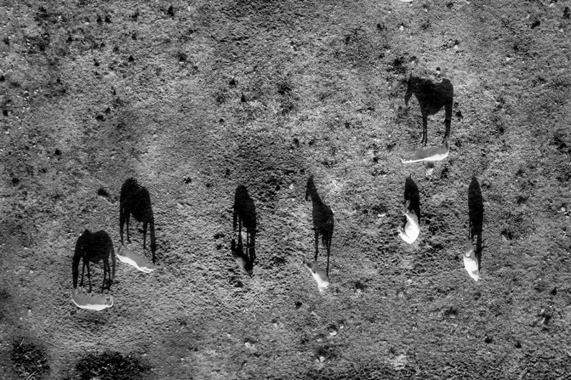

```{css, echo=FALSE}
.spoiler {
  visibility: hidden;
}

.spoiler::before {
  visibility: visible;
  content: "ОТВЕТ (наведите указатель, чтобы увидеть)"
}

.spoiler:hover {
  visibility: visible;
}

.spoiler:hover::before {
  display: none;
}
```

```{r setup, include=FALSE}
knitr::opts_chunk$set(echo = TRUE)
library("knitcitations")
cleanbib()
options("citation_format" = "pandoc")

# Knitr hooks
knitr::knit_hooks$set(
  hide_button = function(before, options, envir) {
    if (is.character(options$hide_button)) {
      button_text = options$hide_button
    } else {
      button_text = "Решение"
    }
    block_label <- paste0("hide_button", options$label)
    if (before) {
      return(paste0(sep = "\n",
                   '<button class="btn btn-primary btn-sm" data-toggle="collapse" data-target="#', block_label, '"> ', button_text, ' </button>\n',
                   '<div id="', block_label, '" class="collapse">\n'))
    } else {
      return("</div><br />\n")
    }
  },
  output = function(x, options){
    x <- gsub(x, pattern = "<", replacement = "&lt;")
    x <- gsub(x, pattern = ">", replacement = "&gt;")
    paste0(
      "<pre class=\"r-output\"><code>",
      fansi::sgr_to_html(x = x, warn = TRUE, term.cap = "256"),
      # ansistrings::ansi_to_html(text = x, fullpage = FALSE),
      "</code></pre>"
    )
  }
)
```

```{r libs-funs, include=FALSE}
library(knitr)

library(DiagrammeR)
library(ggplot2)
library(gridExtra)
theme_set(theme_bw())
library(cowplot)

library(dplyr)

library(vegan)

library(dendextend)

```

---

В этом разделе мы поговорим о том, как делать кластерный анализ и строить тепловые карты экспрессии в R `r citep(citation())`.

- [Код к этому занятию](03_classification1.R)

- Данные о протеоме жабр гребешка _Pecten maximus_ от авторов пакета `prot2D` `r citep(citation("prot2D"))`:
    - [pecten.xlsx](data/pecten.xlsx)
    - [pecten.zip](data/pecten.zip)

- Данные о протеоме сыворотки крови пациентов, страдающих разной степенью гиперплазии предстательной железы, из пакета `digeR` [@fan2009diger]:
    - [prostate.xlsx](data/prostate.xlsx)
    - [prostate.zip](data/prostate.zip)

- Пакеты (инсталлируйте при необходимости)

```{r eval=FALSE}
# Из репозитория CRAN
install.packages(c("dendextend", "ape", "vegan", "pvclust", "gplots", "NMF"), dependencies = TRUE)
```


---

# Многомерные данные

## Облако точек в многомерном пространстве

Когда признаков много, можно представить все объекты как облако точек в многомерном пространстве.


Migration by Don McCullough on [Flickr](https://flic.kr/p/fEFhCj)


Для изображения N объектов в идеале нужно N-1 измерений

- 2 объекта = 1D прямая
- 3 объекта = 2D плоскость
- 4 объекта = 3D объем
- ...
- N объектов = (N-1)-мерное пространство

Многомерное пространство сложно изобразить. Есть два пути:

- Выбрать наиболее информативную проекцию (не все можно хорошо спроецировать).
- Сохранить отношения между объектами (придется исказить расстояния).



black shadows for a white horses / les negres ombres dels cavalls blancs by  Ferran Jordà on [Flickr](https://flic.kr/p/9XJxiL)


# Коэффициенты сходства-различия

Различия

$d \ge 0$
```{r echo=FALSE, fig.width=4.5, fig.height=0.5}
DiagrammeR("images/dist.gv", type = "grViz")
```

Сходства 

$0 \le S \le 1$ или $-1 \le S \le 1$

```{r echo=FALSE, fig.width=4.5, fig.height=0.5}
DiagrammeR("images/sim.gv", type = "grViz")
```

- Используются в качестве исходных данных для многих видов многомерных анализов, в т.ч. для иерархического кластерного анализа
- Из сходств можно получить различия и наоборот
- Свои собственные коэффициенты существуют для количественных и качественных признаков

## Евклидово расстояние

```{r echo=FALSE, message=FALSE, fig.width=4, fig.height=3}
dat <- data.frame(X1 = c(5, 2), X2 = c(1, 4))
theme_set(theme_linedraw())
ggplot(dat, aes(x = X1, y = X2)) + geom_point(size = 6, colour = "steelblue") + scale_x_continuous(breaks = 0:6) + scale_y_continuous(breaks = 0:6) + coord_fixed(expand = 0, xlim = c(0, 6), ylim = c(0, 6)) + geom_line() + geom_segment(aes(xend = c(0, 0), yend = X2), linetype = "dashed") + geom_segment(aes(xend = X1, yend = c(0, 0)), linetype = "dashed") + geom_text(aes(label = paste0("(", X1, ", ", X2, ")")), hjust = 0, vjust = -1)
```

Для двумерного пространства Евклидово расстояние рассчитывается так:

```{r echo=FALSE, fig.width=2, fig.height=0.4}
ggplot() + annotate(geom = "text", x = 0, y = 0, label = "d == sqrt((x[11] - x[12])^{2} + (x[21] - x[22])^{2}) ", parse = TRUE, size = 4) + theme_void()
```

Т.е. Евклидово расстояние в этом гипотетическом примере будет

```{r echo=FALSE, fig.width=2, fig.height=0.4}
ggplot() + annotate(geom = "text", x = 0, y = 0, label = "sqrt((5 - 2)^{2} + (4 - 1)^{2})==4.24", parse = TRUE, size = 4) + theme_void()
```

Для пространства с большим числом измерений формула Евклидова расстояния выглядит так:

```{r echo=FALSE, fig.width=2, fig.height=0.4}
ggplot() + annotate(geom = "text", x = 0, y = 0, label = "d == sqrt(sum((X[ik] - X[jk]))^{2})", parse = TRUE, size = 4) + theme_void()
```

Евклидово расстояние --- это метрика.

Для всех метрик (расстояний) справедливы три свойства:

1) Адекватность: 

$$d_{A, A} = 0$$

```{r, echo=FALSE, fig.width=4, fig.height=.5}
DiagrammeR("images/adequa.gv", type = "grViz")
```

2) Симметричность: 

$$d_{A, B} = d_{B, A}$$

```{r, echo=FALSE, fig.width=4, fig.height=.5}
# DiagrammeR("images/symmetry.mmd")
DiagrammeR("images/symmetry.gv", type = "grViz")
```

3) Триангулярность: 

$$d_{A, B} \le d_{A, C} + d_{C, B}$$

__Триангулярность есть только у метрик!__ Именно потому, что для них выполняется неравенство треугольника, они имеют право называться __расстояниями__, а не просто мерами различия.

```{r, echo=FALSE, fig.width=4, fig.height=1}
DiagrammeR("images/triang.gv", type = "grViz")
```

## Коэффициент Жаккара

Если используются бинарные данные, то посчитать сходство можно, учитывая присутствие-отсутствие признаков.

| объект I / объект J | признак есть | признака нет |
| ----- |-----|-----|
| признак есть | a | b |
| признака нет | c | d |

- $I$, $J$ --- объекты
- $a$ --- число сходств по наличию признака
- $b$ --- число отличий $I$ от $J$
- $c$ --- число различий $J$ от $I$
- $d$ --- число сходств по отсутствию признака
- $n_J$ --- число признаков у объекта $J$
- $n_I$ --- число признаков у объекта $I$
- $n = a + b + c + d$ --- общее число признаков

Коэффициентов сходства-различия для качественных данных придумано великое множество.

Коэффициент Жаккара рассчитывается по формуле:

$S = a / (a + b + c)$, причем $0 \le S \le 1$

Соответствующий коэффициент различия Жаккара можно посчитать так:

$d = 1 - a / (a + b + c) = (b + c) / (a + b + c)$

У коэффициента Жаккара есть одно забавное свойство. Обратите внимание, в знаменателе фигурирует не общее число признаков --- сходство по отсутствию не учитывается! Это свойство очень полезно для работы с протеомными данными. Пятно может отсутствовать на геле не только потому, что белка не было в пробе, но и в силу самых разных других причин (например, экспрессия ниже порога определения, плохо прокрашен образец и проч.).

Например, пусть у нас есть три пробы, у которых мы нашли всего 5 пятен. 

```{r echo=FALSE, results='asis'}
tab <- data.frame(Objects = paste("Object ", 1:3), 
                  'Spot 1' = c(1, 1, 0),
                  'Spot 2' = c(1, 1, 0),
                  'Spot 3' = c(0, 1, 0),
                  'Spot 4' = c(1, 1, 1),
                  'Spot 5' = c(0, 0, 0))
kable(tab, format = "markdown")
```

Чтобы оценить различие между этими пробами, можно посчитать коэффициент Жаккара.

```{r echo=FALSE, results='asis'}
djac_samples <- as.data.frame(as.matrix(round(dist(tab[, -1], method = "binary"), 2)))
colnames(djac_samples) <- rownames(djac_samples) <- paste0("Object ", 1:3)
kable(djac_samples, format = "markdown")
```

Точно так же, чтобы оценить различие белков, можно посчитать коэффициент Жаккара между белками.

```{r echo=FALSE, results='asis'}
djac_spot <- as.data.frame(as.matrix(round(dist(t(tab[, -1]), method = "binary"), 2)))
colnames(djac_spot) <- rownames(djac_spot) <- paste0("Spot ", 1:5)
kable(djac_spot, format = "markdown")
```

# Визуализация многомерных данных

- Дендрограммы
- Танглграммы
- Тепловые карты
- Ординация

# Иерархическая кластеризация

Существует много методов классификации: методы класстеризации на основании расстояний и методы кластеризации на основании признаков.

В этом курсе мы будем затрагивать только __методы иерархической класстеризации на основании расстояний__.

Классификация данных проходит в несколько этапов. Рзультат кластеризации будет сильнее всего зависеть (1) от выбора коэффициента сходства-различия и (2) от алгоритма кластеризации. Нет формальных способов выбрать наиболее подходящий коэффициент и алгоритм.

```{r echo=FALSE, fig.width=6, fig.height=4, cache=FALSE}
DiagrammeR("images/clust-stages.gv", type = "grViz")
```

## Алгоритмы иерархической кластеризации на основании расстояний

Мы рассмотрим несколько алгоритмов, которые строят иерархическую кластеризацию объектов на основании матрицы различий между ними:

- Метод ближайшего соседа
- Метод отдаленного соседа
- Метод среднегруппового расстояния

```{r, echo=FALSE, fig.height=5, message=FALSE }
cl_dat <- data.frame(cl = c(rep("A", 5), rep("B", 4)), 
           x = c(1, 2.7, 2, 1.5, 2, 5, 6, 5.5, 5.8),
           y = c(1, 1.2, 3, 2, 1.5, 1.2, 1, 3, 2))

segm_between <- function(ind1, ind2, dat){
i_betw <- expand.grid(ind1, ind2)
segm <- lapply(1:nrow(i_betw), function(i) cbind(dat[i_betw[i, 1], ], dat[i_betw[i, 2], ]))
segm <- Reduce(rbind, segm)
colnames(segm) <- c("x", "y", "xend", "yend")
return(segm)
}

segm_within <- function(ind1, ind2, dat){
  # for ward
  dat1 <- dat[ind1, ]
  dat2 <- dat[ind2, ]
with1 <- segm_between(1:nrow(dat1), nrow(dat1)+1, rbind(dat1, colMeans(dat1)))
with2 <- segm_between(1:nrow(dat2), nrow(dat2)+1, rbind(dat2, colMeans(dat2)))
segm <- rbind(with1, with2)
return(segm)
}

betw_segm <- segm_between(1:5, 6:9, cl_dat[, 2:3])
with_segm <- segm_within(1:5, 6:9, cl_dat[, 2:3])


cl_means <- cl_dat %>% group_by(cl) %>% summarise(
  x = mean(x), y = mean(y)
)
betw <- as.matrix(dist(cl_dat[, 2:3]))[6:9, 1:5]
# which.min(betw)
# which.max(betw)
th <- theme_classic() + theme(axis.line = element_blank(), axis.title = element_blank(), axis.ticks = element_blank(), axis.text = element_blank(), legend.position = "none")

gg <- ggplot(cl_dat, aes(x = x, y = y, colour = cl)) + geom_point() + stat_ellipse(level = 0.8) + geom_point(data = cl_means, size = 4, shape = 5) + th

gg_single <- gg +  annotate(geom = "segment", x = 2.7, y = 1.2, xend = 5, yend = 1.2, colour = "grey60")

gg_complete <- gg +  annotate(geom = "segment", x = 1, y = 1, xend = 6, yend = 1, colour = "grey60")

gg_average <- gg + geom_segment(data = betw_segm, aes(x = x, y = y, xend = xend, yend = yend, colour = NULL), colour = "grey60")

gg_ward <- gg + geom_segment(data = with_segm, aes(x = x, y = y, xend = xend, yend = yend, colour = NULL), colour = "grey60")

grid.arrange(gg_single + ggtitle("Метод ближайшего соседа"), gg_complete + ggtitle("Метод отдаленного соседа"), gg_average + ggtitle("Метод среднегруппового расстояния"), ncol = 3)
```


## Метод ближайшего соседа (= nearest neighbour = single linkage)

- к кластеру присоединяется ближайший к нему кластер/объект
- кластеры объединяются в один на расстоянии, которое равно расстоянию между ближайшими объектами этих кластеров

```{r, echo=FALSE, fig.width=4.5, fig.height=2.5}
gg_single + ggtitle("Метод ближайшего соседа")
```

Особенности:

- Может быть сложно интерпретировать, если нужны группы
  - объекты на дендрограмме часто не образуют четко разделенных групп
  - часто получаются цепочки кластеров (объекты присоединяются как бы по-одному)
- Хорош для выявления градиентов

```{r ani-dat, include=FALSE, cache=TRUE, purl=FALSE}
# Данные
dat <- data.frame(x = c(9, 19, 27, 32, 38, 50), y = c(42, 40, 10, 30, 60, 35))
rownames(dat) <- LETTERS[1:6]
# Кластеризация
hc_s <- hclust(dist(dat), method = "single")
hc_c <- hclust(dist(dat), method = "complete")
hc_a <- hclust(dist(dat), method = "average")

cluster_ani <- function(dat, gg_dat, dist_fun = "vegdist", dist_method = "euclidean", hclust_method = "average", k = nrow(dat)){
  library(vegan)
  library(ggplot2)
  library(ggalt)
  library(dendextend)
  library(cowplot)
  if (dist_fun == "vegdist") {
    d <- vegdist(dat, method = dist_method)
  } else if (dist_fun == "dist") {
    d <- vegdist(dat, method = dist_method)
  } else {
    stop("dist_fun should be either `vegdist` or `dist`")
  }

  hc <- hclust(d, method = hclust_method)
  den <- as.dendrogram(hc)
    # ordination plot
    gg_ord <- ggplot(data = gg_dat, aes(x = MDS1, y = MDS2, label = rownames(gg_dat))) +
      coord_fixed() +
      geom_point() +
      geom_text(hjust = 1.1, vjust = 1.1) +
      geom_encircle(aes(group = cutree(hc, k = k)), colour = "red", s_shape = 0, expand = 0.01) +
      scale_y_continuous(expand=c(0.1,0.1))

    # dendrogram plot
    par(mar = c(2, 2, 0, 0))
    if (k == 1) {
      plot(den)
    } else {
      plot(den)
      rect.dendrogram(den, k = k, lty = 1, lwd = 1, border = "red")
    }
    gg_tree <- recordPlot()
    # together
    plot_grid(gg_ord, gg_tree, nrow = 1, rel_widths = c(0.6, 0.4), hjust = 0, vjust = 1, scale = c(0.8, 0.9))
}

suppressWarnings(ord <- metaMDS(dat, distance = "euclidean", autotransform = FALSE))
gg_dat <- data.frame(ord$points)

gg_list_s <- lapply(6:1, function(x) cluster_ani(dat, gg_dat, hclust_method = "single", k = x))
gg_list_c <- lapply(6:1, function(x) cluster_ani(dat, gg_dat, hclust_method = "complete", k = x))
gg_list_a <- lapply(6:1, function(x) cluster_ani(dat, gg_dat, hclust_method = "average", k = x))
gg_list_w <- lapply(6:1, function(x) cluster_ani(dat, gg_dat, hclust_method = "ward.D2", k = x))

par(mar = c(4, 4, 2, 1))
```

```{r single-ani, echo=FALSE, purl=FALSE, fig.width=8, fig.height=5, fig.show='animate', interval=3, animation.hook='gifski', aniopts='control,loop', results='hide'}
sapply(gg_list_s, plot)
```


## Метод отдаленного соседа (= furthest neighbour = complete linkage)

- к кластеру присоединяется отдаленный кластер/объект
- кластеры объединяются в один на расстоянии, которое равно расстоянию между самыми отдаленными объектами этих кластеров (следствие - чем более крупная группа, тем сложнее к ней присоединиться)

```{r, echo=FALSE, fig.width=4.5, fig.height=2.5}
gg_complete + ggtitle("Метод отдаленного соседа")
```

Особенности:

- На дендрограмме образуется много отдельных некрупных групп
- Хорош для поиска дискретных групп в данных

```{r complete-ani, echo=FALSE, purl=FALSE, fig.width=8, fig.height=5, fig.show='animate', interval=3, animation.hook='gifski', aniopts='control,loop', results='hide'}
sapply(gg_list_c, plot)
```

## Метод невзвешенного попарного среднего (= UPGMA = Unweighted Pair Group Method with Arithmetic mean)

- кластеры объединяются в один на расстоянии, которое равно среднему значению всех возможных расстояний между объектами из разных кластеров.

```{r, echo=FALSE, fig.width=4.5, fig.height=2.5}
gg_average + ggtitle("Метод среднегруппового расстояния")
```

Особенности:

- UPGMA и WUPGMС иногда могут приводить к инверсиям на дендрограммах


<small>из Borcard et al., 2011</small>

```{r average-ani, echo=FALSE, purl=FALSE, fig.width=8, fig.height=5, fig.show='animate', interval=3, animation.hook='gifski', aniopts='control,loop', results='hide'}
sapply(gg_list_a, plot)
```


## Кластерный анализ в R: гребешки

Вспомним, на чем мы остановились в прошлый раз.

```{r}
library(readxl)
library(limma)

# Данные об экспрессии
pecten <- read_excel(path = "data/pecten.xlsx", sheet = "exprs")
spot_names <- pecten$Spot
pecten <- as.matrix(pecten[, -1])
rownames(pecten) <- spot_names

# Данные о пробах
pecten.fac <- read_excel(path = "data/pecten.xlsx", sheet = "pheno")
pecten.fac <- data.frame(pecten.fac)
pecten.fac$Condition <- factor(pecten.fac$Condition)

# Логарифмируем данные
pecten_log <- log2(pecten)
# Квантильная нормализация
pecten_norm <- normalizeQuantiles(as.matrix(pecten_log))
```


Названия проб в этом файле --- длинные непонятные аббревиатуры.

```{r}
colnames(pecten_norm)
```

Вместо них нужно создать осмысленные и краткие лейблы для проб.

Информацию о лейблах возьмем из датафрейма с факторами

```{r}
head(pecten.fac)

colnames(pecten_norm) <- make.unique(as.character(pecten.fac$Condition))
```

Чтобы строить деревья для проб, нам понадобится транспонировать исходные данные

```{r}
tpecten_norm <- t(pecten_norm)
```

Давайте построим деревья при помощи нескольких алгоритмов кластеризации (по стандартизованным данным, с использованием Евклидова расстояния) и сравним их. Нам понадобится матрица расстояний.

```{r}
d <- dist(x = tpecten_norm, method = "euclidean")
```


```{r fig.height=5, fig.width=10}
# Метод ближайшего соседа
hc_single <- hclust(d, method = "single")
```

Деревья можно визуализировать при помощи базовой графики, но у нее довольно мало возможностей для настройки внешнего вида.

```{r}
# ?plot.hclust
plot(hc_single)
```

Визуализируем средствами пакета `ape` `r citep(citation("ape"))`.

```{r}
library(ape)
ph_single <- as.phylo(hc_single)
# ?plot.phylo
plot(ph_single, type = "phylogram", cex = 0.7)
axisPhylo()
```

Визуализируем средствами `dendextend` `r citep(citation("dendextend"))`.

```{r message=FALSE}
library(dendextend)
den_single <- as.dendrogram(hc_single)
# ?plot.dendrogram
op <- par(mar = c(4, 4, 1, 4), cex = 0.7)
plot(den_single, horiz = TRUE)
```

При желании можно раскрасить лейблы. Это можно сделать вручную, просто передав вектор нужных цветов в том порядке, в котором идут лейблы на дендрограмме. 

Чтобы не пришлось вручную создавать вектор цветов, можно попробовать при помощи функции вытащить информацию из лейблов на дендрограмме. Эта функция берет дендрограмму, экстрагирует из нее порядок лейблов, берет первые несколько букв в имени лейбла и на основании этого фактора создает вектор цветов.

```{r}
library(RColorBrewer)
get_colours <- function(dend, n_chars, palette = "Dark2"){
labs <- get_leaves_attr(dend, "label")
group <- substr(labs, start = 0, stop = n_chars)
group <- factor(group)
cols <- brewer.pal(length(levels(group)), name = palette)[group]
return(cols)
}
```

Теперь можно легко раскрасить группы на дендрограмме, ориентируясь на первые несколько символов в названии лейбла.

```{r}
cols <- get_colours(dend = den_single, n_chars = 2)
den_single_c <- color_labels(dend = den_single, col = cols)
plot(den_single_c, horiz = TRUE)
```

### Задание 1

Постройте дендрограммы, описывающие сходство проб, при помощи методов отдаленного соседа и среднегруппового расстояния.

#### Метод отдаленного соседа в R


```{r, hide_button=TRUE}
# Метод отдаленного соседа
hc_compl <- hclust(d, method = "complete")
den_compl <- as.dendrogram(hc_compl)
den_compl_c <- color_labels(den_compl, col = get_colours(den_compl, n_chars = 2))
plot(den_compl_c, horiz = TRUE)
```

#### Метод невзвешенного попарного среднего в R


```{r, hide_button=TRUE}
# Метод невзвешенного попарного среднего
hc_avg <- hclust(d, method = "average")
den_avg <- as.dendrogram(hc_avg)
den_avg_c <- color_labels(den_avg, col = get_colours(den_avg, n_chars = 2))
plot(den_avg_c, horiz = TRUE)
```

## Кофенетическая корреляция

Кофенетическая корреляция --- метод оценки соответствия расстояний на дендрограмме расстояниям либо в исходном многомерном пространстве, либо на другой дендрограмме.

Кофенетическое расстояние --- расстояние между объектами на дендрограмме. Его можно рассчитать при помощи функции из пакета `ape`, например.

```{r}
cophenetic(ph_single)
```

Кофенетическую корреляцию можно рассчитать как пирсоновскую корреляцию (обычную) между матрицами исходных и кофенетических расстояний между всеми парами объектов 

```{r}
cor(d, as.dist(cophenetic(ph_single)))
```

Метод, который дает наибольшую кофенетическую корреляцию дает кластеры лучше всего отражающие исходные данные.

### Задание 2

Оцените при помощи кофенетической корреляции качество кластеризаций, полученных разными методами. Какой метод дает лучший результат?

```{r, hide_button=TRUE}
cor(d, as.dist(cophenetic(as.phylo(hc_compl))))
cor(d, as.dist(cophenetic(as.phylo(hc_avg))))
```

## Бутстреп-поддержка ветвей

Вычисление бутстреп-поддержки ветвей дендрограммы поможет оценить, насколько стабильна полученная кластеризация.

"An approximately unbiased test of phylogenetic tree selection" (Shimodaria, 2002)

Этот тест использует специальный вариант бутстрепа --- multiscale bootstrap. Мы не просто многократно берем бутстреп-выборки и оцениваем для них вероятность получения топологий (BP p-value), эти выборки еще и будут с разным числом объектов. По изменению BP при разных объемах выборки можно вычислить AU (approximately unbiased p-value). 

```{r}
library(pvclust)
```

```{r pvclust, cache=TRUE}
# итераций должно быть 10000 и больше, здесь мало для скорости
cl_boot <- pvclust(pecten_norm, method.hclust = "average", nboot = 100, 
                   method.dist = "euclidean", iseed = 278456)
```

Дерево с величинами поддержки

AU --- approximately unbiased p-values (красный),
BP --- bootstrap p-values (зеленый)

```{r pvclust-tree, fig.width=10, fig.height=6}
plot(cl_boot)
# pvrect(cl_boot) # достоверные ветвления
```

Если для кластера AU p-value > 0.95, то нулевую гипотезу о том, что он не существует отвергают на уровне значимости 0.05.

Но сами AU p-values оцениваются при помощи бутстрепа, а значит, тоже не точно. Стандартные ошибки можно оценить чтобы оценить точность оценки самих AU. Для диагностики качества оценок AU нам понадобится график стандартных ошибок для AU p-value. Чем больше было бутстреп-итераций, тем точнее будет оценка.

```{r}
seplot(cl_boot)
seplot(cl_boot, identify = TRUE)
```

Например, для кластера 8 $AU =$ `r round(cl_boot$msfit[[8]]$p[1], 8)`, а ее стандартная ошибка $SE =$ `r round(cl_boot$msfit[[8]]$se[1], 8)`. Границы  95% доверительного индервала к AU p-value: `r round(cl_boot$msfit[[8]]$p[1] - 1.96 * cl_boot$msfit[[8]]$se[1], 8)` и `r round(cl_boot$msfit[[8]]$p[1] + 1.96 * cl_boot$msfit[[8]]$se[1], 8)`. Такая оценка значимости не точна.

```{r}
print(cl_boot)
```


### Задание 3

Повторите бутстреп с 1000 итераций. Чему теперь будет равна стандартная ошибка AU p-value для 8 кластера. Используйте тот же сид, что в прошлом примере.

```{r pvclust1, cache=TRUE, hide_button=TRUE}
cl_boot <- pvclust(pecten_norm, method.hclust = "average", nboot = 1000, 
                   method.dist = "euclidean", iseed = 278456, quiet = TRUE)
```

```{r}
print(cl_boot)
```


# Танглграмма

Два дерева (с непохожим ветвлением) выравнивают, вращая случайным образом ветви вокруг оснований. Итеративный алгоритм. Картина каждый раз может получиться немного разная, особенно в сложных случаях.

```{r tang}
set.seed(395)
untang_w <- untangle_step_rotate_2side(den_single, den_avg, print_times = F)
# танглграмма
tanglegram(untang_w[[1]], untang_w[[2]],
           highlight_distinct_edges = FALSE,
           common_subtrees_color_lines = F,
           main = "Tanglegram",
           main_left = "Single linkage",
           main_right = "UPGMA",
           columns_width = c(8, 1, 8),
           margin_top = 3.2, margin_bottom = 2.5,
           margin_inner = 4, margin_outer = 0.5,
           lwd = 1.2, edge.lwd = 1.2,
           lab.cex = 1, cex_main = 1)
```

# Тепловая карта

```{r message=FALSE}
library(gplots) # для тепловых карт

# Палитры для тепловых карт
pal_green <- colorpanel(75, low = "black", mid = "darkgreen", high = "yellow")
# library(spatstat) # to convert palette to grayscale
# pal_gray <- to.grey(pal_green, weights=c(1,1,1))
```

```{r, fig.height=12}
dat <- as.matrix(pecten_norm)
heatmap.2(dat, col = pal_green, scale = "none", 
          key = TRUE, symkey = FALSE, 
          density.info = "none", trace = "none", 
          cexRow = 1, cexCol = 1, 
          keysize = 1, margins = c(8, 5))

# Настройка внешнего вида
heatmap.2(dat, col = pal_green, scale = "none", 
          key = TRUE, symkey = FALSE, 
          density.info = "none", trace = "none", 
          cexRow = 1, cexCol = 1, keysize = 1, 
          margins = c(8, 5), 
          key.par = list(mgp = c(1.5, 0.9, 0), 
                         mar = c(3, 1, 3, 0.1), cex = 1),
          key.title = NA, key.xlab = NA)
```

Еще один вариант

```{r echo=FALSE}
library(NMF)
aheatmap(dat, color = "-RdBu:256", scale = "none", 
         annCol = pecten.fac$Group, 
         hclustfun = "average")
```

# Ординация

Из множества методов ординации здесь мы рассмотрим только неметрическое многомерное шкалирование.

## Неметрическое многомерное шкалирование

Неметрическое многомерное шкалирование (Nonmetric Multidimensional Scaling, nMDS) --- метод визуализации отношений между объектами в пространстве с небольшим числом измерений (обычно 2).

Исходные данные для nMDS --- матрица расстояний между объектами в многомерном пространстве.

```{r echo=FALSE, purl=FALSE, include=FALSE}
# Загрузка пакетов ###############################

# Чтение файлов
library(readxl)

# Обработка данных
library(tidyr)
library(dplyr)
library(broom)

# Графики
library(ggmap)
theme_set(theme_bw())

# Многомерная статистика
library(vegan)

# Карта пригородов Санкт-Петербурга ##############

# Матрица расстояний
dist_spb <- read_excel("data/dist_spb.xlsx", sheet = "dist")
D <- as.matrix(dist_spb[, -1]) %>%
  `rownames<-`(dist_spb$name) %>%
  as.dist()

# Координаты городов
coord <- read_excel("data/dist_spb.xlsx", sheet = "coord")

# Фон карты
load(file = "data/dist_spb_dat.RData")

```


## Расстояния по автодорогам между пригородами Санкт-Петербурга

```{r dist-table, echo=FALSE, purl=FALSE, max.print=14}
as.data.frame(dist_spb)
```

Расстояния по автородогам не совсем "евклидовы": например, из Кронштадта до Санкт-Петербурга нельзя добраться по прямой.


```{r gg-spb, message = FALSE, echo=FALSE, purl=FALSE, fig.height=5, fig.width=7}
# Карта окрестностей спб
gg_spb <- ggmap(map_dat) + 
  geom_point(data = coord, aes(x = lng, y = lat, 
                               size = population/1000), 
             alpha = 0.8, colour = "grey20") + 
  geom_text(data = coord, aes(x = lng, y = lat, 
                              label = name), 
            vjust = -0.3, hjust = -0.05) + 
  theme(legend.position = "none") +
  labs(x = "Долгота", y = "Широта", 
       size = "Население,\nтыс. чел.")
gg_spb
```

При помощи nMDS ординации можно восстановить карту, сохраняя ранги расстояний между объектами. 

```{r ord-spb, echo=FALSE, purl=FALSE, fig.height=3.5, fig.width=5, results='hide'}
op <- par(mar = c(3, 3, 0.1, 0.1), mgp = c(2, 1, 0))
spb_ord <- metaMDS(D)
ordiplot(spb_ord, type = "t")
```

Что странного в этой карте?

## Важные свойства nMDS

1. Ординация __сохраняет ранг расстояний между объектами__ (похожие располагаются близко, непохожие --- далеко; если объект А похож на B, больше чем на C, то и на ординации он, скорее всего, окажется ближе к B, чем к C).

2. На ординации имеет смысл только взаиморасположение объектов. Облако точек в осях MDS можно вращать, перемещать, зеркально отражать. Суть ординации от этого не изменится.

3. Значения координат точек в ординации лишены смысла (их вообще можно не приводить на итоговой ординации).

## Как работает nMDS

nMDS старается сохранить отношения между объектами. Взаиморасположение точек на плоскости ординации подобно взаиморасположению точек исходном многомерном пространстве признаков, но значения не полностью совпадают. У хорошей ординации nMDS ранги расстояний должны совпадать с рангами коэффициентов различия в исходном многомерном пространстве. Это значит, что в идеале, бOльшим расстояниям в исходном пространстве должны соответствовать бOльшие расстояния на ординации, а меньшим --- меньшие (т.е. должны сохраняться ранги расстояний).

__Стресс (Stress)__ --- мера качества ординации. Он показывает, насколько соответствуют друг другу взаиморасположение точек на плоскости ординации и в исходном многомерном пространстве признаков.

$$ Stress(1) = \sqrt{\frac{\sum_{h < i}{(d_{h,i} - \hat d_{h,i})^2}}{\sum_{h < i}{d_{{h,i}}^2}}}$$

- $d$ --- наблюдаемое значение коэффициента различия между двумя точками
- $\hat d$ --- значение, предсказанное монотонной регрессией

Хорошо, когда $Stress(1) < 0.2$.


## Алгоритм MDS (для двумерного случая)


<!-- Марка СССР Ёжик в тумане (1988, ЦФА №5919). [Википедия](https://ru.wikipedia.org/wiki/%D0%A4%D0%B0%D0%B9%D0%BB:1988_CPA_5919.jpg) -->

1. Вычисляем матрицу коэффициентов различия между объектами.
2. Распределеяем объекты на плоскости в случайном порядке (или при помощи PCoA).
3. Вычисляем стресс.
4. Сдвигаем точки по плоскости так, чтобы минимизировать стресс.
5. Повторяем шаги 2-4 несколько раз, чтобы избежать локальных минимумов стресса.
6. Обычно финальную ординацию поворачивают, чтобы вдоль оси X было максимальное варьирование.

## Ограничения nMDS

- nMDS --- метод визуализации данных.
- Коэффициент различия и трансформация данных должны быть выбраны исходя из того, какие именно свойства объектов должны быть визуализированы.
- Число измерений, выбранное для решения, может влиять на результат.

## nMDS ординация в R: гребешки

```{r}
library(vegan)
pecten_ord <- metaMDS(tpecten_norm, 
                      distance = "euclidean", 
                      autotransform = FALSE)
```

Простейший график ординации проб:

```{r}
ordiplot(pecten_ord, type = "t", display = "sites")
```

Хорошая ли получилась ординация, можно узнать по величине стресса:

```{r}
pecten_ord$stress
```

Давайте теперь раскрасим график ординаци.

```{r}
# Палитры
pal_col <- c("steelblue", "orangered")
pal_sh <- c(17, 19)

# Украшенный график nMDS ординации
ordiplot(pecten_ord, type = "n", display = "sites")
points(pecten_ord, 
       col = pal_col[pecten.fac$Condition], 
       pch = pal_sh[pecten.fac$Condition])
legend("topleft", 
       levels(pecten.fac$Condition),
       col = pal_col, 
       pch = pal_sh, 
       bty = "n", 
       xpd = T)

# График nMDS ординации, где обведено облако проб одной категории
ordiplot(pecten_ord, type = "n", display = "sites")
points(pecten_ord, 
       col = pal_col[pecten.fac$Condition], 
       pch = pal_sh[pecten.fac$Condition])
ordihull(pecten_ord, groups = pecten.fac$Condition, col = pal_col, label = TRUE)
```

Можно сопоставить результаты ординации и классификации. Видно, что дендрограмма лишь очень условно отображает исходное многомерное пространство.

```{r}
# График nMDS ординации с наложенной дендрограммой
ordiplot(pecten_ord, type = "n", display = "sites")
points(pecten_ord, 
       col = pal_col[pecten.fac$Condition], 
       pch = pal_sh[pecten.fac$Condition])
ordicluster(pecten_ord, cluster = hc_avg)
legend("topleft", 
       levels(pecten.fac$Condition),
       col = pal_col, 
       pch = pal_sh, 
       bty = "n", 
       xpd = T)
```


# Задание для самостоятельной работы

Для выполнения этого задания вы можете использовать либо свои собственные данные, либо (уже логарифмированные) данные о протеоме сыворотки крови пациентов, страдающих разной степенью гиперплазии предстательной железы, из пакета `digeR` [@fan2009diger]:
    - [prostate.xlsx](data/prostate.xlsx)
    - [prostate.zip](data/prostate.zip)

В качестве исходных данных используйте матрицу евклидовых расстояний между пробами.

- Постройте дендрограмму. Используйте алгоритм кластеризации, который лучше всего отражает матрицу исходных расстояний на дендрограмме)

- Постройте танглграмму из двух дендрограмм, полученных методом ближайшего соседа и методом невзвешенного попарного среднего.

- Постройте тепловую карту.

- Постройте ординацию методом nMDS.

На ваш взгляд, для каких целей лучше всего подходит каждый из использованных методов визуализации?

# Ссылки

```{r include=FALSE}
write.bibtex(file="bibs/03_packages.bib")
```
