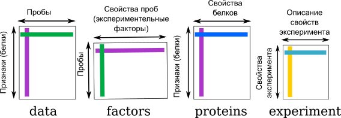

```{r setup, include=FALSE}
knitr::opts_chunk$set(echo = TRUE)
library("knitcitations")
cleanbib()
options("citation_format" = "pandoc")
```

## Анализ протеомных данных в R

## Формат записи данных

Результаты измерения интенсивности пятен на гелях обычно записываются в виде нескольких таблиц:

- Данные об интенсивности пятен (data) --- таблица $p \times n$, где записаны интенсивности _p_ белков (строки) для каждого из _n_ гелей (столбцы).
- Данные о пробах (factors) --- таблица $n \times q$, в которой для каждой из _n_ проб записана информация о _q_ свойствах (об экспериментальных факторах, повторностях и т.д.).
- Данные о свойствах белков (proteins) ---  таблица $p \times m$, где для _p_ белков (строки) записаны _m_ свойств (столбцы).
- Данные об эксперименте в целом (experiment) --- таблица произвольной длины, в которой содержатся свойства эксперимента и их значения (например, информация об экспериментальном объекте, имя экспериментатора, ссылка на публикацию и т.п.).



## Протокол анализа данных

1. Правильно ли открылись данные? Правильно ли определены типы переменных?
1. Сколько белков и сколько проб в файле с экспрессией? Для всех ли проб указаны значения факторов в файле с факторами? (т.е. соответствует ли число строк в файле с факторами числу столбцов в файле с экспрессией?)
1. Сколько групп закодировано в каждом факторе? Сколько проб входит в каждую из групп?
1. Сколько пропущенных значений экспрессии для каждого из белков? Если есть пропуски --- проводим импутацию пропущенных значений.
1. Трансформируем сырые данные экспрессии при помощи двоичного логарифма.
1. Нужна ли нормализация? RI-plot или боксплот. Если нужно --- нормализуем.
1. (Не обязательно, но возможно) Разведочный анализ (ординация методом главных компонент), чтобы выяснить нет ли таких отдельных белков или проб, которые сильно отличаются от других. На этой стадии можно выявить технические ошибки.
1. Усредняем технические повторности.
1. Строим дендрограмму проб. Получаем значения бутстреп поддержки ветвей (и/или считаем другие индексы оценки качества кластеризации).
1. Проводим анализ дифференциальной экспрессии. Полную таблицу дифференциально-экспрессируемых белков можно включить в приложения. Краткую таблицу и/или тепловую карту экспрессии всех дифференциальных белков  можно включить в текст.

В итоге у вас должны получится:

- Дендрограмма проб.
- Таблица дифференциально-экспрессируемых белков (краткая или полная).
- Тепловая карта экспрессии дифференциальных белков.

## Пример: протеом жабр гребешка _Pecten maximus_

Мы рассмотрим различные техники анализа на примере данных о протеоме жабр гребешка _Pecten maximus_. Гребешков подвергали воздействию двух разных температур (15 и 25 градусов, по 6 гребешков в каждой группе). В этом исследовании на гелях было обнаружено в общей сложности 766 пятен. Данные о протеоме жабр гребешка содержатся в пакете prot2D `r citep(citation("prot2D"))`, который можно инсталлировать с Bioconductor.

```{r, message=FALSE, warning=FALSE}
library(prot2D)
data(pecten)
data(pecten.fac)
```

В датафрейме `pecten` хранятся необработанные данные интенсивностей пятен (_raw volume data_)

```{r}
dim(pecten)
head(pecten, 2)
```

В датафрейме `pecten.fac` описана принадлежность гребешков к разным вариантам экспериментальной обработки. В данном случае, всего один фактор --- `Condition`.

```{r}
dim(pecten.fac)
head(pecten.fac)
```

## Предварительная обработка 

### Импутация пропущенных значений

Довольно часто бывает так, что в матрице экспрессии могут пустовать некоторые ячейки. Пятно может быть обнаружено на одном геле, но отсутствовать на других в силу различных причин. Например, в силу различий между биологическими репликами, из-за различий между техническими репликами по техническим причинам, из-за ошибок в идентификации пятен, из-за плохой изоэлектрической фокусировки, из-за малого количества белка и т.п.

Отсутствие пятна на геле может обозначать разные вещи: белок может действительно отсутствовать, либо он отсутствует в силу технических причин, либо он все же присутствует в концентрации ниже порога определения. Отсутствие пятна на всех технических повторностях может скорее означать отсутствие белка --- в таких ячейках можно записать нули. Однако, если пропущенные значения появились в результате неправильного сопоставления пятен, то замена их нулями может исказить данные. Если мы имеем дело с истинно пропущенными значениями, то такие ячейки мы оставим пустыми, а R во время чтения данных автоматически преобразует их в `NA` (специальное обозначение пропущенных данных, от англ. _not available_).

Как поступать с пропущенными значениями? Есть несколько возможных вариантов. (а) Исключение переменных, в которых есть пропущенные значения (использование только "надежных" белков) сильно снижает "интересность" анализа, потому что многие белки будут исключены, и в результате останется меньше пятен. (б) Замена пропущенных значений средними значениями экспрессии данного белка в разных образцах (mean substitution). Это довольно грубый вариант, который вносит искажения в данные.  (в) Замена `NA` средним по _k_-ближайшим соседям --- очень хорший метод импутации [_k-nearest neighbour averaging_; @troyanskaya_missing_2001]. Как работает этот методы мы разберем подробнее и потом потренируемся его использовать.

### Импутация методом замены средним по _k_-ближайшим соседям

Метод импутации по k-ближайшим соседям заменяет каждое пропущенное значение взвешенным средним, рассчитанным по _k_-ближайшим белкам-соседям, у которых это значение не пропущено [@troyanskaya_missing_2001]

Допустим, у белка _#1_ есть пропущенное значение экспрессии в пробе _A_. Алгоритм вначале находит _k_ белков с похожим паттерном экспрессии (соседей). Соседство определяется при помощи евклидова расстояния между белками, рассчитанного по пробам с известным уровнем экспрессии. Далее, в пробе _А_ рассчитывается взвешенное среднее уровней экспрессии этих _k_ похожих белков. Вклад каждого белка взвешивают по степени его сходства с белком _#1_.

Может случиться так, что у некоторых похожих белков есть пропущенные значения интенсивности экспрессии в некоторых других пробах. В этом случае, сходство между белками определяется как среднее сходств, рассчитанных по пробам без пропущенных для этих белков данных. Наконец, если вдруг так оказалость, что у нескольких похожих белков неизвестна интенсивность экспрессии в одной и той же пробе, тогда пропущенные значения алгоритм заменяет средним значением интенсивности по пробе.

### Импутация по k-ближайшим соседям в R

Для импутации используют данные по всем техническим и биологическим репликам. После импутации можно будет усреднить технические реплики, либо анализировать их отдельно.

В нашем примере пропущенных значений нет. В этом легко убедиться при помощи комбинации из нескольких функций. 

```{r}
colSums(is.na(pecten))
```

Функция `is.na()` --- проверяет, равно ли значение ее аргумента `NA` и возвращает логическое значение. `is.na(pecten)` вернет двумерную таблицу, в которой `TRUE` будет встречаться, только если соответствующий элемент в датафрейме `pecten` был `NA`. Логическим значениям `TRUE` и `FALSE` соответствуют 1 и 0. Если мы посчитаем суммы значений в каждом из столбцов таблицы при помощи функции `colSums()`, то мы получим число `NA` для каждого из них.

Чтобы можно было сейчас продемонстрировать, как работает импутация пропущенных значений, нам потребуется, чтобы в датасете `pecten` всетаки они были, поэтому мы специально заменим случайно выбранные ячейки на `NA`.

```{r}
# "Портим" данные пропущенными значениями.
dim(pecten)
id <- sample(1:9192, size = 1000)
spect <- as.matrix(pecten)
spect[id] <- NA
# Вот что получилось
colSums(is.na(spect))
```

Теперь можно приступать к тренировке заполнения пропущенных значений. Метод _k_-ближайших соседей реализован в пакете `impute` на Bioconductor `r citep(citation("impute"))`. 

Для импутации при помощи среднего по _k_-ближайшим соседям матрицу интенсивностей сначала нужно транспонировать, чтобы пробы были в строках, а белки в столбцах. 

```{r, message=FALSE, warning=FALSE}
library(impute)
# транспонируем, чтобы белки были в столбцах
trans_spect <- t(spect) 
knn_dat <- impute.knn(trans_spect, k = 5)
# в результате импудации получился сложный объект - список
str(knn_dat)
# импутированные данные содержатся в элементе data
ipect_knn <- t(knn_dat$data)
# Теперь нет пропущенных значений
colSums(is.na(ipect_knn))
```


### Логарифмирование

Обычно исследователей интересует оотношение уровней экспрессии. Беда в том, что отношение несимметрично относительно 1. Например, пусть в пробе A уровень экспрессии 10, а в пробе B --- 1. Если мы посчитаем соотношение уровней экспрессии $A/B = 10/1 = 10$, если наоборот $B/A = 1/10 = 0.1$. Уровень экспрессии в пробе А в 10 раз больше, чем в B, но величина соотношения зависит от порядка действий --- это неудобно. Если мы будем использовать логарифмы, эта проблема исчезнет. Логарифм соотношения равен разнице логарифмов: $log_{10}(A/B) = log_{10}(A) - log_{10}(B) = 10 - 1 = 9$, аналогично $log_{10}(B/A) = log_{10}(B) - log_{10}(A) = 1 - 10 = -9$. Разница логарифмов распределена симметрично вокруг нуля, от порядка действий зависит только знак. 

Обычно данные логарифмируют по основанию 2. С логарифмами по основанию 2 принято работать из-за удобства вычислений (числа получаются меньше по абсолютной величине) и удобства интерпретации (если мы считаем разницу логарифмов экспрессии в опыте и контроле и она равна единице, то это означает, что экспрессия различается в два раза). Подробнее об этом можно прочесть в разделе _Соотношение уровней экспрессии_.

Если в ваших исходных данных есть нули, то можно перед логарифмированием прибавить к ним небольшую константу, чтобы не получить `-Inf`. Т.е. преборазовать `log2(x + 1)`.

```{r, message=FALSE, warning=FALSE}
# Логарифмируем данные
pecten_log <- log2(pecten)
# создаем палитру и вектор цветов
library(RColorBrewer)
pal <- brewer.pal(9, "Set1")
cols <- pal[pecten.fac$Condition]
# Сторим боксплот
boxplot(pecten_log, outline = FALSE, boxwex = 0.7, notch = T, col = cols, main = "Логарифмированные\nданные")
legend("topright", levels(pecten.fac$Condition), fill = pal, bty = "n", xpd = T)
```

### Нормализация

Для того, чтобы выровнять форму распределений, применяют квантильную нормализацию. Во время квантильной нормализации сначала для значений экспрессии в каждой пробе вычисляют ранги. Затем, значения одинакового ранга заменяют их средними значениями интенсивности экспрессии. Так, например, максимальные значения экспрессии в пробах станут средним максимальных значений, медианые значения экспрессии в пробах станут средним значением медиан и так далее.

Теперь давайте применим квантильную нормализацию к данным о протеоме гребешков.

```{r}
library(limma)
pecten_norm <- normalizeQuantiles(pecten_log)
boxplot(pecten_norm, outline = FALSE, boxwex = 0.7, notch = T, col = cols, main = "Нормализованные данные")
legend("topright", levels(pecten.fac$Condition), fill = pal, bty = "n", xpd = T)
```

После нормализации размах варьирования величин экспрессии в разных образцах выравнялся

<!-- ### Сохранение данных после предварительной обработки -->

<!-- Сохранение файлов с данными в R -->

<!-- ```{r, eval=FALSE} -->
<!-- write.csv(pecten_norm, file = "pecten_log2_normalized.csv") -->
<!-- ``` -->

## Иерархическая классификация проб на основании различий экспрессии.

Классификация данных проходит в несколько этапов. Вначале формируется набор признаков, на основании которых нужно провести классификацию объектов. В нашем случае объекты --- это пробы, уровень экспрессии белков в пробах --- признаки объектов. На основании этих признаков будет рассчитана матрица коэффициентов различия или сходства между всем объектами, и объекты будут сгруппированы в кластеры по определенным правилам (алгоритм кластеризации). Качество финальной классификации можно оценить различными способами.

Результат кластеризации будет сильнее всего зависеть (1) от выбора коэффициента сходства-различия и (2) от алгоритма кластеризации. Нет формальных способов выбрать наиболее подходящий коэффициент и алгоритм. 

### Коэффициенты сходства-различия

Коэффициенты сходства-различия делятся на различия и сходства, причем из мер сходства легко получить меры различия и наоборот.

Различия

$d \ge 0$
```{r echo=FALSE, fig.width=4.5, fig.height=0.5}
library(DiagrammeR)
DiagrammeR("images/dist.gv", type = "grViz")
```

Сходства 

$0 \le S \le 1$ или $-1 \le S \le 1$

```{r echo=FALSE, fig.width=4.5, fig.height=0.5}
DiagrammeR("images/sim.gv", type = "grViz")
```

Коэффициенты сходства-различия используются в качестве исходных данных для многих видов многомерных анализов, в т.ч. для иерархического кластерного анализа. Из сходств можно получить различия и наоборот.  Свои собственные коэффициенты существуют для количественных и качественных признаков. Есть несколько популярных в протеомике коэффициентов сходства-различия: для количественных данных --- Евклидово расстояние, для бинарных данных --- коэффициент Жаккара. 

#### Евклидово расстояние

```{r echo=FALSE, message=FALSE, fig.width=4, fig.height=3}
dat <- data.frame(X1 = c(5, 2), X2 = c(1, 4))
library(ggplot2)
theme_set(theme_linedraw())
ggplot(dat, aes(x = X1, y = X2)) + geom_point(size = 6, colour = "steelblue") + scale_x_continuous(breaks = 0:6) + scale_y_continuous(breaks = 0:6) + coord_fixed(expand = 0, xlim = c(0, 6), ylim = c(0, 6)) + geom_line() + geom_segment(aes(xend = c(0, 0), yend = X2), linetype = "dashed") + geom_segment(aes(xend = X1, yend = c(0, 0)), linetype = "dashed") + geom_text(aes(label = paste0("(", X1, ", ", X2, ")")), hjust = 0, vjust = -1)
```

Для двумерного пространства Евклидово расстояние рассчитывается так:

```{r echo=FALSE, fig.width=2, fig.height=0.4}
ggplot() + annotate(geom = "text", x = 0, y = 0, label = "d == sqrt((x[11] - x[12])^{2} + (x[21] - x[22])^{2}) ", parse = TRUE, size = 4) + theme_void()
```

Т.е. Евклидово расстояние в этом гипотетическом примере будет

```{r echo=FALSE, fig.width=2, fig.height=0.4}
ggplot() + annotate(geom = "text", x = 0, y = 0, label = "sqrt((5 - 2)^{2} + (4 - 1)^{2})==4.24", parse = TRUE, size = 4) + theme_void()
```

Для пространства с большим числом измерений формула Евклидова расстояния выглядит так:

```{r echo=FALSE, fig.width=2, fig.height=0.4}
ggplot() + annotate(geom = "text", x = 0, y = 0, label = "d == sqrt(sum((X[ik] - X[jk]))^{2})", parse = TRUE, size = 4) + theme_void()
```

Евклидово расстояние --- это метрика.

Для всех метрик (расстояний) справедливы три свойства:

1) Адекватность: 

$$d_{A, A} = 0$$

```{r, echo=FALSE, fig.width=4, fig.height=.5}
DiagrammeR("images/adequa.gv", type = "grViz")
```

2) Симметричность: 

$$d_{A, B} = d_{B, A}$$

```{r, echo=FALSE, fig.width=4, fig.height=.5}
# DiagrammeR("images/symmetry.mmd")
DiagrammeR("images/symmetry.gv", type = "grViz")
```

3) Триангулярность: 

$$d_{A, B} \le d_{A, C} + d_{C, B}$$

__Триангулярность есть только у метрик!__ Именно потому, что для них выполняется неравенство треугольника, они имеют право называться __расстояниями__, а не просто мерами различия.

```{r, echo=FALSE, fig.width=4, fig.height=1}
DiagrammeR("images/triang.gv", type = "grViz")
```

#### Коэффициент Жаккара

Если используются бинарные данные (наличие или отсутствие экспрессии), то посчитать сходство можно, учитывая присутствие-отсутствие признаков. 

| объект I / объект J | признак есть | признака нет |
| ----- |-----|-----|
| признак есть | a | b |
| признака нет | c | d |

- $I$, $J$ --- объекты
- $a$ --- число сходств по наличию признака
- $b$ --- число отличий $I$ от $J$
- $c$ --- число различий $J$ от $I$
- $d$ --- число сходств по отсутствию признака
- $n_J$ --- число признаков у объекта $J$
- $n_I$ --- число признаков у объекта $I$
- $n = a + b + c + d$ --- общее число признаков

Коэффициентов сходства-различия для качественных данных придумано великое множество.

Коэффициент Жаккара рассчитывается по формуле:

$S = a / (a + b + c)$, причем $0 \le S \le 1$

Соответствующий коэффициент различия Жаккара можно посчитать так:

$d = 1 - a / (a + b + c) = (b + c) / (a + b + c)$

У коэффициента Жаккара есть одно забавное свойство. Обратите внимание, в знаменателе фигурирует не общее число признаков --- сходство по отсутствию не учитывается! Это свойство очень полезно для работы с протеомными данными. Пятно может отсутствовать на геле не только потому, что белка не было в пробе, но и в силу самых разных других причин (например, экспрессия ниже порога определения, плохо прокрашен образец и проч.).

Например, пусть у нас есть три пробы, у которых мы нашли всего 5 пятен. 

```{r echo=FALSE, results='asis'}
library(knitr)
tab <- data.frame(Objects = paste("Object ", 1:3), 
                  'Spot 1' = c(1, 1, 0),
                  'Spot 2' = c(1, 1, 0),
                  'Spot 3' = c(0, 1, 0),
                  'Spot 4' = c(1, 1, 1),
                  'Spot 5' = c(0, 0, 0))
kable(tab, format = "markdown")
```

Чтобы оценить различие между этими пробами, можно посчитать коэффициент Жаккара.

```{r echo=FALSE, results='asis',warning=FALSE, message=FALSE}
djac_samples <- as.data.frame(as.matrix(round(dist(tab[, -1], method = "binary"), 2)))
colnames(djac_samples) <- rownames(djac_samples) <- paste0("Object ", 1:3)
kable(djac_samples, format = "markdown")
```

### Алгоритмы иерархической класстеризации на основании расстояний

Мы рассмотрим несколько алгоритмов, которые строят иерархическую кластеризацию объектов на основании матрицы расстояний / сходств между ними: методы ближайшего соседа, отдаленного соседа, среднегруппового расстояния и метод Варда.

```{r, echo=FALSE, fig.height=5, message=FALSE }
library(ggplot2)
library(gridExtra)
theme_set(theme_bw())
cl_dat <- data.frame(cl = c(rep("A", 5), rep("B", 4)), 
           x = c(1, 2.7, 2, 1.5, 2, 5, 6, 5.5, 5.8),
           y = c(1, 1.2, 3, 2, 1.5, 1.2, 1, 3, 2))

segm_between <- function(ind1, ind2, dat){
i_betw <- expand.grid(ind1, ind2)
segm <- lapply(1:nrow(i_betw), function(i) cbind(dat[i_betw[i, 1], ], dat[i_betw[i, 2], ]))
segm <- Reduce(rbind, segm)
colnames(segm) <- c("x", "y", "xend", "yend")
return(segm)
}

segm_within <- function(ind1, ind2, dat){
  # for ward
  dat1 <- dat[ind1, ]
  dat2 <- dat[ind2, ]
with1 <- segm_between(1:nrow(dat1), nrow(dat1)+1, rbind(dat1, colMeans(dat1)))
with2 <- segm_between(1:nrow(dat2), nrow(dat2)+1, rbind(dat2, colMeans(dat2)))
segm <- rbind(with1, with2)
return(segm)
}

betw_segm <- segm_between(1:5, 6:9, cl_dat[, 2:3])
with_segm <- segm_within(1:5, 6:9, cl_dat[, 2:3])

library(dplyr)
cl_means <- cl_dat %>% group_by(cl) %>% summarise(
  x = mean(x), y = mean(y)
)
betw <- as.matrix(dist(cl_dat[, 2:3]))[6:9, 1:5]
# which.min(betw)
# which.max(betw)
th <- theme_classic() + theme(axis.line = element_blank(), axis.title = element_blank(), axis.ticks = element_blank(), axis.text = element_blank(), legend.position = "none")

gg <- ggplot(cl_dat, aes(x = x, y = y, colour = cl)) + geom_point() + stat_ellipse(level = 0.8) + geom_point(data = cl_means, size = 4, shape = 5) + th

gg_single <- gg +  annotate(geom = "segment", x = 2.7, y = 1.2, xend = 5, yend = 1.2, colour = "grey60")

gg_complete <- gg +  annotate(geom = "segment", x = 1, y = 1, xend = 6, yend = 1, colour = "grey60")

gg_average <- gg + geom_segment(data = betw_segm, aes(x = x, y = y, xend = xend, yend = yend, colour = NULL), colour = "grey60")

gg_ward <- gg + geom_segment(data = with_segm, aes(x = x, y = y, xend = xend, yend = yend, colour = NULL), colour = "grey60")

grid.arrange(gg_single + ggtitle("Метод ближайшего соседа"), gg_complete + ggtitle("Метод отдаленного соседа"), gg_average + ggtitle("Метод среднегруппового расстояния"), gg_ward + ggtitle("Метод Варда"), ncol = 2)
```


__Метод ближайшего соседа__ (= nearest neighbour = single linkage) --- к кластеру присоединяется ближайший к нему кластер/объект. Кластеры объединяются в один на расстоянии, которое равно расстоянию между ближайшими объектами этих кластеров. Результаты иногда сложно интерпретировать, особенно, если цель анализа заключалась в выделении групп. Объекты на дендрограмме часто не образуют четко разделенных групп, получаются цепочки кластеров (объекты присоединяются как бы по-одному). Метод хорош для выявления градиентов.

__Метод отдаленного соседа__ (= furthest neighbour = complete linkage) --- к кластеру присоединяется отдаленный кластер/объект. Кластеры объединяются в один на расстоянии, которое равно расстоянию между самыми отдаленными объектами этих кластеров. Следствие --- чем более крупная группа, тем сложнее к ней присоединиться. В результате работы этого метода на дендрограмме образуется много отдельных некрупных групп. Метод хорош для поиска дискретных групп в данных.

__Метод невзвешенного попарного среднего__ (= UPGMA = Unweighted Pair Group Method with Arithmetic mean) --- кластеры объединяются в один на расстоянии, которое равно среднему значению всех возможных расстояний между объектами из разных кластеров.

__Метод Варда__ (= Ward's Minimum Variance Clustering) --- объекты объединяются в кластеры так, чтобы внутригрупповая дисперсия расстояний была минимальной. Метод годится и для неевклидовых расстояний несмотря на то, что внутригрупповая дисперсия расстояний рассчитывается так, как будто это евклидовы расстояния.


### Кластерный анализ в R

Подготовим данные к кластерному анализу. Названия проб в нашем датасете `pecten_norm` --- длинные непонятные аббревиатуры. Вместо них нужно создать осмысленные и краткие лейблы для проб. Информацию о лейблах возьмем из датафрейма с факторами. Температура содержания закодирована в факторе `pecten.fac$Condition`. Добавим номер к повторяющимся значениям, чтобы сделать их уникальными, при помощи функции `make.unique()`. Затем заменим старые названия проб новыми.

```{r}
# Старые названия проб
colnames(pecten_norm)
# Новые названия проб
colnames(pecten_norm) <- make.unique(as.character(pecten.fac$Condition))
```

Чтобы строить деревья для проб, нам понадобится транспонировать исходные данные так, чтобы пробы оказались в строках. Мы рассчитаем матрицу евклидовых расстояний между пробами, кластеризуем их разными методами.

```{r  fig.height=5, fig.width=10, fig.show='hold'}
# Транспонируем данные, чтобы пробы были в строках
tpecten_norm <- t(pecten_norm)
# Матрица евклидовых расстояний
d <- dist(x = tpecten_norm, method = "euclidean")
# Кластеризация разными методами
hc_single <- hclust(d, method = "single")
hc_compl <- hclust(d, method = "complete")
hc_avg <- hclust(d, method = "average")
hc_w2 <- hclust(d, method = "ward.D2")
```

Построим дендрограммы средствами базовой графики R.

```{r  fig.height=5, fig.width=10, fig.show='hold'}
old_par <- par(mfrow = c(2, 2), mar = c(4, 3, 3, 4))
plot(hc_single, main = "Метод\nближайшего соседа")
plot(hc_compl, main = "Метод\nотдаленного соседа")
plot(hc_avg, main = "Метод\nсреднегруппового расстояния")
plot(hc_w2, main = "Метод\nВарда")
par(old_par)
```

### Кофенетическая корреляция

По одним и тем же исходным данным может быть построено множество вариантов дендрограмм, поскольку могут быть использованы разные коэффициенты сходства-различия и разные методы кластеризации. Любая дендрограмма --- это упрощенное представление отношений между объектами. Расстояния на дендрограмме передают различия между объектами с некоторыми искажениями. Кри помощи кофенетической корреляции можно оценить, насколько кофенетические расстояния соответствуют реальным расстояниям между объектами. Кофенетическую корреляцию можно рассчитать как Пирсоновскую корреляцию (обычную) между матрицами исходных и кофенетических расстояний между всеми парами объектов. Дендрограмма с наибольшей кофенетическей корреляцией лучше всего отражает исходные данные.

Какая из построенных нами дендрограмм лучше отражает действительные расстояния между объектами можно оценить при помощи кофенетической корреляции. Сперва рассчитаем кофенетическое расстояние при помощи функции `cophenetic()` из пакета `ape` `r citep(citation("ape"))`, затем вычислим кофенетическую корреляцию. Для данных о протеоме гребешков лучшим методом кластеризации оказывается метод среднегруппового расстояния.

```{r}
library(ape)
c_single <- cophenetic(as.phylo(hc_single))
c_compl <- cophenetic(as.phylo(hc_compl))
c_avg <- cophenetic(as.phylo(hc_avg))
c_w2 <- cophenetic(as.phylo(hc_w2))
cor(d, as.dist(c_single))
cor(d, as.dist(c_compl))
cor(d, as.dist(c_avg))
cor(d, as.dist(c_w2))
```

Мы с вами видели, что дендрограммы можно нарисовать при помощи базовой графики R, но у нее довольно мало возможностей для настройки внешнего вида. Гораздо больше возможностей для настройки у дендрограмм, построенных средствами пакета `dendextend` `r citep(citation("dendextend"))`. Давайте визуализируем дендрограммы и раскрасим лейблы в разные цвета. Для того, чтобы не пришлось вручную создавать вектор цветов, можно попробовать при помощи пользовательской функции вытащить информацию из лейблов на дендрограмме. Функция `get_colours()` берет дендрограмму, экстрагирует из нее порядок лейблов, берет первые несколько букв в имени лейбла и на основании этого фактора создает вектор цветов. Теперь можно легко раскрасить группы на дендрограмме, ориентируясь на первые несколько символов в названии лейбла.

```{r  fig.height=4, fig.width=10, warning=FALSE, message=FALSE}
library(dendextend)

# Пользовательская функция get_colours возвращает
# вектор цветов из одной из Брюйеровских палитр
# palette, ориентируясь на первые n_chars символов
# в названиях ветвей на дендрограмме dend
get_colours <- function(dend, n_chars, palette = "Dark2"){
  library(RColorBrewer)
  library(dendextend)
  labs <- get_leaves_attr(dend, "label")
  group <- substr(labs, start = 0, stop = n_chars)
  group <- factor(group)
  cols <- suppressWarnings(brewer.pal(length(levels(group)), name = palette))[group]
  return(cols)
}

# Преобразуем кластеризацию в класс dendrogram
den_avg <- as.dendrogram(hc_avg)
# Создаем вектор цветов
cols <- get_colours(den_avg, n_chars = 2)
# Раскрашиваем лейблы
den_avg_c <- color_labels(den_avg, col = cols)
# Рисуем дендрограмму
plot(den_avg_c, horiz = TRUE, main = "Метод\nсреднегруппового расстояния")
```

### Сопоставление дендрограмм: танглграмма

Иногда бывает нужно сравнить несколько деревьев, построенных разными методами. Это удобно делать визуально на так называемых танглграммах. Два дерева выравнивают, вращая случайным образом ветви вокруг их оснований. Процесс повторяется много раз и каждый раз рассчитывается мера "запутанности" дендрограмм. Из множества вариантов выбирается наименее запутанный.

Давайте сравним дендрограммы, полученные методами ближайшего соседа и среднегруппового расстояния. У этих кластеризаций были наибольшие и довольно близкие значения кофенетического расстояния. Их дендрограммы выглядят очень похоже, отличаются только группировкой трех проб внутри одного из кластеров.

```{r tang, warning=FALSE, fig.height=4}
# Раскрасим дендрограмму, полученную методом ближайшего соседа
den_single <- as.dendrogram(hc_single)
cols <- get_colours(den_single, n_chars = 2)
den_single_c <- color_labels(den_single, col = cols)

set.seed(395)
untang_w <- untangle_step_rotate_2side(den_single_c, den_avg_c, print_times = F)
# танглграмма
tanglegram(untang_w[[1]], untang_w[[2]],
           highlight_distinct_edges = FALSE,
           common_subtrees_color_lines = F,
           main = "Танглграмма\nЕвклидово расстояние",
           main_left = "Метод\nближайшего соседа",
           main_right = "Метод\nсреднегруппового расстояния",
           columns_width = c(8, 1, 8),
           margin_top = 3.2, margin_bottom = 2.5,
           margin_inner = 4, margin_outer = 0.5,
           lwd = 1.2, edge.lwd = 1.2,
           lab.cex = 1, cex_main = 1)
```

### Бутстреп поддержка ветвей

Насколько часто будет воспроизводится ветвление можно оценить при помощи приблизительно несмещенного теста ("An approximately unbiased test of phylogenetic tree selection", Shimodaria, 2002). Этот тест использует специальный вариант бутстрепа --- разномасштабный бутстреп (multiscale bootstrap). Как работает этот тест? Представьте, что мы многократно делаем бутстреп выборки --- случайные выборки из классифицируемых объектов с повторениями: один и тот же объект может попасть в выборку несколько раз или не попасть вообще. Для каждой такой выборки мы строим классификацию. Для каждого узла дерева можно посчитать долю классификаций, где воспроизводится это конкретное ветвление (бутстреп поддержка, BP p-value). Эта доля, BP, будет оценивать вероятность получения топологий со смещением, поскольку выборки одного размера. Чтобы лучше оценить  связанную с выборочной ошибкой неопределенность топологии, можно делать разномасштабный бутстреп --- выборки разного размера, т.е. с разным числом объектов. По изменению BP при разных объемах выборки можно вычислить приблизительно несмещенную оценку вероятности, с которой воспроизводится ветвление --- AU (approximately unbiased p-value). Если для кластера AU p-value > 0.95, то нулевую гипотезу о том, что он не существует отвергают на уровне значимости 0.05.

В R разномасштабный бутстреп реализован в пакете `pvclust` автором этого метода `r citep(citation("pvclust"))`.

```{r}
library(pvclust)
```
```{r pvclust, cache=TRUE}
# Итераций должно быть nboot = 1000 и больше!!!
# Здесь мало для скорости
set.seed(42)
cl_boot <- pvclust(pecten_norm, method.hclust = "average", nboot = 100, method.dist = "euclidean")
```

Построим дерево с величинами поддержки при помощи средств пакета `dendextend` `r citep(citation("dendextend"))`

AU --- approximately unbiased p-values (красный),
BP --- bootstrap p-values (зеленый)

```{r fig.width=10, fig.height=6}
den_cl_boot <- as.dendrogram(cl_boot)
cols <- get_colours(den_cl_boot, n_chars = 2)
den_cl_boot_c <- color_labels(den_cl_boot, col = cols)

plot(den_cl_boot_c)
text(cl_boot)
pvrect(cl_boot) # достоверные ветвления
```

Но сами AU p-values оцениваются при помощи бутстрепа, а значит, тоже не точно. Стандартные ошибки AU можно оценить, чтобы оценить точность оценки самих AU. Чем больше было бутстреп-итераций, тем точнее будет оценка.  Для диагностики качества оценок AU нам понадобится график стандартных ошибок для AU p-value.

```{r}
seplot(cl_boot)
# seplot(cl_boot, identify = TRUE) # интерактивная идентификация значений
# print(cl_boot) # все значения
```

Например, для кластера 2 $AU =$ `r round(cl_boot$msfit[[2]]$p[1], 3)`, а ее стандартная ошибка $SE =$ `r round(cl_boot$msfit[[2]]$se[1], 3)`. Зная стандартную ошибку можно вычислить 95% доверительный интервал для AU. Истинное значение AU p-value будет с 95% вероятностью лежать в пределах между `r round(cl_boot$msfit[[2]]$p[1] - 1.96 * cl_boot$msfit[[2]]$se[1], 3)` и `r round(cl_boot$msfit[[2]]$p[1] + 1.96 * cl_boot$msfit[[2]]$se[1], 3)`. Такая оценка значимости не точна, т.к. по смыслу AU не должна быть больше 1 ($0 \le AU\,p\,value \le 1$).

```{r}
print(cl_boot, which = 2)
```

Нужно увеличить число итераций.

```{r pvclust1, cache=TRUE}
set.seed(42)
cl_boot <- pvclust(pecten_norm, method.hclust = "average", nboot = 1000, method.dist = "euclidean")
```
```{r}
seplot(cl_boot)
```

Если повторить бутстреп с большим числом итераций, стандартные ошибки AU p-values уменьшатся. 

```{r}
print(cl_boot, which = 2)
```

Для кластера 2 $AU =$ `r round(cl_boot$msfit[[2]]$p[1], 3)`, а ее стандартная ошибка $SE =$ `r round(cl_boot$msfit[[2]]$se[1], 3)`. Нижняя граница 95% доверительного интервала для AU `r round(cl_boot$msfit[[2]]$p[1] - 1.96 * cl_boot$msfit[[2]]$se[1], 3)`, а верхняя --- `r round(cl_boot$msfit[[2]]$p[1] + 1.96 * cl_boot$msfit[[2]]$se[1], 3)`. Теперь мы можем доверять такой оценке AU.

## Анализ дифференциальной экспрессии

### Тестирование статистических гипотез

Мы хотим сравнить уровень экспрессии белков у морских гребешков, которых содержали при разной температуре. Допустим, исходя из существующих исследований и общих знаний мы предполагаем, что уровень экспрессии некоторых белков будет различаться (это то, что мы на самом деле думаем --- __исследовательская гипотеза__). Чтобы проверить исследовательскую гипотезу, нужна __нулевая гипотеза__. Обычно нулевые гипотезы постулируют отсутствие каких либо различий. Так и в этом примере, нулевая гипотеза говорит, что уровень экспрессии не будет различаться.

Далее, мы проводим эксперимент, измеряем уровень экспрессии. После этого рассчитываем статистику, которая позволит оценить разницу уровней экспрессии в эксперименте (например, t-критерий). Наблюдаемое в эксперименте значение статистики сравнивают со значением, которое было бы получено, если бы уровни экспрессии не различались (т.е. если нулевая гипотеза верна). Если это значение маловероятно получить, когда уровни экспрессии не различаются, то мы "отвергаем" нулевую гипотезу. В таком случае, мы считаем, что результаты нашего эксперимента говорят в пользу нашей исследовательской гипотезы. 

```{r power_data, echo=FALSE, cache=TRUE, message=FALSE, warning=FALSE}
# Power plot using ggplot2
# reworked after
# http://rpsychologist.com/creating-a-typical-textbook-illustration-of-statistical-power-using-either-ggplot-or-base-graphics/

generate_power_data <- function(m1 = 0, sd1 = 7, m2 = 3.5, sd2 = 7, alpha = 0.05, h.type = "equal"){
  # set length of tails
  min1 <- m1-sd1*4
  max1 <- m1+sd1*4
  min2 <- m2-sd2*4
  max2 <- m2+sd2*4
  # create a sequence for x axis including z.crit
  x <- seq(min(min1,min2), max(max1, max2), .01)
  # compute critical value

  switch(h.type,
         greater={
           z.crit <- qnorm(1-alpha, m1, sd1)
           z.critm <- m1 - abs(m1 - z.crit)
         },
         less={
           z.crit <- qnorm(1-alpha, m1, sd1)
           z.critm <- m1 - abs(m1 - z.crit)
         },
         equal={
           z.crit <- qnorm(1-(alpha/2), m1, sd1)
           z.critm <- m1 - abs(m1 - z.crit)
         }
  )
  x[length(x)+1] <- z.crit
  x[length(x)+1] <- z.critm
  x <- sort(x)

  # generate normal distributions
  y1 <- dnorm(x, m1, sd1)
  y2 <- dnorm(x, m2, sd2)
  # combine to data frame
  df1 <- data.frame(x = x, y = y1)
  df2 <- data.frame(x = x, y = y2)
  # compute intervals for polygons
  outside.l <- x <= z.critm
  inside <- (x >= z.critm) & (x <= z.crit)
  outside.r <- x >= z.crit

  switch(h.type,
         greater={
           # Alpha polygon
           if(m1 < m2){
             alph <- data.frame(x = x[outside.r], y = pmin(y1[outside.r], y2[outside.r]))
           } else {
             alph <- data.frame(x = x[outside.r], y = pmax(y1[outside.r], y2[outside.r]))
           }
           alph$y[alph$x == z.crit] <- 0
           # Beta polygon one-tailed
           bet <- data.frame(x = x[outside.l | inside], y = y2[outside.l | inside])
           bet$y[bet$x == z.crit] <- 0
           bet$y[bet$x == z.critm] <- 0
           # power polygon; 1-beta, one-tailed
           pwrd <- data.frame(x = x[outside.r], y = y2[outside.r])
           pwrd$y[pwrd$x == z.crit] <- 0
           alph$id <- 3
           bet$id <- 2
           pwrd$id <- 1
           alph$obj <- 3
           bet$obj <- 2
           pwrd$obj <- 1
           # combine data frames
           poly <- rbind(alph, bet, pwrd)
           poly$id <- factor(poly$id,  labels = c("power","beta","alpha"))
         },
         less={
           # Alpha polygon
           if(m1 < m2){
             alph <- data.frame(x = x[outside.l], y = pmax(y1[outside.l], y2[outside.l]))
           } else{
             alph <- data.frame(x = x[outside.l], y = pmin(y1[outside.l], y2[outside.l]))
           }
           alph$y[alph$x == z.critm] <- 0
           # Beta polygon one-tailed
           bet <- data.frame(x = x[outside.r | inside], y = y2[outside.r | inside])
           bet$y[bet$x == z.crit] <- 0
           bet$y[bet$x == z.critm] <- 0
           # power polygon; 1-beta, one-tailed
           pwrd <- data.frame(x = x[outside.l], y = y2[outside.l])
           pwrd$y[pwrd$x == z.critm] <- 0
           alph$id <- 3
           bet$id <- 2
           pwrd$id <- 1
           alph$obj <- 3
           bet$obj <- 2
           pwrd$obj <- 1
           # combine data frames
           poly <- rbind(alph, bet, pwrd)
           poly$id <- factor(poly$id,  labels = c("power","beta","alpha"))
         },
         equal={
           # alph polygon
           if(m1 < m2){
             alph.r <- data.frame(x = x[outside.r], y = pmin(y1[outside.r], y2[outside.r]))
             alph.l <- data.frame(x = x[outside.l], y = pmax(y1[outside.l], y2[outside.l]))
           } else {
             alph.r <- data.frame(x = x[outside.r], y = pmax(y1[outside.r], y2[outside.r]))
             alph.l <- data.frame(x = x[outside.l], y = pmin(y1[outside.l], y2[outside.l]))
           }
           alph.r$y[alph.r$x == z.crit] <- 0
           alph.l$y[alph.l$x == z.critm] <- 0
           # beta polygon, two-tailed
           bet <- data.frame(x = x[inside], y = y2[inside])
           bet$y[bet$x == z.crit] <- 0
           bet$y[bet$x == z.critm] <- 0
           # two power polygons, two-tailed
           pwrd.l <- data.frame(x = x[outside.l], y = y2[outside.l])
           pwrd.l$y[pwrd.l$x == z.critm] <- 0
           pwrd.r <-data.frame(x = x[outside.r], y = y2[outside.r])
           pwrd.r$y[pwrd.r$x == z.crit] <- 0
           alph.l$id <- 3
           alph.l$obj <- 5
           alph.r$id <- 3
           alph.r$obj <- 4
           bet$id <- 2
           bet$obj <-3
           pwrd.l$id <- 1
           pwrd.l$obj <- 2
           pwrd.r$id <- 1
           pwrd.r$obj <- 1
           # combine data frames
           poly <- rbind(alph.l, alph.r, bet, pwrd.l, pwrd.r)
           poly$id <- factor(poly$id,  labels = c("power","beta","alpha"))
           poly$obj <- factor(poly$obj,  labels = c("powerr","powerl", "beta", "alphar", "alphal"))
         }
  )
  return(list(df1 = df1, df2 = df2, poly = poly, m1 = m1, m2 = m2, h.type = h.type, z.crit = z.crit, z.critm = z.critm))
}

pwr_plot <- function(pwrd, alph = TRUE, bet = TRUE, power = TRUE, ann = TRUE){
  require(ggplot2)
  # initialise filter for the data
  filter <- vector(length = length(pwrd$poly$id))
  # possible values for the scale
  category <- vector()
  lbls <- vector()
  if(alph){
    filter <- pwrd$poly$id == "alpha"
    category <- c(category, "alpha")
    lbls <- c(lbls, bquote(alpha))
  }
  if(bet){
    filter <- filter | pwrd$poly$id == "beta"
    category <- c(category, "beta")
    lbls <- c(lbls, bquote(beta))
  }
  if(power){
    filter <- filter | pwrd$poly$id == "power"
    category <- c(category, "power")
    lbls <- c(lbls, bquote(1 - beta))
  }
  # define colours by type of polygon
  cols <- c("alpha" = "red", "beta" = "blue", "power" = "green")
  if(any(alph, bet, power)){
  p <- ggplot() +
    geom_line(data = pwrd$df1, aes(x, y, linetype = "H0", group = NULL, fill = NULL)) +
    geom_line(data = pwrd$df2, aes(x, y, linetype = "Ha", group = NULL, fill = NULL)) +
    geom_polygon(data = pwrd$poly[filter, ], aes(x, y, fill = id, group = obj), alpha = 0.3) +
    scale_linetype_discrete(name = "Гипотезы") +
    scale_fill_manual(values = cols, limits = category, name = "Вероятности", labels = lbls)
  } else {
    p <- ggplot() +
      geom_line(data = pwrd$df1, aes(x, y, linetype = "H0", group = NULL, fill = NULL)) +
      geom_line(data = pwrd$df2, aes(x, y, linetype = "Ha", group = NULL, fill = NULL)) +
      scale_linetype_discrete(name = "Гипотезы")
  }
  return(p)
}

dat <- generate_power_data(m1 = 0, m2 = 5, sd1 = 10, sd2 = 10, h.type = "equal")
```

### Статистические ошибки при тестировании гипотез

При тестировании статистических гипотез возможно четыре варианта развития событий: мы можем принять верное решение (отвергнуть неправильную или принять верную $H_0$), или мы можем ошибиться --- тоже двумя разными способами. В таблице ниже показаны типы ошибок при проверке гипотез.

| 	|$H_0$ == TRUE |	$H_0$ == FALSE |
|:-----:|:-----:|:-----:|
| Отклоняем $H_0$ 	| Ошибка __I__ рода | 	Правильно |
| Сохраняем $H_0$ 	| Правильно | Ошибка __II__ рода |


```{r power_beta, message=FALSE, echo=FALSE, fig.height=1.5, fig.width=4}
pwr_plot(pwrd = dat, alph = T, bet = T, power = F) +
  guides(fill = guide_legend(title = NULL), linetype = guide_legend(title = NULL)) +
  theme_void()
```


__Ошибки I рода__ возникают тогда, когда мы ошибочно отклоняем справедливую $H_0$, т.е. находим различия там, где их нет на самом деле. Находить различия там, где их нет --- значит множить сущности сверх необходимого. Поэтому вероятность ошибок I рода ученые договорились строго контролировать и следить, чтобы они появлялись не чаще, чем в 5% случаев. Иногда этот произвольно выбранный порог делают еще жестче --- 1%. Вероятность ошибок I рода принято обозначать $\alpha$. Это тот самый уровень значимости, с которым принято сравнивать доверительные вероятности (p-values), полученные в статистических тестах.

__Ошибки II рода__ возникают, когда мы ошибочно принимаем ложную $H_0$, т.е. не находим различий, там, где они на самом деле есть. Несмотря на то, что про ошибки II рода реже вспоминают, их не менее обидно делать. Считается допустимым, если такие ошибки возникают не чаще чем в 20% случаев. Это тоже совершенно произвольно взятый порог. Вероятность ошибок II рода принято обозначать $\beta$.

### Мощность статистических тестов

__Мощность теста__ --- это способность выявлять различия, когда они есть на самом деле. Зная $\beta$ можно вычислить вероятность того, что статистический тест обнаружит различия $Power = 1 - \beta$

```{r power, echo=FALSE, fig.height=1.5, fig.width=4, warning=FALSE}
pwr_plot(pwrd = dat, alph = T, bet = T, power = T) +
  guides(fill = guide_legend(title = NULL), linetype = guide_legend(title = NULL)) +
  theme_void()
```

Мощность любого статистического теста будет больше, если величина эффекта будет больше, если увеличить объем выборки или повысить уровень значимости (например, вместо $\alpha = 0.01$, взять $\alpha = 0.05$). 
На примере t-критерия зависимость мощности от этих трех величин будет выглядеть так:

```{r pwr_vs_n, echo = FALSE, warning = FALSE, message = FALSE, fig.height=3}
# Plots of power vs. sample size etc.
# Modified after http://imdevsoftware.wordpress.com/2013/01/17/255/

# Need pwr, reshape2, ggplot2 packages
gen_pwr_vs_n <- function(d = c(0.2, 0.5, 0.8), a = c(0.05, 0.01), n = 150){
  if(!require(pwr)){install.packages("pwr");library("pwr")}
  # t-TEST
  #---------------------------------
  n <- 1:n
  t.test.power.effect<-
    as.data.frame(do.call("cbind", lapply(1:length(d),function(i){
    sapply(1:length(a),function(k){
      sapply(1:length(n), function(j){
        #       paste(d[i], n[j], a[k])
        power.t.test(n = n[j],d = d[i],sig.level = a[k],power = NULL,
                     type = "two.sample")$power
      })
    })
  })))
  t.test.power.effect[is.na(t.test.power.effect)]<-0 # some powers couldn't be calculated, set these to zero
  # melt the data
  if(!require(reshape2)){install.packages("reshape2");library("reshape2")}
  measured <- length(d)*length(a)
  t.test.power.effect <- melt(t.test.power.effect, measure.vars = 1:measured)
  # fill the levels of n, a, and d
  nms <- expand.grid(size = n, sig.level = a, effect = d)
  t.test.power.effect <- cbind(t.test.power.effect, nms)
  # do-not need variable column
  t.test.power.effect <- t.test.power.effect[, -1]
  return(t.test.power.effect)
}

dat <-gen_pwr_vs_n(n = 150)
# factors
dat$sig.level <- factor(dat$sig.level, levels = c(0.01, 0.05),
                        labels = c("p = 0.01", "p = 0.05"))
dat$effect <- factor(dat$effect, levels = c(0.2, 0.3, 0.5, 0.8),
                     labels = c("d = 0.2", "d = 0.3", "d = 0.5", "d = 0.8"))

pwr.plot <-
  ggplot(data = dat, aes(x = size, y = value, color = sig.level)) +
  geom_line(size = 1.5) + 
  facet_wrap(~effect) +
  scale_colour_discrete(name = "Уровень\nзначимости") +
  labs(x = "Объем выборки", y = "Мощность") +
  ggtitle("Мощность t-теста при различной величине эффекта (d)") +
  theme_bw() +
  theme(legend.key = element_blank(),
        axis.line = element_line(colour = "black"))
pwr.plot
```

### Способы выявления дифференциально экспрессируемых белков.

Есть множество способов измерить разницу экспрессии между белками. Вот самые распространенные:

- __Соотношение уровней экспрессии__ (fold change) --- применяется, если нет повторностей. Это очень грубый метод оценки, т.к. не позволяет оценить статистическую значимость различий.
- __t-тест__ --- у этого метода малая мощность при небольших выборках из-за неточной оценки стандартной ошибки разницы уровней экспрессии.
- __Модерированный t-тест__ (с использованием эмпирического Байесовского метода, Empirical Bayes) --- обладает большей мощностью, чем обычный t-критерий. Позволяет точнее оценить стандартную ошибку для конкретного белка, используя информацию об их распределении для всех белков.

### Соотношение уровней экспрессии

__Соотношение уровней экспрессии__ (fold change, FC) --- исторически первый способ оценивать дифференциальную экспрессию. Его придумали в те времена, когда делать повторности было дорого. Договорились, что будем считать, что экспрессия меняется, если ее уровень сильно отличается между группами (в 1.5 или 2 раза). Соотношение уровней экспрессии оценивает во сколько раз экспрессия в одной группе больше, чем экспрессия в другой группе. FC --- это пропорция, дробь, в числителе одна группа, в знаменателе другая.

Соотношения уровней экспрессии требуют осторожного обращения. Давайте разберемся, почему не стоит усреднять соотношения (например, если у вас были технические повторности). Допустим, мы сравниваем уровень экспрессии до и после какого-то воздействия и у нас есть две повторности:

|                   | Повторность 1 | Повторность 2 | Среднее |
|:-----------------:|--------------:|--------------:|---------:|
| До воздействия    | $A_{1} = 1$ | $A_{2} = 10$ | $\bar{A} = 5.5$ |
| После воздействия | $B_{1} = 10$ | $B_{2} = 1$ | $\bar{B} = 5.5$ |
| | $A_{1}/B_{1} = 1/10$ | $A_{2}/B_{2} = 10/1$ |  |
| Соотношение экспрессии | $\frac {A_{1} / B_{1}} {A_{2} / B_{2}} = \frac {1 / 10 + 10 / 1} {2} = 5.05$ (__Неправильно!__) | | $\bar{A} / \bar{B} = 5.5/5.5 = 0$ (__Правильно!__) |

В первой из повторностей уровень экспрессии cнизился в 10 раз ($1/10$), а во второй --- в 10 раз вырос ($10/1$). Если мы опрометчиво усредним эти соотношения $(1/10 + 10/1) / 2 = 5.05$, то получится, что уровень экспрессии в среднем вырос в 5 раз --- ерунда. Правильней было бы посчитать средний уровень экспрессии до ($(1 + 10)/2 = 5.5$) и после ($(10 + 1)/2 = 5.5$) и только потом посчитать их соотношение. Тогда мы получили бы гораздо более логичный результат: на самом деле соотношение уровней эеспрессии не изменилось ($5.5/5.5 = 1$).

Соотношения сырых данных экспрессии брать неудобно, потому что обычные соотношения распределены несимметрично вокруг 1. Сравните, например соотношения: $1/5 = 0.2$, $5/5 = 1$ и $5/1 = 5$. Гораздо удобнее брать логарифм соотношения, потому что его величина распределена симметрично вокруг нуля (и тогда $log(X) = -1 * log(1/X)$). Действительно, в нашем примере будет так: $log(1/5) = -1.6$, $log(5/5) = 0$ и $log(5/1) = 1.6$.

По свойствам логарифмов $log(a/b) = log(a) - log(b)$ --- это и есть соотношение уровней экспрессии. Обычно, данные логарифмируют при помощи логарифма по основанию 2 --- `log2()`, чтобы облегчить сравнение уровней экспрессии. Если экспрессия в 2 раза отличается между образцами, получится, что $log2(2x/x) = log2(2) = 1$.

Основная проблема использования соотношения уровней экспрессии --- метод позволяет выбрать белки, у которых самая большая разница экспрессии, но не позволяет проверить статистическую значимость различий. На самом деле, при наличии повторностей лучше использовать другие методы оценки статистической значимости различий уровней экспрессии.


## t-тест

Чтобы проверить гипотезу $H_{0}: \bar{A} - \bar{B} = 0$, нужно оценить дисперсию в генеральной совокупности $\sigma$. После этого можно воспользоваться t-критерий.

__t-критерий__

$$t = \frac {\bar {A} - \bar {B}} {\sqrt{s^{2}}}$$

Обычный t-тест исходит из предположения, что дисперсии в группах одинаковы. Обычно, это предположение нереалистично. Мы будем использовать модификацию t-теста для разных дисперсий в группах --- т.наз. t-критерий Велша (Welch's t-test). 

|                | Группа А | Группа B |
|:---------------:|:--------:|:--------:|
| Наблюдения | $$a_1, a_2, ..., a_n$$ | $$b_1, b_2, ..., b_m$$ |
| Средние значения | $$\bar{A} = \frac {\sum{a_i}} {n}$$ | $$\bar{B} = \frac {\sum{b_i}} {m}$$ |
| Дисперсии | $$s^2_a = \frac {\sum{a_i - \bar{A}}} {n - 1}$$ | $$s^b_b = \frac {\sum{b_i - \bar{B}}} {m - 1}$$ |

__t-критерий для случая неравных дисперсий__ (Welch's t-test)

$$t = \frac {\bar {A} - \bar {B}} {\sqrt{\frac{s^{2}_{a}}{n} + \frac{s^{2}_{b}}{m}}}$$

Если исходные данные распределены нормально, то t-статистика подчиняется t-распределению с числом степеней свободы df, которое рассчитывается по уравнению Уэлча-Саттеруэйта 

$$df_{ Welch–Satterthwaite} \approx \frac {\Big(\frac{s^2_1}{n_1} + \frac{s^2_2}{n_2}\Big)^2} {\frac {s_1^4} {n^2_1 \cdot df_1} + \frac {s_2^4} {n^2_2 \cdot df_1}}$$

Далее при t-тесте следуют действия, обычные при тестировании гипотез:

- Считаем t-статистику.
- Считаем вероятность получить такое значение статистики при условии, что нулевая гипотеза верна (доверительную вероятность, p-value).
- Сравниваем доверительную вероятность вероятность с заданным критическим уровнем значимости ($\alpha$). Если эта вероятность меньше заданного уровня значимости --- отвергаем нулевую гипотезу.


### t-тест в R

Давайте сравним уровень экспрессии первого белка между группами при помощи простого t-критерия.

```{r}
groups <- pecten.fac$Condition == "15C"
t.test(x = pecten_norm[1, groups], y = pecten_norm[1, !groups])
```

Но у нас всего `r nrow(pecten_norm)` белков --- давайте посчитаем t-тест для каждого белка. Для этого нам понадобится написать функцию, которая считает t-test и добывает p-value из его результатов, затем применить ее к каждой строке данных.

```{r}
# 1) пишем функцию, которая считает t-test и добывает p-value
t_p_val <- function(x, f1, f2) {
  tryCatch(t.test(x = x[f1], y = x[f2])$p.value,
           error = function(e) NA)
}
# # тестируем функцию
# t_p_val(pecten_norm[1, ], f1 = groups, f2 = !groups)

# 2) к каждой строке данных применяем наш t.test
pvals <- apply(X = pecten_norm, MARGIN = 1, FUN = t_p_val, 
               f1 = groups, f2 = !groups)
```

Все готово, в результате мы посчитали вектор p-values для всех белков. 
```{r}
head(pvals)
```

Сколько белков, достоверно меняющих экспрессию, мы нашли?

```{r}
sum(pvals <= 0.05, na.rm = TRUE)
```

Экспрессия каких белков различается?

```{r}
rownames(pecten_norm)[which(pvals <= 0.05)]
```

Проблема в том, что __это неправильные доверительные вероятности!__ Мы сделали множество тестов, и теперь необходимо внести поправку на множественное тестирование.

### Поправки на множественное тестирование.

В результате протеомного исследования обычно получают данные об экспрессии сотен--тысяч белков. При анализе дифференциальной экспрессии для каждого белка нам нужно протестировать нулевую гипотезу $H_0: \bar{A} = \bar{B}$. 

В случае, если у нас всего один белок --- мы делаем всего один статистический тест. В этом единственном тесте мы заранее фиксируем вероятность совершить ошибку I рода на уровне значимости $\alpha = 0.05$ (или $\alpha = 0.01$). 

Но представьте себе, что мы сравниваем уровень экспрессии 1000 белков. Даже если на самом деле их экспрессия не различается в двух группах ($H_0$ на самом деле справедлива), мы получим по крайней мере в 50 из этих тестов $p < 0.05$. Т.е. в 50 из 1000 тестов мы совершим ошибку I рода --- найдем различия экспрессии там, где их нет. Это непозволительно большое количество ошибок.

Если вероятность ошибки I рода $\alpha = 0.05$, тогда вероятность не совершить ошибку первого рода $1 - \alpha$. Вероятность не совершить ошибку первого рода ни в одном из сравнений $(1 - \alpha)^{m}$. Вероятность совершить хотябы одну ошибку первого рода в группе сравнений $1 - (1 - \alpha)^{m}$.

|Если не делать поправок на число сравнений...         | 1 сравнение | семейство из 1000 сравнений |
|:--------:|:-----------:|:---------------------------:|
| Число ошибок I рода на число сравнений<br />Per comparison error rate | 0.05 | 0.05 |
| Ожидаемое число ошибок <br /> Per family error rate | 0.05 | 0.05 * 1000 = 50 |
| Вероятность получить хотябы одну ошибку I рода <br /> Family-wise error rate (FWER) | 0.05 | $$1 - (1 - 0.05)^{1000} = 1$$ |

#### Контроль вероятности получить хотя бы одну ошибку I рода в группе сравнений.

__Вероятность получить хотябы одну ошибку I рода в группе сравнений (Family-wise error rate, FWER)__ можно зафиксировать на каком-нибудь приемлемом уровне. Примеры таких процедур --- поправка Бонферрони и метод Хольма-Бонферрони.

__Поправка Бонферрони__ --- процедура в один шаг. Отклоняем все нулевые гипотезы, для которых $p \le \frac {\alpha} {m}$. Например, если вам нужно сделать 1000 сравнений, чтобы вероятность совершить ошибку I рода была 0.05, то нужно использовать $p = 0.05/1000 = 0.00005$ для каждого сравнения. Это очень жесткая поправка. 

__Метод Хольма-Бонферрони__ --- это способ ввести более мягкие поправки при помощи пошаговой процедуры.  Чтобы зафиксировать $FWER \le \alpha$ мы сначала сортируем {p_n} p-values, полученные в тестах, в порядке возрастания $p_{1} \le p_{2} \le \cdots \le p_{n - 1} \le p_{n}$. Затем вводим поправку для уровня значимости $\hat{p_{j}} = min{\{(n - j + 1) \cdot p_{j}, 1\}}$

В таблице приведены результаты нескольких сравнений. Для каждой из доверительных вероятностей мы получим свой порог значимости при помощи поправки Хольма-Бонферрони: 

```{r echo=FALSE, message=FALSE, results='asis'}
n <- 5
alph <- 0.05
dat <- data.frame(
  rank = 5:1, 
  p_val = c(0.015, 0.01, 0.035, 0.04, 0.046))

dat$adj <- n - dat$rank + 1
dat$p_adj <- dat$adj * dat$p_val
dat$h0 <- ifelse(dat$p_adj <= alph, "Да", "Нет")

colnames(dat) <- c("Ранг ($j$)", "$\\mathbf{p_{j}}$", "$(n - j + 1)$",  "$\\mathbf{\\hat{p_{j}}}$", "Отвергаем $H_0$?")

library(knitr)
kable(dat, format = "markdown")
```

Недостаток применения процедур контроля FWER --- снижение мощности всех тестов: мы каким либо способом снижаем $\alpha$ для каждого сравнения, в результате возрастает $\beta$, а значит снижается мощность $1 - \beta$.

Процедуры контроля FWER неоправданно жесткие. Они контролируют вероятность возникновения __хотябы одной__ ошибки первого рода в группе сравнений. Эти процедуры устроены так, как будто мы проверяем обобщенную нулевую гипотезу --- об отсутствии различий во всех сравнениях. На самом деле, эта гипотеза редко интересна с практической точки зрения. Считается, что небольшое число ошибок I рода все же можно допустить (например, при анализе геномных или протеомных данных). Именно поэтому часто указывают не уровни значимости после коррекции на множественные сравнения, а частоту ложноположительных результатов (частоту возникновения ошибок I рода).

#### Контроль частоты ложноположительных результатов.

__Частота ложноположительных результатов (false discovery rate, FDR)__ --- это доля ошибок I рода относительно общего числа отвегнутых $H_0$.

Для контроля FDR используется __процедура Беньямини-Хохберга__. Чтобы зафиксировать $FDR \le \gamma$ мы сначала сортируем в порядке возрастания {p_n} доверительных вероятностей $p_{1} \le p_{2} \le \cdots \le p_{n - 1} \le p_{n}$. Затем, находим такое значение p-value с наибольшим рангом $j$, чтобы $p_{j} \le \frac{j}{n}\times \gamma$. Результаты всех тестов с рангами меньше $j$ считаем значимыми.

Для каждого теста можно вычислить точную ожидаемую долю ложноположительных результатов. $\mathbf{q-value}$ --- минимальное значение FDR при котором результат конкретного теста можно считать значимым (Storey 2002, Storey Tibshirani 2003). Например, для 15 сравнений результаты процедуры Беньямини-Хохберга могут выглядеть так:

```{r echo=FALSE, message=FALSE, results='asis'}
sim_pval <- c(0.0003, 0.0015, 0.0074, 0.0291, 0.0661, 0.1923, 0.2972, 0.3599, 0.4955, 0.5687, 0.6434, 0.7151, 0.8947, 0.9441, 1.0000)
n <- length(sim_pval)
dat <- data.frame(rank = rank(sim_pval), pval = round(sim_pval, 4))

gamma <- 0.05

dat$adj <- gamma * dat$rank / n
dat$h0 <- ifelse(dat$pval <= dat$adj, "Да", "Нет")
library(qvalue)
dat$q <- round(qvalue(dat$pval)$qvalues, 4)

colnames(dat) <- c("Ранг ($j$)", "$\\mathbf{p_{j}}$", "$\\mathbf{\\frac{j}{n}\\times \\gamma}$", "Отвергаем $H_0$?", "q-value")

library(knitr)
kable(dat, format = "markdown")
```

#### Контроль FWER и FDR в R

Поправки к p-values в R можно сделать при помощи функции `p.adjust()`

```{r}
p_bonf <- p.adjust(pvals, method = "bonferroni")
```

У скольких белков экспрессия достоверно различается после поправки Бонферрони?

```{r}
sum(p_bonf <= 0.05, na.rm = TRUE)
```

Названия белков, экспрессия которых достоверно различается после поправки Бонферрони?

```{r}
names(pvals)[p_bonf <= 0.05]
```

Аргумент `method` функции `p.adjust()` задает тип поправки.

Давайте посчитаем, сколько достоверно различающихся белков будет найдено после поправки Хольма

```{r}
p_holm <- p.adjust(pvals, method = "holm")
sum(p_holm <= 0.05, na.rm = TRUE)
```

и сколько --- после применения процедуры Беньямини-Хохберга

```{r}
p_bh <- p.adjust(pvals, method = "BH")
sum(p_bh <= 0.05, na.rm = TRUE)
```

### Модерированный t-критерий

Использование обычного t-критерия не очень удачно для протеомных данных.

Во-первых, может быть __разная дисперсия экспрессии у разных белков__. Часто оказывается, что большая разница уровней экспрессии наблюдается у белков с низким уровнем экспрессии. Из-за этой особенности данных простое применение t-критерия может привести к некорректным выводам. Например, даже ничтожные различия уровня экспрессии могут оказаться достоверными для белков с небольшой дисперсией экспрессии (т.к. небольшие стандартные ошибки). Или же очень сильные различия уровня экспрессии могут оказаться недостоверными для белков с большой дисперсией экспрессии (т.к. стандартные ошибки будут велики).

Во-вторых, __оценка дисперсии экспрессии может быть неточной__. При рассчете обычного t-критерия для оценки дисперсии экспрессии белков используется выборочная оценка дисперсии. Если повторностей мало, оценки дисперсии получаются нестабильными и неточными. t-критерий лучше работает при __большом__ числе повторностей, т.к. удается точнее оценить $\sigma$

Модерированный t-критерий (moderated t-test) борется с этими недостатками, позволяя для оценки дисперсии использовать информацию о других белках. С учетом распределения возможных значений дисперсии для белков оцениваются "поправленные" стандартные отклонения (shrunk standard deviations)

$$\tilde{s}^{2}_{i} = \frac {s^{2}_{i} d_{i} + s^{2}_{0} d_{0}} {d_{i} + d_{0}}$$
$s^{2}_{i}$ --- наблюдаемая дисперсия экспрессии i-того белка; $s^{2}_{0}$ --- ожидаемое значение дисперсии экспрессии, оцененное по всему массиву белков; $d_i$ и $d_o$ --- весовые коэффициенты, которые регулируют степень поправки, при малых выборках больший вес несет ожидаемое значение дисперсиии, при больших выборках --- наблюдаемая дисперсия.

Модерированный t-критерий испольюует "поправленные" стандартные отклонения для стандартизации разницы логарифмов экспрессии.

$$\tilde{t}_{i} = \frac {(\bar {A}_{i} - \bar {B}_{i})} {\tilde{s}_{i}\sqrt{c_{i}}}$$

После его применения не будет случаев, когда t-статистика велика просто потому, что стандартная ошибка оказалась маленькой.

### Анализ дифференциальной экспрессии в пакете limma в R

Модерированный t-критерий, как и обычный, можно использовать для оценки значимости коэффициентов линейных моделей (дисперсионный и регрессионный анализ) . Мы найдем дифференциально-экспрессируемые белки при помощи простой линейной модели:

$$\hat y _{i} = b _0 + b _1 x _{1i} + \epsilon _{i}$$

В нем $\hat y _{i}$ --- зависимая переменная, уровень экспрессии, $b _0$ и $b _1$ - коэффициенты, $x _{1i}$ --- независимая переменная (предиктор, фактор), описывающая принадлежность гребешка к группе, $\epsilon _{i}$ --- остатки от линейной регрессии, $i = 1, 2, \cdots, n$ --- значения.

Поскольку мы сравниваем всего два состояния фактора, их можно закодировать при помощи одного единственного предиктора $x _{1i}$. Этот предиктор будет принимать значение 0 на базовом уровне фактора (для гребешков при 15 градусах), и значение 1 на другом уровне (для гребешков при 25 градусах). В таком случае, коэффициент $b_0$ будет означать уровень экспрессии на базовом уровне фактора, а коэффициент $b_1$ --- разницу уровней экспрессии между двумя уровнями фактора. Таким образом, чтобы выяснить, есть ли разница уровней экспрессии в двух группах, нужно всего лишь протестировать $H_0: b_1 = 0$ при помощи модерированного t-критерия.

Уравнение линейной регрессии можно переписать в виде матриц:

$$\left[\begin{array}{c}
\hat y_1 \\ \hat y_2 \\ \vdots \\ \hat y_n 
\end{array}\right] = 
\left[\begin{array}{cc}
1 & x_{1,1} \\
1 & x_{2,1} \\
\vdots & \vdots \\
1 & x_{n,1} 
\end{array}\right] \cdot
\left[\begin{array}{c}
b _0 \\ b _1
\end{array}\right] +
\left[\begin{array}{c}
\epsilon _1 \\ \epsilon _2 \\ \vdots \\ \epsilon _n
\end{array}\right]
$$

Сокращенная форма записи линейной регрессии в матричном виде выглядит так: $\mathbf{\hat y} = \mathbf{X} \mathbf{b} + \mathbf{\epsilon}$.

Модерированный t-тест для линейных моделей реализован в пакете `limma` `r citep(citation("limma"))` на Bioconductor. 

Чтобы подобрать в R линейную модель экспрессии, нужно будет создать модельную матрицу $\mathbf{X}$. Затем при помощи функции `lmFit()` мы подберем коэффициенты линейной регрессии. 

```{r}
# Создаем модельную матрицу
X <- model.matrix(~ Condition, data = pecten.fac)
# Подбираем линейную модель для каждого белка
fit <- lmFit(pecten, design = X, method = "robust", maxit = 1000)
```

Поскольку в этом примере мы сравниваем всего два уровня фактора, чтобы проверить, различается ли экспрессия какого-либо белка между ними, нужно будет всего лишь проверить значимость второго коэффициента линейной модели $b _1$ (это второй коэффициент). Это мы сделаем как раз при помощи модерированного t-критерия.

```{r}
# Empirical Bayes statistics
efit <- eBayes(fit)
```
Наконец, при помощи функции topTable() мы отберем дифференциально-экспрессируемые белки. Поскольку мы по-прежнему тестируем много белков сразу, limma автоматически сделает FDR поправку на множественные сравнения. Вот первые 10 белков, отсортированные по величине $B$

```{r}
topTable(efit, coef = 2)
```

Полную таблицу белков с результатами всех тестов можно вывести, если задать общее число белков в данных. Удобно не сортировать строки этой таблицы, т.к. их порядок будет соответствовать порядку в исходных данных.

```{r}
num_spots <- nrow(pecten)
full_list <- topTable(efit, coef = 2, number = num_spots, sort.by = "none")
```

При желании, можно сохранить список всех (или не всех) белков в файл.

```{r}
# Сохраняем список всех белков в файл
write.csv(full_list, file = "pecten_diff_expression.csv")
# Прочесть файл можно будет так
# my_data <- read.csv("pecten_diff_expression.csv", row.names = 1)
```

Для того, чтобы построить тепловую карту экспрессии, нам понадобятся дифференциально-экспрессируемые белки. Давайте добудем из полного списка белков только те, экспрессия которых значимо меняется ($\alpha \le 0.05$).

```{r}
f_dif <- full_list$adj.P.Val <= 0.05
# Фильтруем исходные данные
dif_pecten <- pecten[f_dif, ]
```

#### Тепловая карта экспрессии дифференциальных белков

Палитры для тепловых карт


```{r  message=FALSE}
library(gplots)
```


```{r message=FALSE, fig.height=8}
# Для "сырых данных"
pal_green <- colorpanel(75, low = "black", mid = "darkgreen", high = "yellow")

heatmap.2(x = as.matrix(dif_pecten), col = pal_green, scale = "none", key=TRUE, symkey = FALSE, density.info = "none", trace = "none", cexRow = 0.9, cexCol = 1, margins = c(4, 3), keysize = 0.8, key.par = list(mar = c(3, 0.1, 3, 0.1)))
```


```{r fig.height=8}
# Для стандартизованных данных
pal_blue_red <- colorpanel(75, low = "steelblue", mid = "black", high = "red")

heatmap.2(x = as.matrix(dif_pecten), col = pal_blue_red, scale = "row", key = TRUE, symkey = FALSE, density.info = "none", trace = "none", cexRow = 0.9, cexCol = 1, margins = c(4, 3), keysize = 0.8, key.par = list(mar = c(3, 0.1, 3, 0.1)))
```

```{r message=FALSE, fig.height=8}
# Палитра из оттенков серого
library(spatstat)
pal_gray <- to.grey(pal_green, weights=c(1,1,1))
heatmap.2(x = as.matrix(dif_pecten), col = pal_gray, scale = "row", key = TRUE, symkey = FALSE, density.info = "none", trace = "none", cexRow = 0.9, cexCol = 1, margins = c(4, 3), keysize = 0.8, key.par = list(mar = c(3, 0.1, 3, 0.1)))
```

# Ссылки

```{r include=FALSE}
write.bibtex(file="bibs/my_packages.bib")
```

